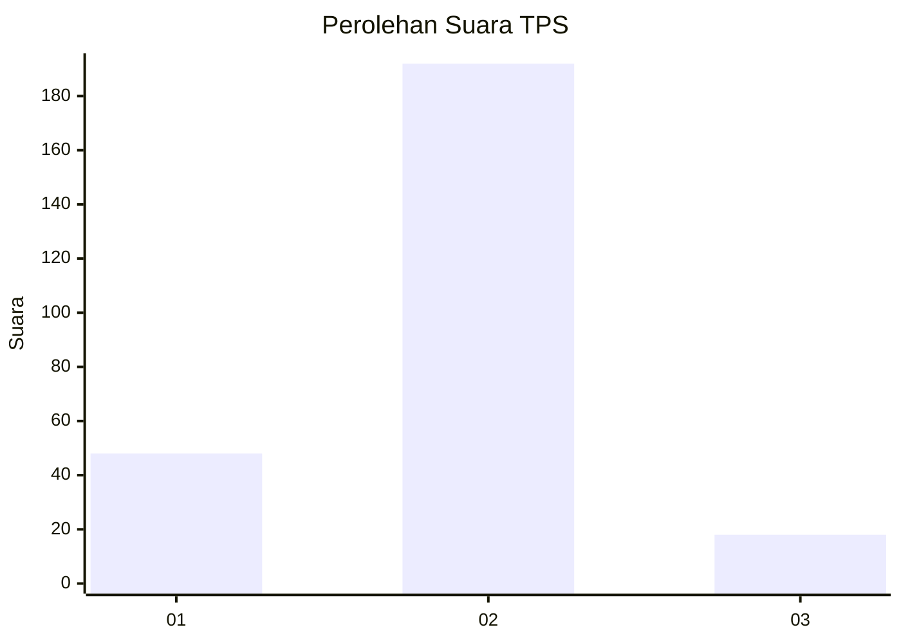
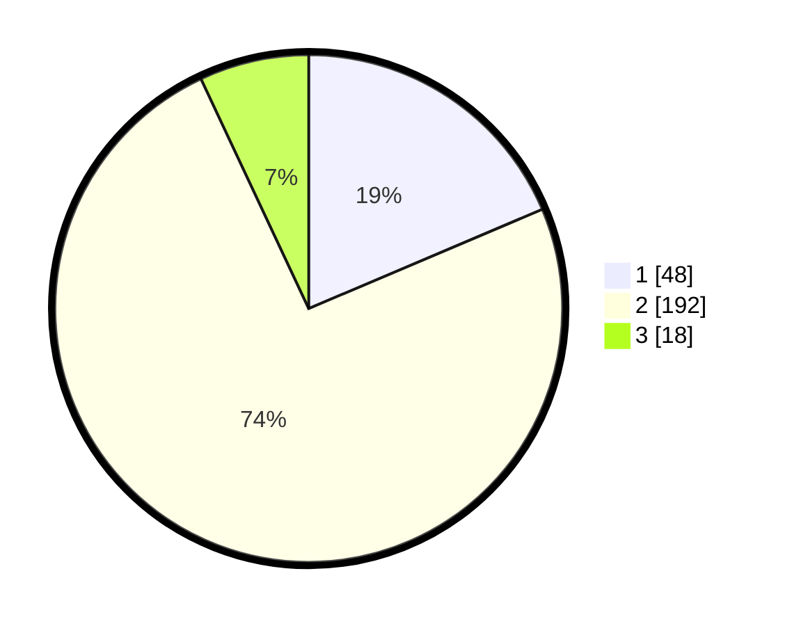

# Hasil

## Grafik

## Tabel

| No. | Nama Paslon    | Suara | Suara (raw) | Persentase |
|:--- |:-------------- | -----:| -----------:| ----------:|
| 1   | ANIES MUHAIMIN | 48    | [48][p-1]   | 18,60      |
| 2   | PRABOWO GIBRAN | 192   | [192][p-2]  | 74,42      |
| 3   | GANJAR MAHFUD  | 18    | [18][p-3]   | 6,98       |

[p-1]: https://github.com/gigit-pemilu/pemilu-2024/blob/main/pilpres/hitung-suara/sub/32-jawa-barat/sub/05-garut/sub/35-cisewu/sub/2001-cisewu/sub/011-tps/sub/paslon-1.txt
[p-2]: https://github.com/gigit-pemilu/pemilu-2024/blob/main/pilpres/hitung-suara/sub/32-jawa-barat/sub/05-garut/sub/35-cisewu/sub/2001-cisewu/sub/011-tps/sub/paslon-2.txt
[p-3]: https://github.com/gigit-pemilu/pemilu-2024/blob/main/pilpres/hitung-suara/sub/32-jawa-barat/sub/05-garut/sub/35-cisewu/sub/2001-cisewu/sub/011-tps/sub/paslon-3.txt

## Foto C Plano

https://sirekap-obj-formc.kpu.go.id/f814/pemilu/ppwp/32/05/35/20/01/3205352001011-20240216-122857--c3d43dbf-d33d-409a-b844-a32292e22d92.jpg

https://sirekap-obj-formc.kpu.go.id/f814/pemilu/ppwp/32/05/35/20/01/3205352001011-20240216-122654--80492486-35bf-4c4a-8046-d3f88eb8fd0e.jpg

https://sirekap-obj-formc.kpu.go.id/f814/pemilu/ppwp/32/05/35/20/01/3205352001011-20240216-122726--ac0e4dc2-25bd-445e-9782-b716b1c372a5.jpg

## Metadata

| Key        | Value               |
| ---------- | ------------------- |
| Time Stamp | 2024-02-20 19:00:00 |

