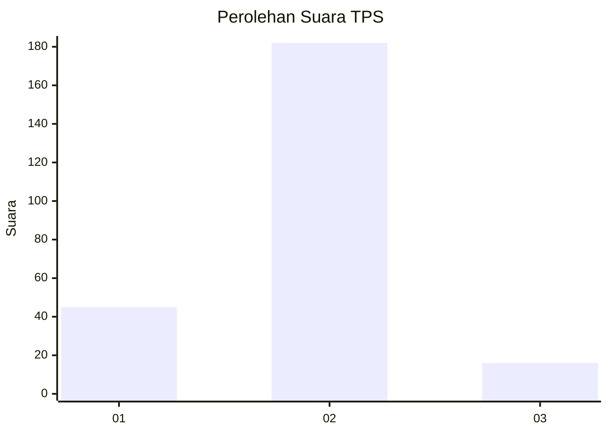
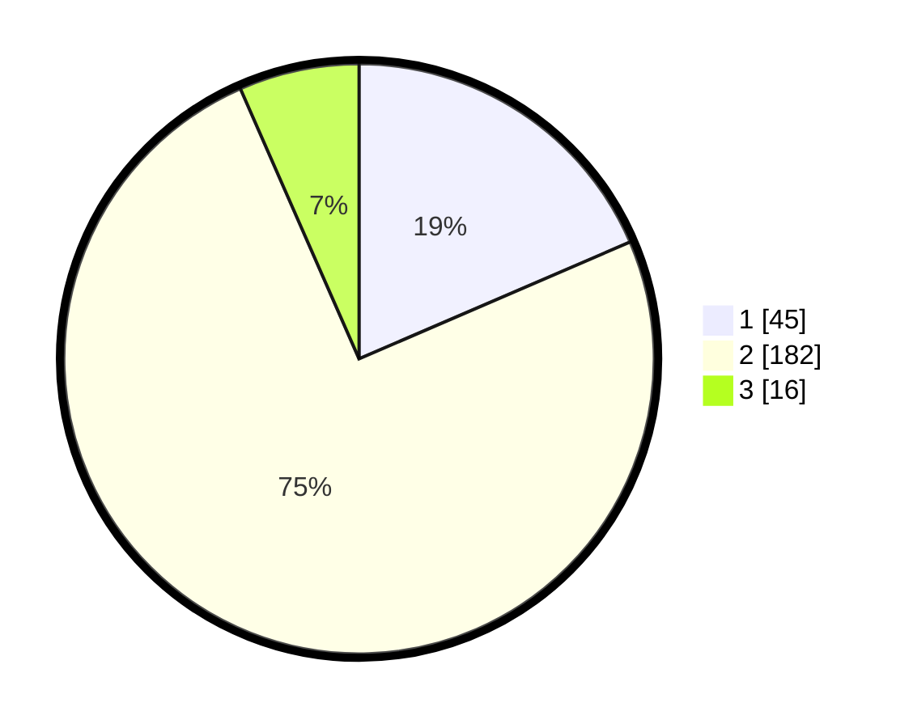

# Hasil

## Grafik

## Tabel

| No. | Nama Paslon    | Suara | Suara (raw) | Persentase |
|:--- |:-------------- | -----:| -----------:| ----------:|
| 1   | ANIES MUHAIMIN | 45    | [45][p-1]   | 18,52      |
| 2   | PRABOWO GIBRAN | 182   | [182][p-2]  | 74,90      |
| 3   | GANJAR MAHFUD  | 16    | [16][p-3]   | 6,58       |

[p-1]: https://github.com/gigit-pemilu/pemilu-2024/blob/main/pilpres/hitung-suara/sub/32-jawa-barat/sub/05-garut/sub/37-talegong/sub/2004-mekarmulya/sub/004-tps/sub/paslon-1.txt
[p-2]: https://github.com/gigit-pemilu/pemilu-2024/blob/main/pilpres/hitung-suara/sub/32-jawa-barat/sub/05-garut/sub/37-talegong/sub/2004-mekarmulya/sub/004-tps/sub/paslon-2.txt
[p-3]: https://github.com/gigit-pemilu/pemilu-2024/blob/main/pilpres/hitung-suara/sub/32-jawa-barat/sub/05-garut/sub/37-talegong/sub/2004-mekarmulya/sub/004-tps/sub/paslon-3.txt

## Foto C Plano

https://sirekap-obj-formc.kpu.go.id/6f22/pemilu/ppwp/32/05/37/20/04/3205372004004-20240215-074438--586c2d61-d1c4-45c3-8291-a0534ec5c5eb.jpg

https://sirekap-obj-formc.kpu.go.id/6f22/pemilu/ppwp/32/05/37/20/04/3205372004004-20240215-074629--fcb529a4-e55b-4d88-9006-c439e900390b.jpg

https://sirekap-obj-formc.kpu.go.id/6f22/pemilu/ppwp/32/05/37/20/04/3205372004004-20240215-074811--fcb4e121-fa51-4ccb-89e2-0bd94454c652.jpg

## Metadata

| Key        | Value               |
| ---------- | ------------------- |
| Time Stamp | 2024-02-16 08:00:28 |

