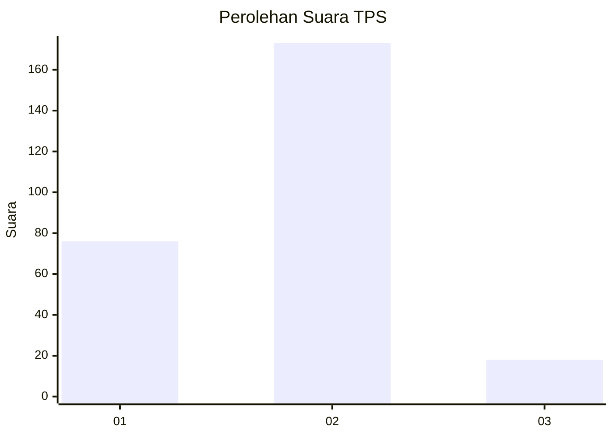
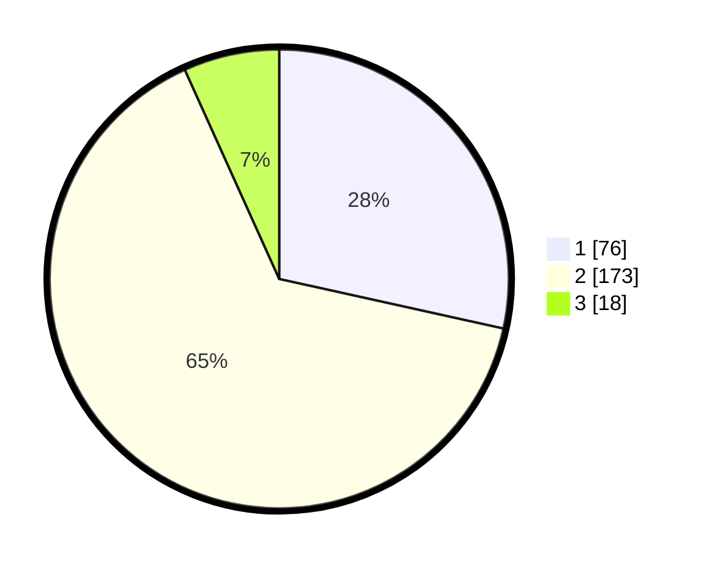

# Hasil

## Grafik

## Tabel

| No. | Nama Paslon    | Suara | Suara (raw) | Persentase |
|:--- |:-------------- | -----:| -----------:| ----------:|
| 1   | ANIES MUHAIMIN | 76    | [76][p-1]   | 28,46      |
| 2   | PRABOWO GIBRAN | 173   | [173][p-2]  | 64,79      |
| 3   | GANJAR MAHFUD  | 18    | [18][p-3]   | 6,74       |

[p-1]: https://github.com/gigit-pemilu/pemilu-2024/blob/main/pilpres/hitung-suara/sub/32-jawa-barat/sub/05-garut/sub/37-talegong/sub/2005-sukalaksana/sub/010-tps/sub/paslon-1.txt
[p-2]: https://github.com/gigit-pemilu/pemilu-2024/blob/main/pilpres/hitung-suara/sub/32-jawa-barat/sub/05-garut/sub/37-talegong/sub/2005-sukalaksana/sub/010-tps/sub/paslon-2.txt
[p-3]: https://github.com/gigit-pemilu/pemilu-2024/blob/main/pilpres/hitung-suara/sub/32-jawa-barat/sub/05-garut/sub/37-talegong/sub/2005-sukalaksana/sub/010-tps/sub/paslon-3.txt

## Foto C Plano

https://sirekap-obj-formc.kpu.go.id/90a9/pemilu/ppwp/32/05/37/20/05/3205372005010-20240214-211934--4b81f50e-b3dc-44ff-a9ff-99ad4f9b1a0b.jpg

https://sirekap-obj-formc.kpu.go.id/90a9/pemilu/ppwp/32/05/37/20/05/3205372005010-20240214-212656--de3099fa-c587-4787-b827-274d3ceef723.jpg

https://sirekap-obj-formc.kpu.go.id/90a9/pemilu/ppwp/32/05/37/20/05/3205372005010-20240214-212852--72e52daf-a1b1-4bed-a5bf-2eae3fc68b32.jpg

## Metadata

| Key        | Value               |
| ---------- | ------------------- |
| Time Stamp | 2024-02-16 08:00:28 |

