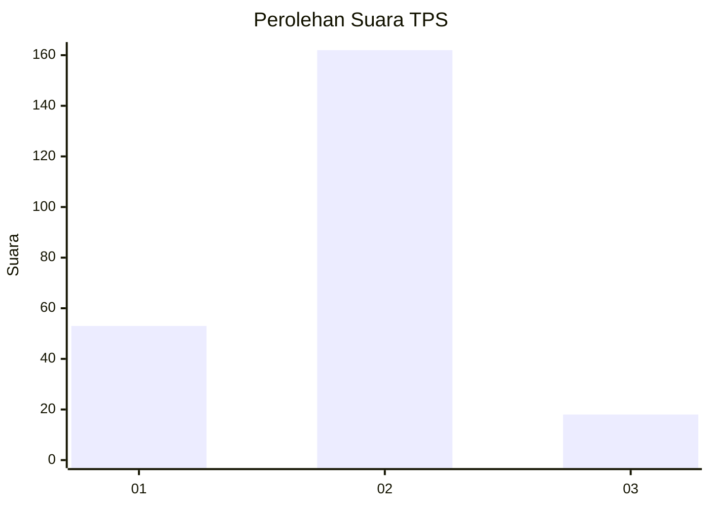
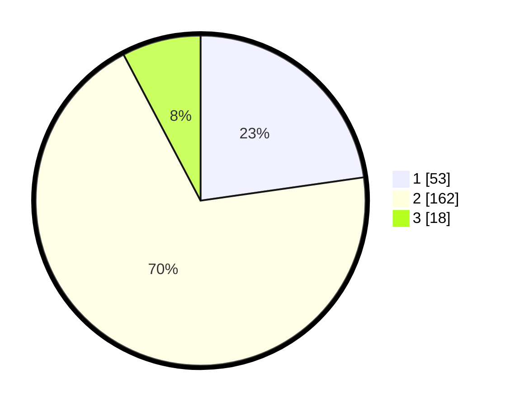

# Hasil

## Grafik

## Tabel

| No. | Nama Paslon    | Suara | Suara (raw) | Persentase |
|:--- |:-------------- | -----:| -----------:| ----------:|
| 1   | ANIES MUHAIMIN | 53    | [53][p-1]   | 22,75      |
| 2   | PRABOWO GIBRAN | 162   | [162][p-2]  | 69,53      |
| 3   | GANJAR MAHFUD  | 18    | [18][p-3]   | 7,73       |

[p-1]: https://github.com/gigit-pemilu/pemilu-2024-32-jawa-barat/blob/main/pilpres/hitung-suara/sub/32-jawa-barat/sub/05-garut/sub/38-bl-limbangan/sub/2001-limbangan-tengah/sub/004-tps/sub/paslon-1.txt
[p-2]: https://github.com/gigit-pemilu/pemilu-2024-32-jawa-barat/blob/main/pilpres/hitung-suara/sub/32-jawa-barat/sub/05-garut/sub/38-bl-limbangan/sub/2001-limbangan-tengah/sub/004-tps/sub/paslon-2.txt
[p-3]: https://github.com/gigit-pemilu/pemilu-2024-32-jawa-barat/blob/main/pilpres/hitung-suara/sub/32-jawa-barat/sub/05-garut/sub/38-bl-limbangan/sub/2001-limbangan-tengah/sub/004-tps/sub/paslon-3.txt

## Foto C Plano

https://sirekap-obj-formc.kpu.go.id/a2c0/pemilu/ppwp/32/05/38/20/01/3205382001004-20240214-201118--9b780985-469c-4f82-8522-3ed02e26a2df.jpg

https://sirekap-obj-formc.kpu.go.id/a2c0/pemilu/ppwp/32/05/38/20/01/3205382001004-20240214-201227--537f6f65-070b-4af1-97d5-09100d6a09f4.jpg

https://sirekap-obj-formc.kpu.go.id/a2c0/pemilu/ppwp/32/05/38/20/01/3205382001004-20240214-201402--2949a989-016d-49f6-9945-db436d2cdad8.jpg

## Metadata

| Key        | Value               |
| ---------- | ------------------- |
| Time Stamp | 2024-02-24 22:31:28 |

