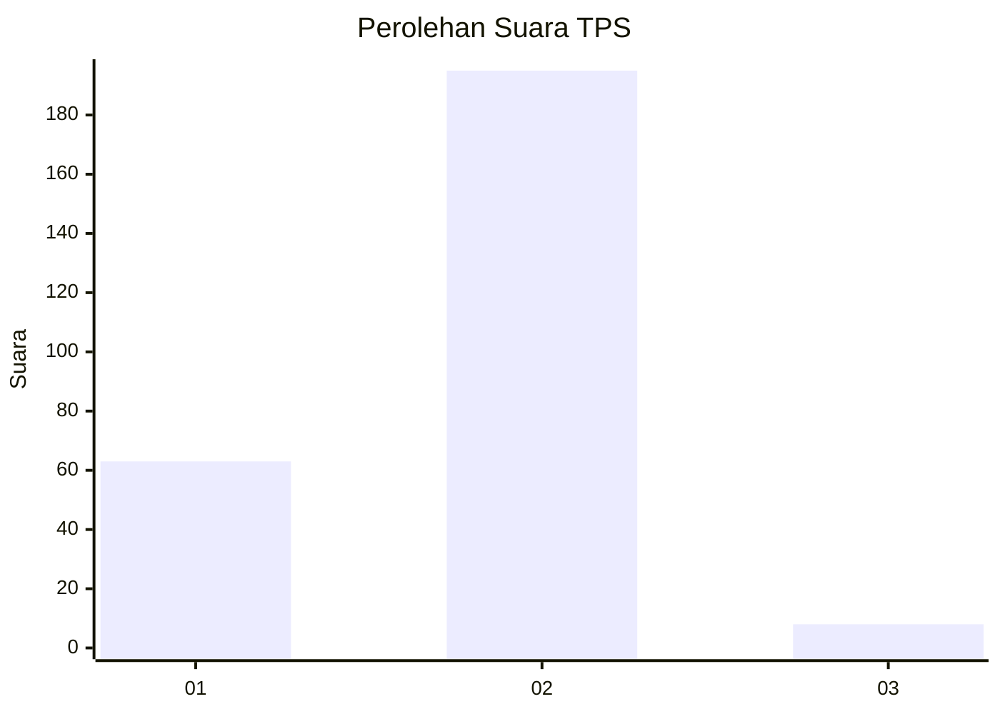

# Hasil

## Grafik

## Tabel

| No. | Nama Paslon    | Suara | Suara (raw) | Persentase |
|:--- |:-------------- | -----:| -----------:| ----------:|
| 1   | ANIES MUHAIMIN | 63    | [63][p-1]   | 23,68      |
| 2   | PRABOWO GIBRAN | 195   | [195][p-2]  | 73,31      |
| 3   | GANJAR MAHFUD  | 8     | [8][p-3]    | 3,01       |

[p-1]: https://github.com/gigit-pemilu/pemilu-2024/blob/main/pilpres/hitung-suara/sub/32-jawa-barat/sub/05-garut/sub/38-bl-limbangan/sub/2005-cijolang/sub/001-tps/sub/paslon-1.txt
[p-2]: https://github.com/gigit-pemilu/pemilu-2024/blob/main/pilpres/hitung-suara/sub/32-jawa-barat/sub/05-garut/sub/38-bl-limbangan/sub/2005-cijolang/sub/001-tps/sub/paslon-2.txt
[p-3]: https://github.com/gigit-pemilu/pemilu-2024/blob/main/pilpres/hitung-suara/sub/32-jawa-barat/sub/05-garut/sub/38-bl-limbangan/sub/2005-cijolang/sub/001-tps/sub/paslon-3.txt

## Foto C Plano

https://sirekap-obj-formc.kpu.go.id/ceba/pemilu/ppwp/32/05/38/20/05/3205382005001-20240214-220905--0eef0df0-2683-4bcb-88fa-407583c5ea8d.jpg

https://sirekap-obj-formc.kpu.go.id/ceba/pemilu/ppwp/32/05/38/20/05/3205382005001-20240214-221236--dc4a9219-cfb3-47e8-a90f-93f9f78223d3.jpg

https://sirekap-obj-formc.kpu.go.id/ceba/pemilu/ppwp/32/05/38/20/05/3205382005001-20240214-221400--943686ed-6460-4332-9dad-35b153945909.jpg

## Metadata

| Key        | Value               |
| ---------- | ------------------- |
| Time Stamp | 2024-02-20 02:00:00 |

