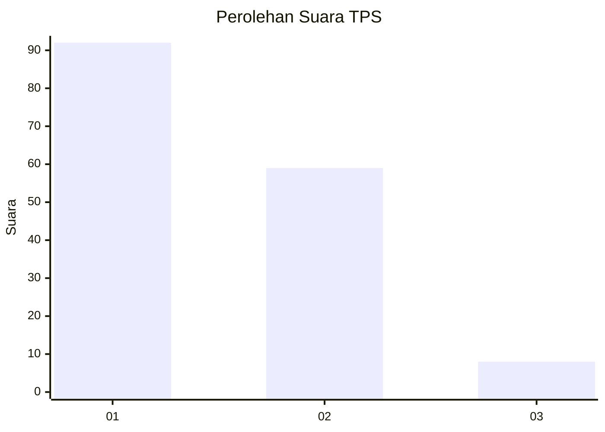
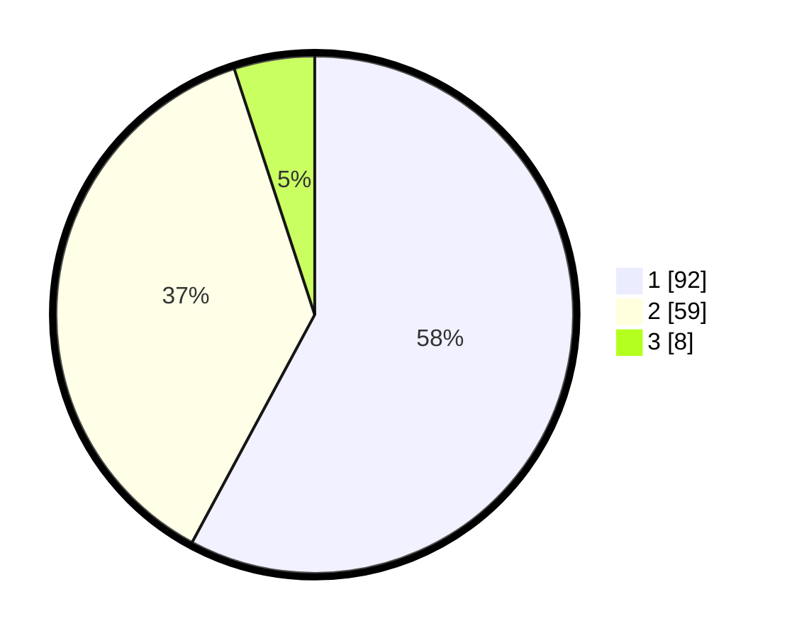

# Hasil

## Grafik

## Tabel

| No. | Nama Paslon    | Suara | Suara (raw) | Persentase |
|:--- |:-------------- | -----:| -----------:| ----------:|
| 1   | ANIES MUHAIMIN | 92    | [92][p-1]   | 57,86      |
| 2   | PRABOWO GIBRAN | 59    | [59][p-2]   | 37,11      |
| 3   | GANJAR MAHFUD  | 8     | [8][p-3]    | 5,03       |

[p-1]: https://github.com/gigit-pemilu/pemilu-2024/blob/main/pilpres/hitung-suara/sub/32-jawa-barat/sub/05-garut/sub/41-pangatikan/sub/2001-citangtu/sub/002-tps/sub/paslon-1.txt
[p-2]: https://github.com/gigit-pemilu/pemilu-2024/blob/main/pilpres/hitung-suara/sub/32-jawa-barat/sub/05-garut/sub/41-pangatikan/sub/2001-citangtu/sub/002-tps/sub/paslon-2.txt
[p-3]: https://github.com/gigit-pemilu/pemilu-2024/blob/main/pilpres/hitung-suara/sub/32-jawa-barat/sub/05-garut/sub/41-pangatikan/sub/2001-citangtu/sub/002-tps/sub/paslon-3.txt

## Foto C Plano

https://sirekap-obj-formc.kpu.go.id/6b08/pemilu/ppwp/32/05/41/20/01/3205412001002-20240215-082151--dec17240-d6b3-43d5-a32c-9a9d95aca019.jpg

https://sirekap-obj-formc.kpu.go.id/6b08/pemilu/ppwp/32/05/41/20/01/3205412001002-20240215-082501--c92f8b55-dc8b-402f-933e-599f00223526.jpg

https://sirekap-obj-formc.kpu.go.id/6b08/pemilu/ppwp/32/05/41/20/01/3205412001002-20240215-083936--665a2ef3-7f09-404e-92ea-b275cf56757b.jpg

## Metadata

| Key        | Value               |
| ---------- | ------------------- |
| Time Stamp | 2024-02-15 21:30:27 |

