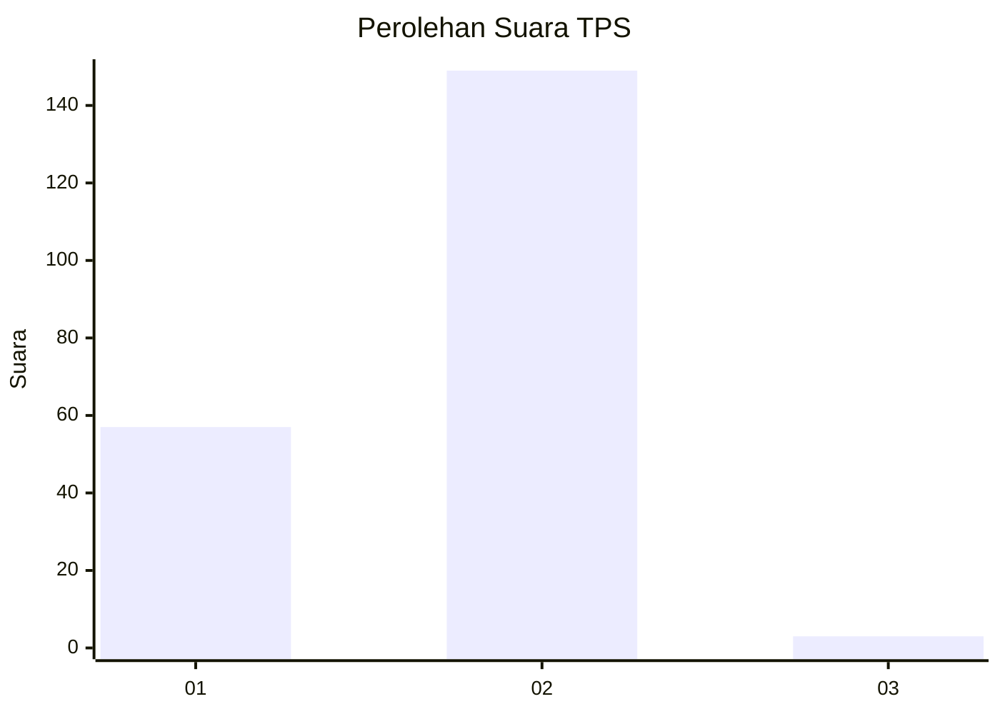
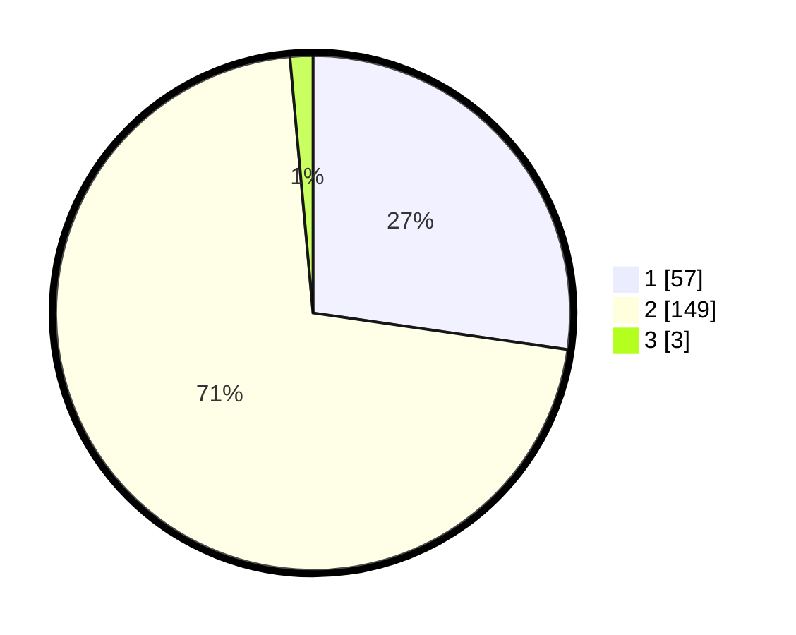

# Hasil

## Grafik

## Tabel

| No. | Nama Paslon    | Suara | Suara (raw) | Persentase |
|:--- |:-------------- | -----:| -----------:| ----------:|
| 1   | ANIES MUHAIMIN | 57    | [57][p-1]   | 27,27      |
| 2   | PRABOWO GIBRAN | 149   | [149][p-2]  | 71,29      |
| 3   | GANJAR MAHFUD  | 3     | [3][p-3]    | 1,44       |

[p-1]: https://github.com/gigit-pemilu/pemilu-2024/blob/main/pilpres/hitung-suara/sub/32-jawa-barat/sub/05-garut/sub/41-pangatikan/sub/2001-citangtu/sub/006-tps/sub/paslon-1.txt
[p-2]: https://github.com/gigit-pemilu/pemilu-2024/blob/main/pilpres/hitung-suara/sub/32-jawa-barat/sub/05-garut/sub/41-pangatikan/sub/2001-citangtu/sub/006-tps/sub/paslon-2.txt
[p-3]: https://github.com/gigit-pemilu/pemilu-2024/blob/main/pilpres/hitung-suara/sub/32-jawa-barat/sub/05-garut/sub/41-pangatikan/sub/2001-citangtu/sub/006-tps/sub/paslon-3.txt

## Foto C Plano

https://sirekap-obj-formc.kpu.go.id/5436/pemilu/ppwp/32/05/41/20/01/3205412001006-20240215-043743--b8f8ae73-53a4-42ad-9ca9-7d5bef820d76.jpg

https://sirekap-obj-formc.kpu.go.id/5436/pemilu/ppwp/32/05/41/20/01/3205412001006-20240215-053955--ced8cee4-4f7e-4d54-8346-c59fc305fe2d.jpg

https://sirekap-obj-formc.kpu.go.id/5436/pemilu/ppwp/32/05/41/20/01/3205412001006-20240215-054059--3d9f3734-337c-4fe7-bf76-b6f8c4e1d729.jpg

## Metadata

| Key        | Value               |
| ---------- | ------------------- |
| Time Stamp | 2024-02-15 21:30:27 |

