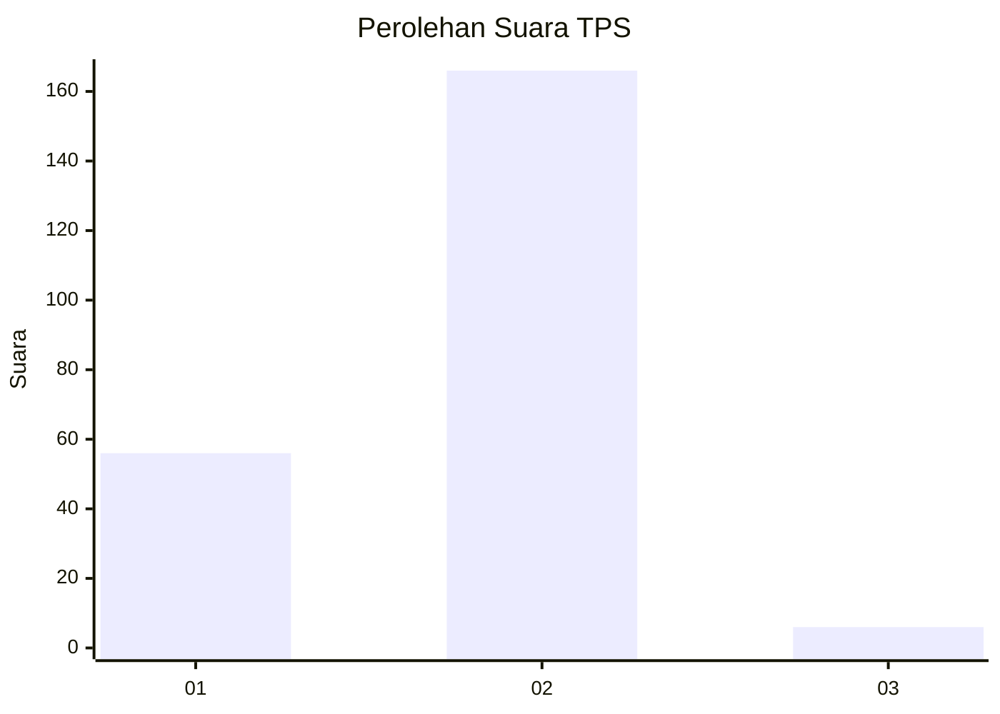
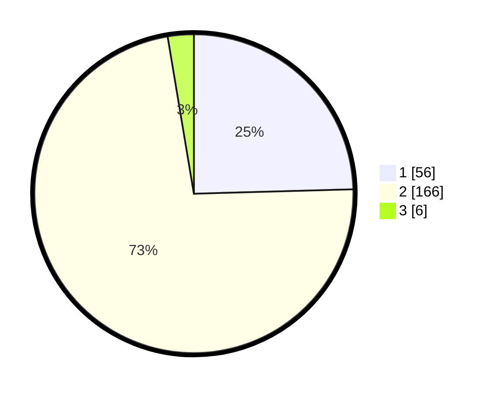

# Hasil

## Grafik

## Tabel

| No. | Nama Paslon    | Suara | Suara (raw) | Persentase |
|:--- |:-------------- | -----:| -----------:| ----------:|
| 1   | ANIES MUHAIMIN | 56    | [56][p-1]   | 24,56      |
| 2   | PRABOWO GIBRAN | 166   | [166][p-2]  | 72,81      |
| 3   | GANJAR MAHFUD  | 6     | [6][p-3]    | 2,63       |

[p-1]: https://github.com/gigit-pemilu/pemilu-2024/blob/main/pilpres/hitung-suara/sub/32-jawa-barat/sub/05-garut/sub/41-pangatikan/sub/2001-citangtu/sub/007-tps/sub/paslon-1.txt
[p-2]: https://github.com/gigit-pemilu/pemilu-2024/blob/main/pilpres/hitung-suara/sub/32-jawa-barat/sub/05-garut/sub/41-pangatikan/sub/2001-citangtu/sub/007-tps/sub/paslon-2.txt
[p-3]: https://github.com/gigit-pemilu/pemilu-2024/blob/main/pilpres/hitung-suara/sub/32-jawa-barat/sub/05-garut/sub/41-pangatikan/sub/2001-citangtu/sub/007-tps/sub/paslon-3.txt

## Foto C Plano

https://sirekap-obj-formc.kpu.go.id/b011/pemilu/ppwp/32/05/41/20/01/3205412001007-20240215-024703--aa9b86d2-e594-4751-a138-987e25712679.jpg

https://sirekap-obj-formc.kpu.go.id/b011/pemilu/ppwp/32/05/41/20/01/3205412001007-20240215-024717--081f0e3e-950d-409b-a9ec-779fb2fea802.jpg

https://sirekap-obj-formc.kpu.go.id/b011/pemilu/ppwp/32/05/41/20/01/3205412001007-20240215-024722--9576bbb5-b14a-431c-bb01-9a638803c5a1.jpg

## Metadata

| Key        | Value               |
| ---------- | ------------------- |
| Time Stamp | 2024-02-15 22:00:27 |

