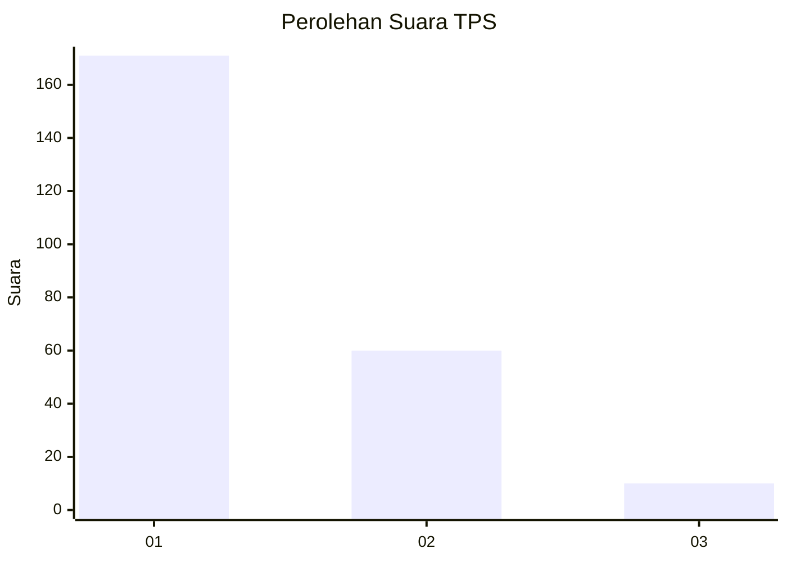
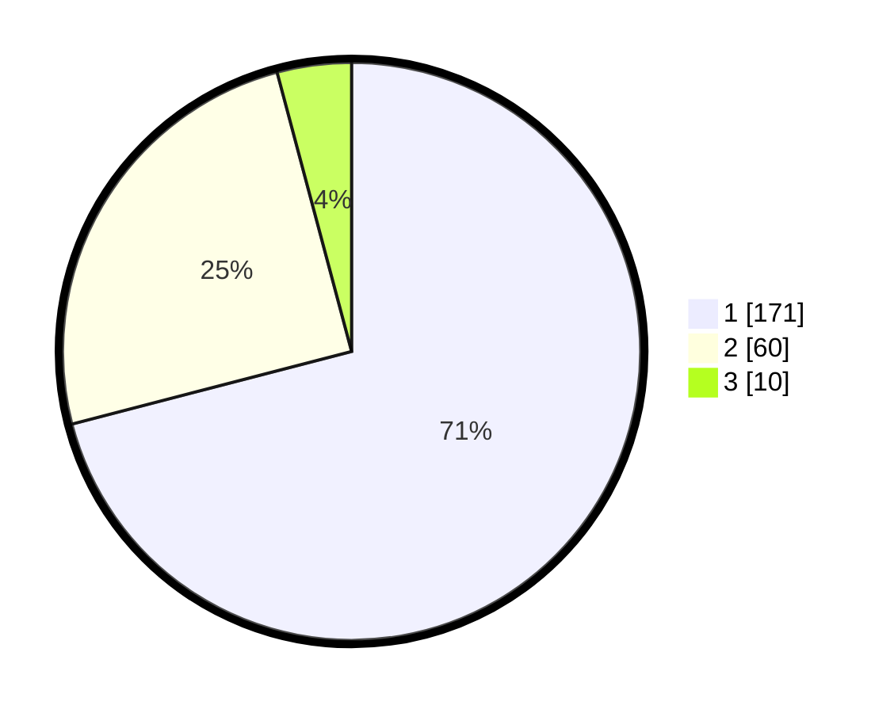

# Hasil

## Grafik

## Tabel

| No. | Nama Paslon    | Suara | Suara (raw) | Persentase |
|:--- |:-------------- | -----:| -----------:| ----------:|
| 1   | ANIES MUHAIMIN | 171   | [171][p-1]  | 70,95      |
| 2   | PRABOWO GIBRAN | 60    | [60][p-2]   | 24,90      |
| 3   | GANJAR MAHFUD  | 10    | [10][p-3]   | 4,15       |

[p-1]: https://github.com/gigit-pemilu/pemilu-2024/blob/main/pilpres/hitung-suara/sub/32-jawa-barat/sub/05-garut/sub/41-pangatikan/sub/2004-sukahurip/sub/011-tps/sub/paslon-1.txt
[p-2]: https://github.com/gigit-pemilu/pemilu-2024/blob/main/pilpres/hitung-suara/sub/32-jawa-barat/sub/05-garut/sub/41-pangatikan/sub/2004-sukahurip/sub/011-tps/sub/paslon-2.txt
[p-3]: https://github.com/gigit-pemilu/pemilu-2024/blob/main/pilpres/hitung-suara/sub/32-jawa-barat/sub/05-garut/sub/41-pangatikan/sub/2004-sukahurip/sub/011-tps/sub/paslon-3.txt

## Foto C Plano

https://sirekap-obj-formc.kpu.go.id/6c5d/pemilu/ppwp/32/05/41/20/04/3205412004011-20240215-153524--816ff5ff-31f1-433d-918d-926d0da91307.jpg

https://sirekap-obj-formc.kpu.go.id/6c5d/pemilu/ppwp/32/05/41/20/04/3205412004011-20240215-153646--a0a15912-4343-43d6-8de2-613d92061d6c.jpg

https://sirekap-obj-formc.kpu.go.id/6c5d/pemilu/ppwp/32/05/41/20/04/3205412004011-20240215-153750--c4f7eb2d-6b03-4cc6-aaec-e00a39dd71b2.jpg

## Metadata

| Key        | Value               |
| ---------- | ------------------- |
| Time Stamp | 2024-02-19 06:16:00 |

