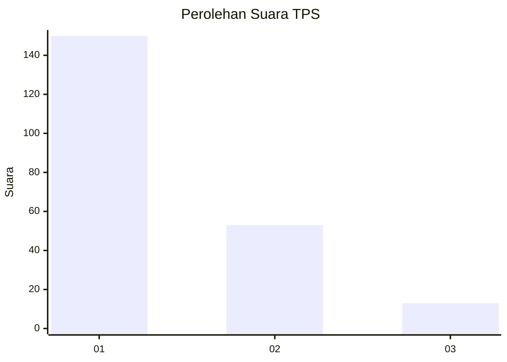
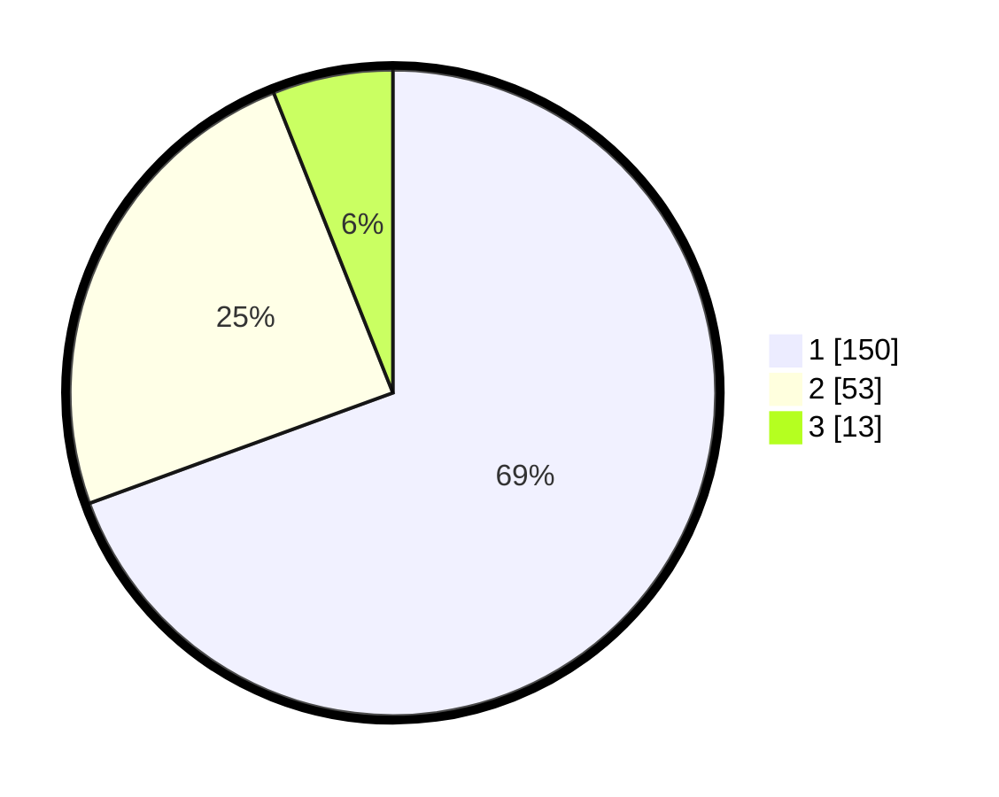

# Hasil

## Grafik

## Tabel

| No. | Nama Paslon    | Suara | Suara (raw) | Persentase |
|:--- |:-------------- | -----:| -----------:| ----------:|
| 1   | ANIES MUHAIMIN | 150   | [150][p-1]  | 69,44      |
| 2   | PRABOWO GIBRAN | 53    | [53][p-2]   | 24,54      |
| 3   | GANJAR MAHFUD  | 13    | [13][p-3]   | 6,02       |

[p-1]: https://github.com/gigit-pemilu/pemilu-2024-32-jawa-barat/blob/main/pilpres/hitung-suara/sub/32-jawa-barat/sub/05-garut/sub/41-pangatikan/sub/2004-sukahurip/sub/019-tps/sub/paslon-1.txt
[p-2]: https://github.com/gigit-pemilu/pemilu-2024-32-jawa-barat/blob/main/pilpres/hitung-suara/sub/32-jawa-barat/sub/05-garut/sub/41-pangatikan/sub/2004-sukahurip/sub/019-tps/sub/paslon-2.txt
[p-3]: https://github.com/gigit-pemilu/pemilu-2024-32-jawa-barat/blob/main/pilpres/hitung-suara/sub/32-jawa-barat/sub/05-garut/sub/41-pangatikan/sub/2004-sukahurip/sub/019-tps/sub/paslon-3.txt

## Foto C Plano

https://sirekap-obj-formc.kpu.go.id/f659/pemilu/ppwp/32/05/41/20/04/3205412004019-20240215-105127--2a0b76df-e641-4242-8ec9-4f9f99f3ddd3.jpg

https://sirekap-obj-formc.kpu.go.id/f659/pemilu/ppwp/32/05/41/20/04/3205412004019-20240215-105450--da0d0fa0-bf61-4d85-ac31-078f26af6462.jpg

https://sirekap-obj-formc.kpu.go.id/f659/pemilu/ppwp/32/05/41/20/04/3205412004019-20240215-105744--552cceb8-6ecd-4fec-915d-35948f336723.jpg

## Metadata

| Key        | Value               |
| ---------- | ------------------- |
| Time Stamp | 2024-02-15 22:40:13 |

