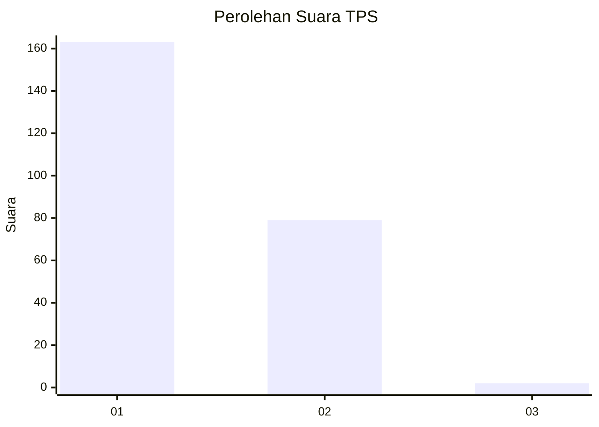
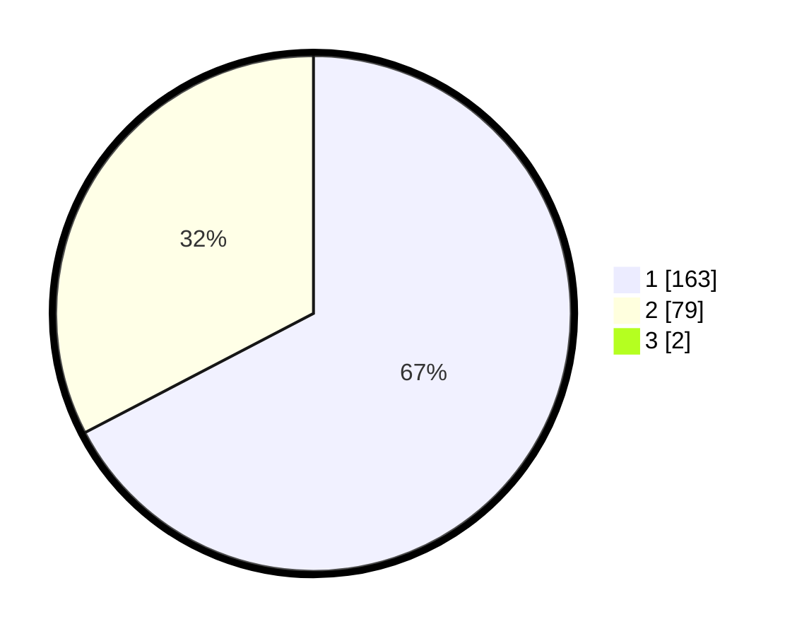

# Hasil

## Grafik

## Tabel

| No. | Nama Paslon    | Suara | Suara (raw) | Persentase |
|:--- |:-------------- | -----:| -----------:| ----------:|
| 1   | ANIES MUHAIMIN | 163   | [163][p-1]  | 66,80      |
| 2   | PRABOWO GIBRAN | 79    | [79][p-2]   | 32,38      |
| 3   | GANJAR MAHFUD  | 2     | [2][p-3]    | 0,82       |

[p-1]: https://github.com/gigit-pemilu/pemilu-2024/blob/main/pilpres/hitung-suara/sub/32-jawa-barat/sub/05-garut/sub/41-pangatikan/sub/2007-sukarasa/sub/006-tps/sub/paslon-1.txt
[p-2]: https://github.com/gigit-pemilu/pemilu-2024/blob/main/pilpres/hitung-suara/sub/32-jawa-barat/sub/05-garut/sub/41-pangatikan/sub/2007-sukarasa/sub/006-tps/sub/paslon-2.txt
[p-3]: https://github.com/gigit-pemilu/pemilu-2024/blob/main/pilpres/hitung-suara/sub/32-jawa-barat/sub/05-garut/sub/41-pangatikan/sub/2007-sukarasa/sub/006-tps/sub/paslon-3.txt

## Foto C Plano

https://sirekap-obj-formc.kpu.go.id/25ca/pemilu/ppwp/32/05/41/20/07/3205412007006-20240217-125203--80bc1d86-f6a5-43da-86cf-5e70b3e0b184.jpg

https://sirekap-obj-formc.kpu.go.id/25ca/pemilu/ppwp/32/05/41/20/07/3205412007006-20240214-235534--ff2beaa0-74d8-4fbd-b87a-5e3b9a8cf09b.jpg

https://sirekap-obj-formc.kpu.go.id/25ca/pemilu/ppwp/32/05/41/20/07/3205412007006-20240214-235518--73bd469d-5209-40ee-a726-485d2259864c.jpg

## Metadata

| Key        | Value               |
| ---------- | ------------------- |
| Time Stamp | 2024-02-17 13:37:34 |

