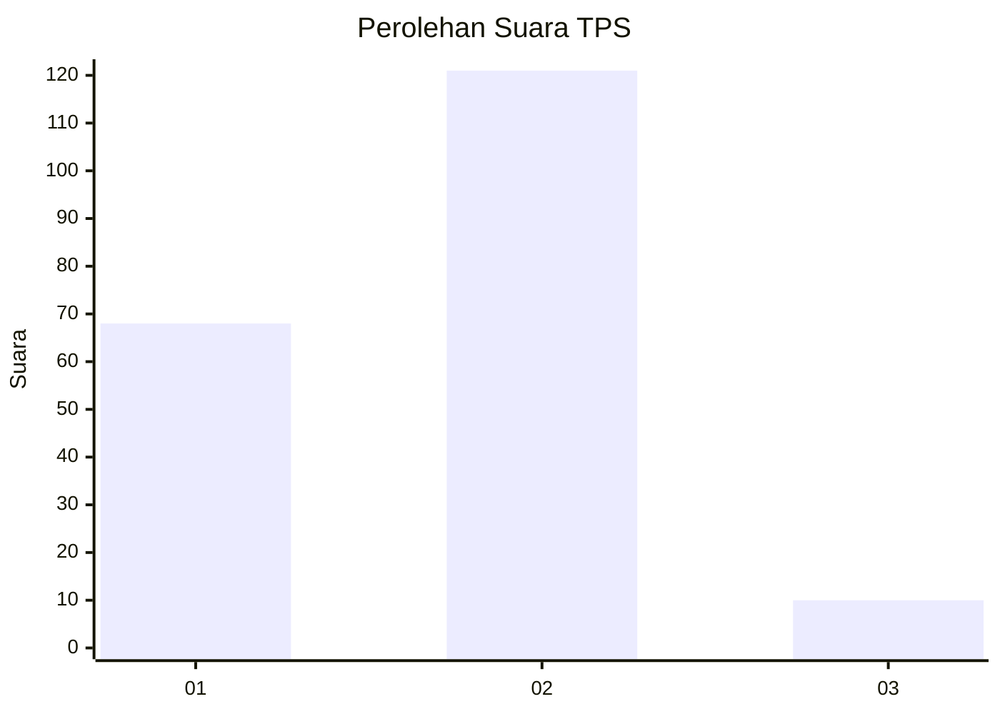
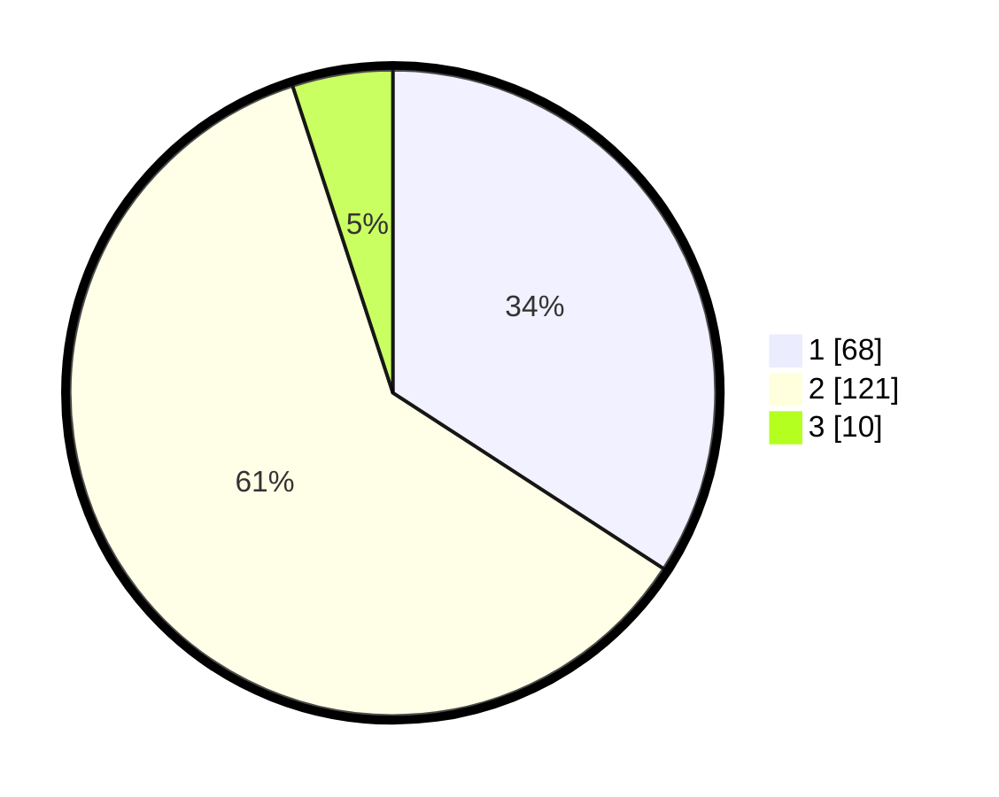

# Hasil

## Grafik

## Tabel

| No. | Nama Paslon    | Suara | Suara (raw) | Persentase |
|:--- |:-------------- | -----:| -----------:| ----------:|
| 1   | ANIES MUHAIMIN | 68    | [68][p-1]   | 34,17      |
| 2   | PRABOWO GIBRAN | 121   | [121][p-2]  | 60,80      |
| 3   | GANJAR MAHFUD  | 10    | [10][p-3]   | 5,03       |

[p-1]: https://github.com/gigit-pemilu/pemilu-2024-32-jawa-barat/blob/main/pilpres/hitung-suara/sub/32-jawa-barat/sub/05-garut/sub/42-sucinaraja/sub/2001-sadang/sub/004-tps/sub/paslon-1.txt
[p-2]: https://github.com/gigit-pemilu/pemilu-2024-32-jawa-barat/blob/main/pilpres/hitung-suara/sub/32-jawa-barat/sub/05-garut/sub/42-sucinaraja/sub/2001-sadang/sub/004-tps/sub/paslon-2.txt
[p-3]: https://github.com/gigit-pemilu/pemilu-2024-32-jawa-barat/blob/main/pilpres/hitung-suara/sub/32-jawa-barat/sub/05-garut/sub/42-sucinaraja/sub/2001-sadang/sub/004-tps/sub/paslon-3.txt

## Foto C Plano

https://sirekap-obj-formc.kpu.go.id/9cee/pemilu/ppwp/32/05/42/20/01/3205422001004-20240215-021029--dec1dcf7-56be-4f65-a8f2-92a318441aa1.jpg

https://sirekap-obj-formc.kpu.go.id/9cee/pemilu/ppwp/32/05/42/20/01/3205422001004-20240215-020257--e9f303ff-47ad-416a-bc06-2f274a4995bb.jpg

https://sirekap-obj-formc.kpu.go.id/9cee/pemilu/ppwp/32/05/42/20/01/3205422001004-20240215-020419--81c3152d-9550-43b4-9f7d-0678a4a943db.jpg

## Metadata

| Key        | Value               |
| ---------- | ------------------- |
| Time Stamp | 2024-02-24 22:31:28 |

