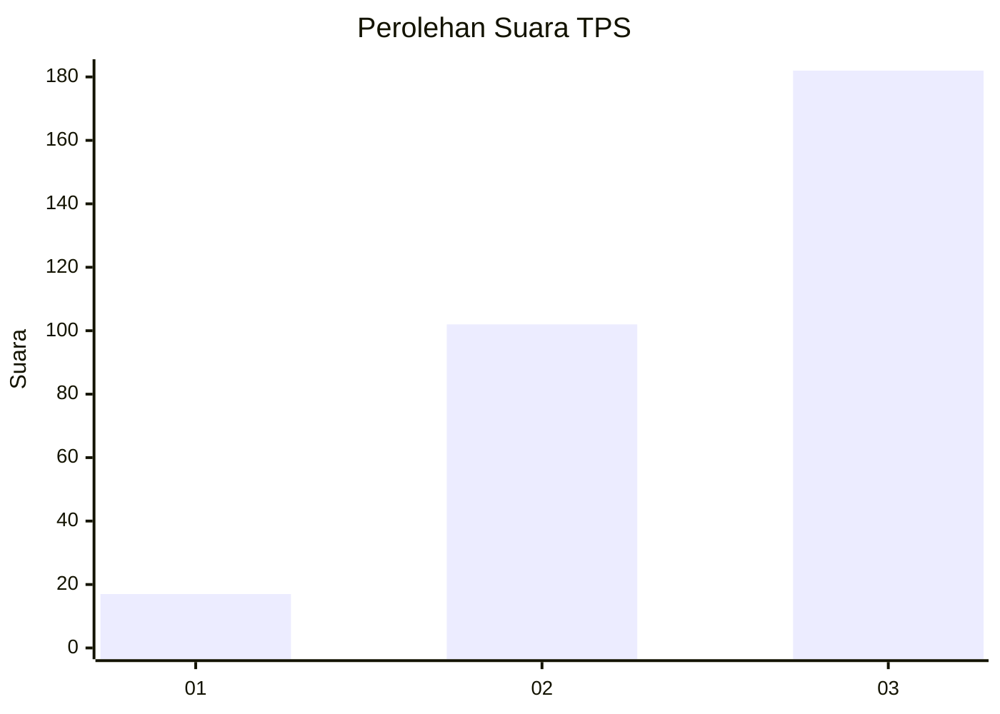
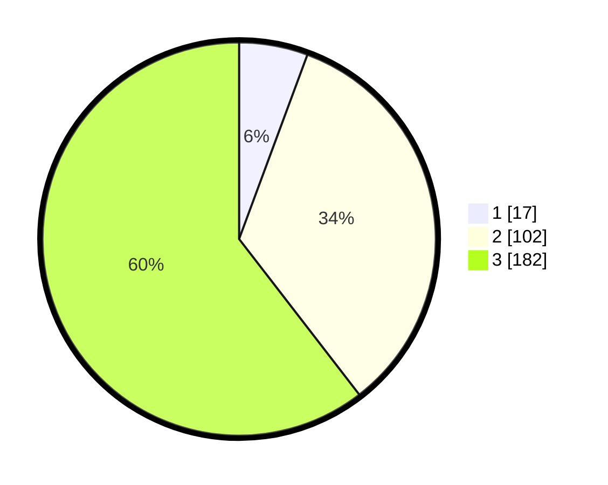

# Hasil

## Grafik

## Tabel

| No. | Nama Paslon    | Suara | Suara (raw) | Persentase |
|:--- |:-------------- | -----:| -----------:| ----------:|
| 1   | ANIES MUHAIMIN | 17    | [17][p-1]   | 5,65       |
| 2   | PRABOWO GIBRAN | 102   | [102][p-2]  | 33,89      |
| 3   | GANJAR MAHFUD  | 182   | [182][p-3]  | 60,47      |

[p-1]: https://github.com/gigit-pemilu/pemilu-2024/blob/main/pilpres/hitung-suara/sub/32-jawa-barat/sub/06-tasikmalaya/sub/01-cipatujah/sub/2001-ciheras/sub/004-tps/sub/paslon-1.txt
[p-2]: https://github.com/gigit-pemilu/pemilu-2024/blob/main/pilpres/hitung-suara/sub/32-jawa-barat/sub/06-tasikmalaya/sub/01-cipatujah/sub/2001-ciheras/sub/004-tps/sub/paslon-2.txt
[p-3]: https://github.com/gigit-pemilu/pemilu-2024/blob/main/pilpres/hitung-suara/sub/32-jawa-barat/sub/06-tasikmalaya/sub/01-cipatujah/sub/2001-ciheras/sub/004-tps/sub/paslon-3.txt

## Foto C Plano

https://sirekap-obj-formc.kpu.go.id/6059/pemilu/ppwp/32/06/01/20/01/3206012001004-20240220-192523--28a325e2-427d-425a-8115-0edd8fb29af6.jpg

https://sirekap-obj-formc.kpu.go.id/6059/pemilu/ppwp/32/06/01/20/01/3206012001004-20240220-192525--fa43ae14-4661-4898-abc2-aef1e0b35069.jpg

https://sirekap-obj-formc.kpu.go.id/6059/pemilu/ppwp/32/06/01/20/01/3206012001004-20240220-192524--8ee21fc3-3edc-4433-b375-fec5d0d10605.jpg

## Metadata

| Key        | Value               |
| ---------- | ------------------- |
| Time Stamp | 2024-02-21 11:00:00 |

## DATA PEMILIH TETAP

Jumlah pemilih dalam DPT: **291**.
 * L: **143**.
 * P: **148**.

## DATA PENGGUNA HAK PILIH

Jumlah pengguna hak pilih dalam DPT: **205**.
 * L: **98**.
 * P: **107**.

Jumlah pengguna hak pilih dalam DPTb: **0**.
 * L: **0**.
 * P: **0**.

Jumlah pengguna hak pilih dalam DPK: **3**.
 * L: **1**.
 * P: **2**.

Jumlah pengguna hak pilih: **208**.
 * L: **99**.
 * P: **109**.

## JUMLAH SUARA SAH DAN TIDAK SAH

JUMLAH SELURUH SUARA SAH: **201**.

JUMLAH SUARA TIDAK SAH: **7**.

JUMLAH SELURUH SUARA SAH DAN SUARA TIDAK SAH: **208**.

