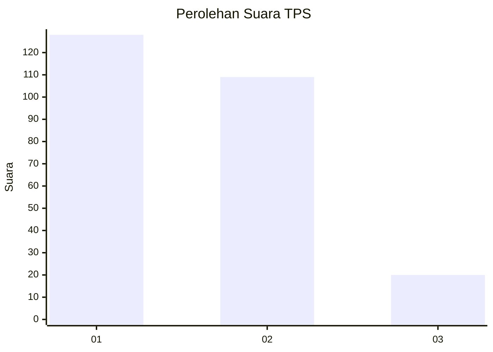
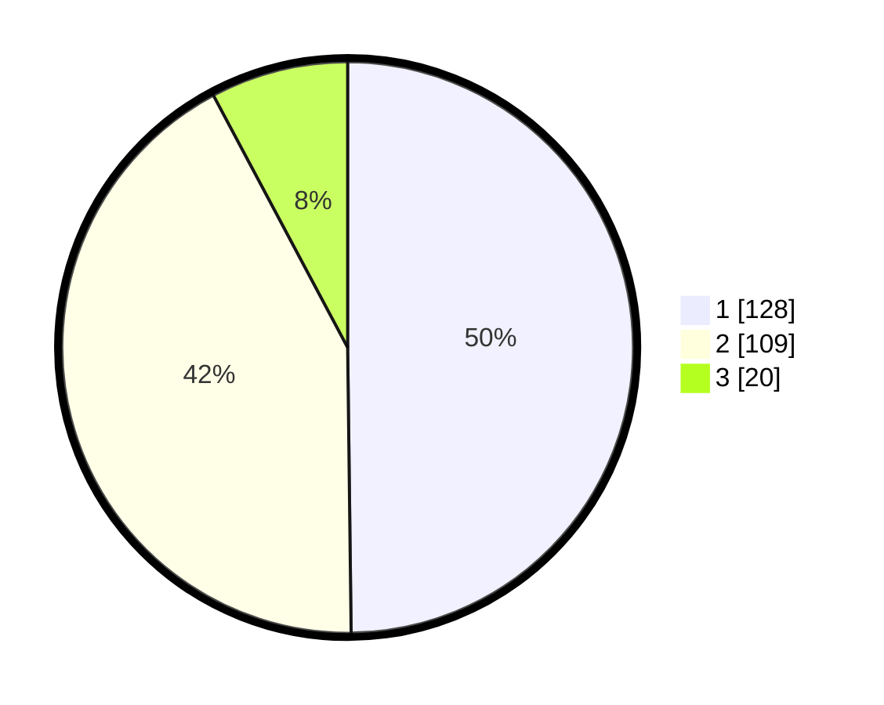

# Hasil

## Grafik

## Tabel

| No. | Nama Paslon    | Suara | Suara (raw) | Persentase |
|:--- |:-------------- | -----:| -----------:| ----------:|
| 1   | ANIES MUHAIMIN | 128   | [128][p-1]  | 49,81      |
| 2   | PRABOWO GIBRAN | 109   | [109][p-2]  | 42,41      |
| 3   | GANJAR MAHFUD  | 20    | [20][p-3]   | 7,78       |

[p-1]: https://github.com/gigit-pemilu/pemilu-2024-32-jawa-barat/blob/main/pilpres/hitung-suara/sub/32-jawa-barat/sub/06-tasikmalaya/sub/02-karangnunggal/sub/2001-cidadap/sub/002-tps/sub/paslon-1.txt
[p-2]: https://github.com/gigit-pemilu/pemilu-2024-32-jawa-barat/blob/main/pilpres/hitung-suara/sub/32-jawa-barat/sub/06-tasikmalaya/sub/02-karangnunggal/sub/2001-cidadap/sub/002-tps/sub/paslon-2.txt
[p-3]: https://github.com/gigit-pemilu/pemilu-2024-32-jawa-barat/blob/main/pilpres/hitung-suara/sub/32-jawa-barat/sub/06-tasikmalaya/sub/02-karangnunggal/sub/2001-cidadap/sub/002-tps/sub/paslon-3.txt

## Foto C Plano

https://sirekap-obj-formc.kpu.go.id/d789/pemilu/ppwp/32/06/02/20/01/3206022001002-20240215-162110--6d7fa7f6-69cf-4439-ba0c-8e951de0203b.jpg

https://sirekap-obj-formc.kpu.go.id/d789/pemilu/ppwp/32/06/02/20/01/3206022001002-20240215-162032--b02216d1-f2e3-4bd3-9a35-b62ad5f4f0b7.jpg

https://sirekap-obj-formc.kpu.go.id/d789/pemilu/ppwp/32/06/02/20/01/3206022001002-20240215-161945--465304cd-8dee-47ba-ad19-e37d36ca5ecd.jpg

## Metadata

| Key        | Value               |
| ---------- | ------------------- |
| Time Stamp | 2024-02-16 06:30:27 |

