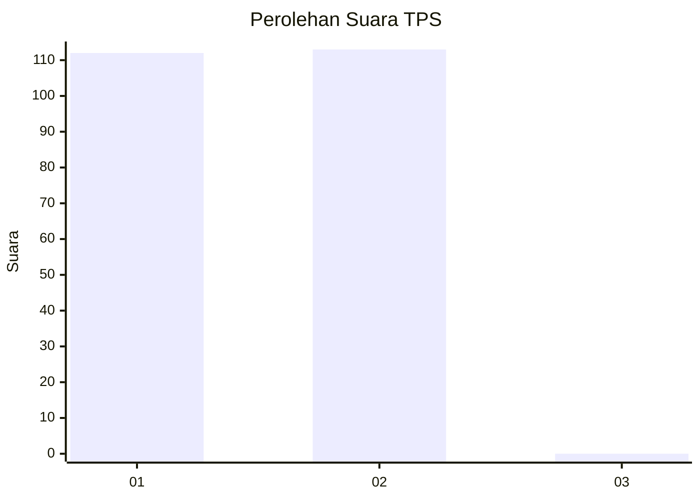
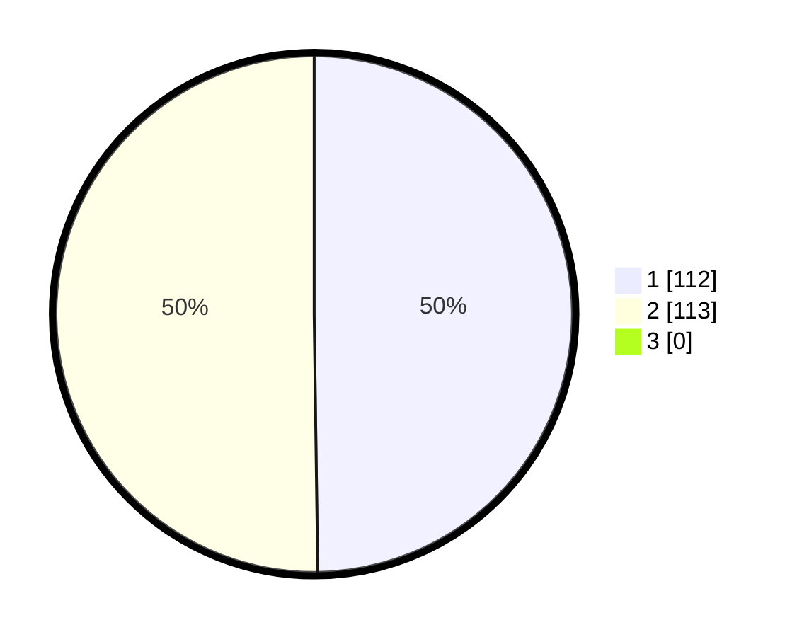

# Hasil

## Grafik

## Tabel

| No. | Nama Paslon    | Suara | Suara (raw) | Persentase |
|:--- |:-------------- | -----:| -----------:| ----------:|
| 1   | ANIES MUHAIMIN | 112   | [112][p-1]  | 49,78      |
| 2   | PRABOWO GIBRAN | 113   | [113][p-2]  | 50,22      |
| 3   | GANJAR MAHFUD  | 0     | [0][p-3]    | 0,00       |

[p-1]: https://github.com/gigit-pemilu/pemilu-2024-32-jawa-barat/blob/main/pilpres/hitung-suara/sub/32-jawa-barat/sub/06-tasikmalaya/sub/02-karangnunggal/sub/2001-cidadap/sub/004-tps/sub/paslon-1.txt
[p-2]: https://github.com/gigit-pemilu/pemilu-2024-32-jawa-barat/blob/main/pilpres/hitung-suara/sub/32-jawa-barat/sub/06-tasikmalaya/sub/02-karangnunggal/sub/2001-cidadap/sub/004-tps/sub/paslon-2.txt
[p-3]: https://github.com/gigit-pemilu/pemilu-2024-32-jawa-barat/blob/main/pilpres/hitung-suara/sub/32-jawa-barat/sub/06-tasikmalaya/sub/02-karangnunggal/sub/2001-cidadap/sub/004-tps/sub/paslon-3.txt

## Foto C Plano

https://sirekap-obj-formc.kpu.go.id/3ac8/pemilu/ppwp/32/06/02/20/01/3206022001004-20240215-173258--b75472e5-7d8b-4a47-90a1-57df9eecc44a.jpg

https://sirekap-obj-formc.kpu.go.id/3ac8/pemilu/ppwp/32/06/02/20/01/3206022001004-20240215-173423--2a9127c2-ffe8-4074-a082-d98ec35f1a59.jpg

https://sirekap-obj-formc.kpu.go.id/3ac8/pemilu/ppwp/32/06/02/20/01/3206022001004-20240215-194435--6dd5b46e-542d-4559-abf5-1959f7f414a9.jpg

## Metadata

| Key        | Value               |
| ---------- | ------------------- |
| Time Stamp | 2024-02-15 20:00:44 |

