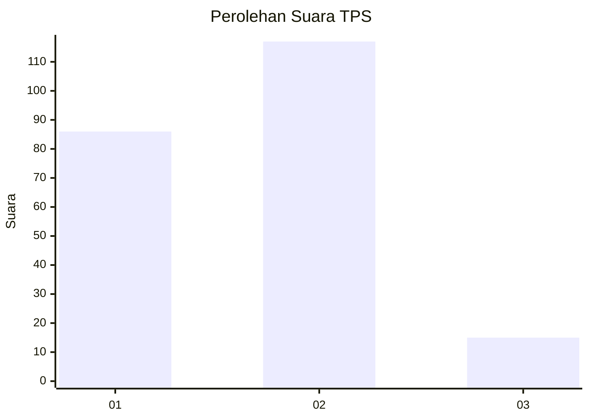

# Hasil

## Grafik

## Tabel

| No. | Nama Paslon    | Suara | Suara (raw) | Persentase |
|:--- |:-------------- | -----:| -----------:| ----------:|
| 1   | ANIES MUHAIMIN | 86    | [86][p-1]   | 39,45      |
| 2   | PRABOWO GIBRAN | 117   | [117][p-2]  | 53,67      |
| 3   | GANJAR MAHFUD  | 15    | [15][p-3]   | 6,88       |

[p-1]: https://github.com/gigit-pemilu/pemilu-2024/blob/main/pilpres/hitung-suara/sub/32-jawa-barat/sub/06-tasikmalaya/sub/03-cikalong/sub/2001-cikalong/sub/005-tps/sub/paslon-1.txt
[p-2]: https://github.com/gigit-pemilu/pemilu-2024/blob/main/pilpres/hitung-suara/sub/32-jawa-barat/sub/06-tasikmalaya/sub/03-cikalong/sub/2001-cikalong/sub/005-tps/sub/paslon-2.txt
[p-3]: https://github.com/gigit-pemilu/pemilu-2024/blob/main/pilpres/hitung-suara/sub/32-jawa-barat/sub/06-tasikmalaya/sub/03-cikalong/sub/2001-cikalong/sub/005-tps/sub/paslon-3.txt

## Foto C Plano

https://sirekap-obj-formc.kpu.go.id/726f/pemilu/ppwp/32/06/03/20/01/3206032001005-20240214-223913--d7e366ec-4b2d-4398-8ed8-a86a4a4432c7.jpg

https://sirekap-obj-formc.kpu.go.id/726f/pemilu/ppwp/32/06/03/20/01/3206032001005-20240214-224154--483d713d-c9bf-4f51-a028-9bbb50654749.jpg

https://sirekap-obj-formc.kpu.go.id/726f/pemilu/ppwp/32/06/03/20/01/3206032001005-20240214-224342--a92a8a2c-9b8e-4fc7-9bc7-589ceaf993d2.jpg

## Metadata

| Key        | Value               |
| ---------- | ------------------- |
| Time Stamp | 2024-02-16 08:00:28 |

