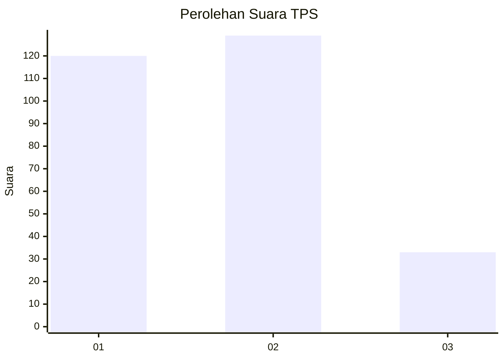
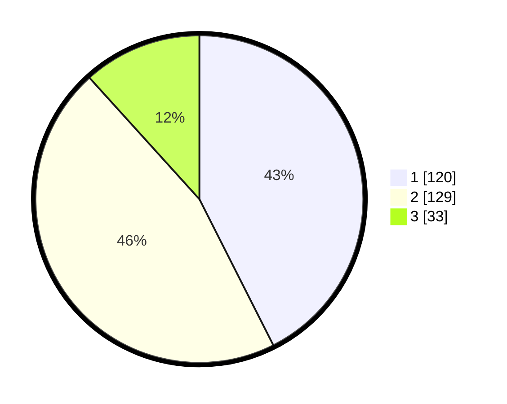

# Hasil

## Grafik

## Tabel

| No. | Nama Paslon    | Suara | Suara (raw) | Persentase |
|:--- |:-------------- | -----:| -----------:| ----------:|
| 1   | ANIES MUHAIMIN | 120   | [120][p-1]  | 42,55      |
| 2   | PRABOWO GIBRAN | 129   | [129][p-2]  | 45,74      |
| 3   | GANJAR MAHFUD  | 33    | [33][p-3]   | 11,70      |

[p-1]: https://github.com/gigit-pemilu/pemilu-2024-32-jawa-barat/blob/main/pilpres/hitung-suara/sub/32-jawa-barat/sub/06-tasikmalaya/sub/03-cikalong/sub/2007-cikadu/sub/005-tps/sub/paslon-1.txt
[p-2]: https://github.com/gigit-pemilu/pemilu-2024-32-jawa-barat/blob/main/pilpres/hitung-suara/sub/32-jawa-barat/sub/06-tasikmalaya/sub/03-cikalong/sub/2007-cikadu/sub/005-tps/sub/paslon-2.txt
[p-3]: https://github.com/gigit-pemilu/pemilu-2024-32-jawa-barat/blob/main/pilpres/hitung-suara/sub/32-jawa-barat/sub/06-tasikmalaya/sub/03-cikalong/sub/2007-cikadu/sub/005-tps/sub/paslon-3.txt

## Foto C Plano

https://sirekap-obj-formc.kpu.go.id/33b8/pemilu/ppwp/32/06/03/20/07/3206032007005-20240215-041202--0d4fe378-1d3d-49d5-8e77-6dc877b165cb.jpg

https://sirekap-obj-formc.kpu.go.id/33b8/pemilu/ppwp/32/06/03/20/07/3206032007005-20240214-211834--c35f02c3-dd78-4d05-9078-b1bf45d33479.jpg

https://sirekap-obj-formc.kpu.go.id/33b8/pemilu/ppwp/32/06/03/20/07/3206032007005-20240214-212055--a63e286c-bc66-423a-84ca-e92279adfdff.jpg

## Metadata

| Key        | Value               |
| ---------- | ------------------- |
| Time Stamp | 2024-02-15 20:30:46 |

