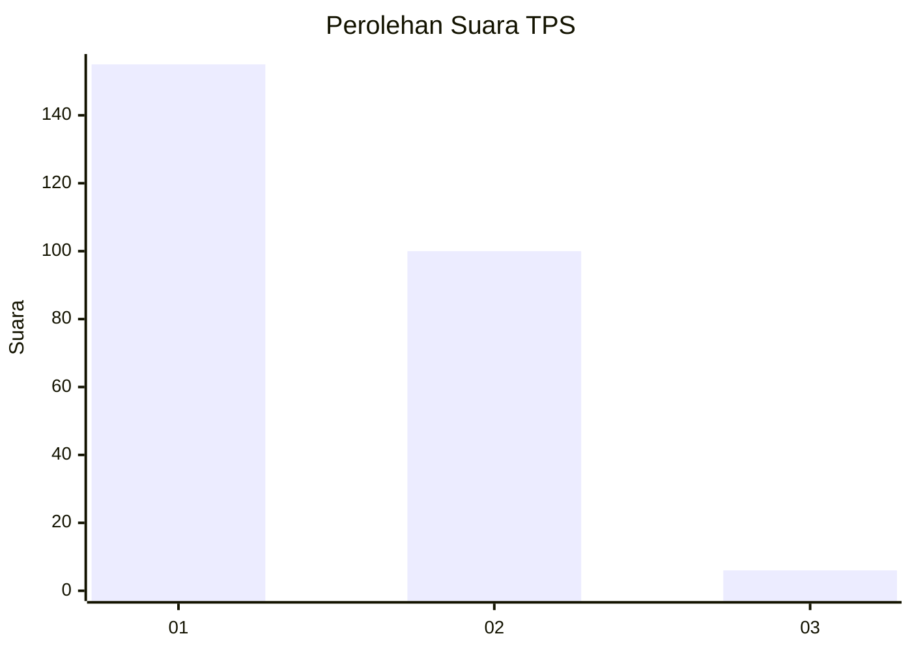
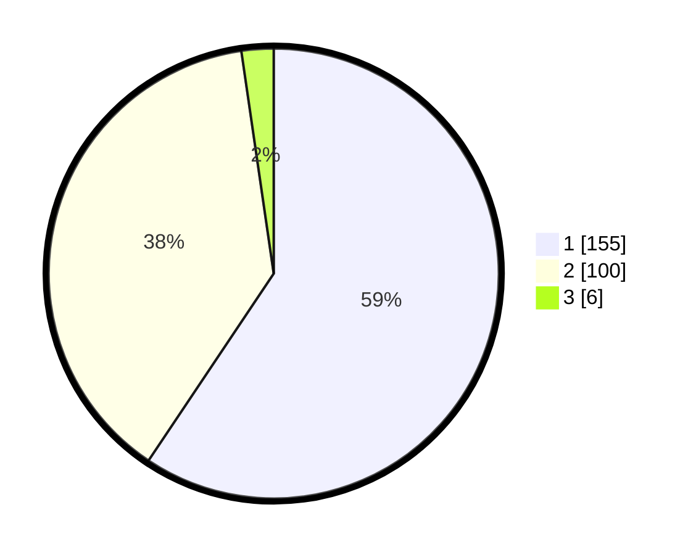

# Hasil

## Grafik

## Tabel

| No. | Nama Paslon    | Suara | Suara (raw) | Persentase |
|:--- |:-------------- | -----:| -----------:| ----------:|
| 1   | ANIES MUHAIMIN | 155   | [155][p-1]  | 59,39      |
| 2   | PRABOWO GIBRAN | 100   | [100][p-2]  | 38,31      |
| 3   | GANJAR MAHFUD  | 6     | [6][p-3]    | 2,30       |

[p-1]: https://github.com/gigit-pemilu/pemilu-2024/blob/main/pilpres/hitung-suara/sub/32-jawa-barat/sub/06-tasikmalaya/sub/03-cikalong/sub/2007-cikadu/sub/008-tps/sub/paslon-1.txt
[p-2]: https://github.com/gigit-pemilu/pemilu-2024/blob/main/pilpres/hitung-suara/sub/32-jawa-barat/sub/06-tasikmalaya/sub/03-cikalong/sub/2007-cikadu/sub/008-tps/sub/paslon-2.txt
[p-3]: https://github.com/gigit-pemilu/pemilu-2024/blob/main/pilpres/hitung-suara/sub/32-jawa-barat/sub/06-tasikmalaya/sub/03-cikalong/sub/2007-cikadu/sub/008-tps/sub/paslon-3.txt

## Foto C Plano

https://sirekap-obj-formc.kpu.go.id/4e89/pemilu/ppwp/32/06/03/20/07/3206032007008-20240214-162238--abf98f5d-d928-4f35-b6c9-d4ca0ef1383d.jpg

https://sirekap-obj-formc.kpu.go.id/4e89/pemilu/ppwp/32/06/03/20/07/3206032007008-20240215-080744--020decbf-4761-4b4c-af0f-04d22289d944.jpg

https://sirekap-obj-formc.kpu.go.id/4e89/pemilu/ppwp/32/06/03/20/07/3206032007008-20240215-080909--f239cc21-86dc-4acd-9562-6b35417c8e3f.jpg

## Metadata

| Key        | Value               |
| ---------- | ------------------- |
| Time Stamp | 2024-02-16 14:00:34 |

