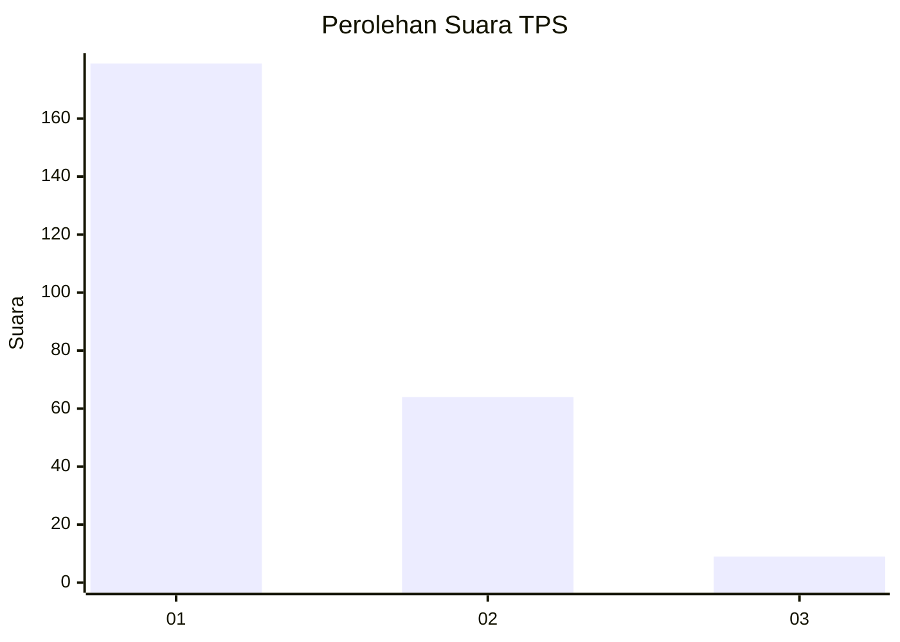
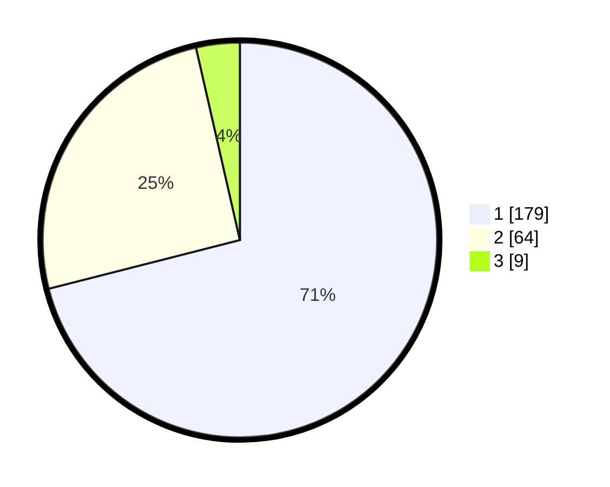

# Hasil

## Grafik

## Tabel

| No. | Nama Paslon    | Suara | Suara (raw) | Persentase |
|:--- |:-------------- | -----:| -----------:| ----------:|
| 1   | ANIES MUHAIMIN | 179   | [179][p-1]  | 71,03      |
| 2   | PRABOWO GIBRAN | 64    | [64][p-2]   | 25,40      |
| 3   | GANJAR MAHFUD  | 9     | [9][p-3]    | 3,57       |

[p-1]: https://github.com/gigit-pemilu/pemilu-2024-32-jawa-barat/blob/main/pilpres/hitung-suara/sub/32-jawa-barat/sub/06-tasikmalaya/sub/04-pancatengah/sub/2009-margaluyu/sub/005-tps/sub/paslon-1.txt
[p-2]: https://github.com/gigit-pemilu/pemilu-2024-32-jawa-barat/blob/main/pilpres/hitung-suara/sub/32-jawa-barat/sub/06-tasikmalaya/sub/04-pancatengah/sub/2009-margaluyu/sub/005-tps/sub/paslon-2.txt
[p-3]: https://github.com/gigit-pemilu/pemilu-2024-32-jawa-barat/blob/main/pilpres/hitung-suara/sub/32-jawa-barat/sub/06-tasikmalaya/sub/04-pancatengah/sub/2009-margaluyu/sub/005-tps/sub/paslon-3.txt

## Foto C Plano

https://sirekap-obj-formc.kpu.go.id/bce2/pemilu/ppwp/32/06/04/20/09/3206042009005-20240215-190118--7510f846-469b-4010-ad63-2df55730d9e8.jpg

https://sirekap-obj-formc.kpu.go.id/bce2/pemilu/ppwp/32/06/04/20/09/3206042009005-20240214-213242--7839651c-2470-4bf9-bd43-932c4f0cb1c2.jpg

https://sirekap-obj-formc.kpu.go.id/bce2/pemilu/ppwp/32/06/04/20/09/3206042009005-20240214-213248--cd9d3643-2ffe-4ba8-87d1-14ab686d2e33.jpg

## Metadata

| Key        | Value               |
| ---------- | ------------------- |
| Time Stamp | 2024-02-19 06:16:00 |

