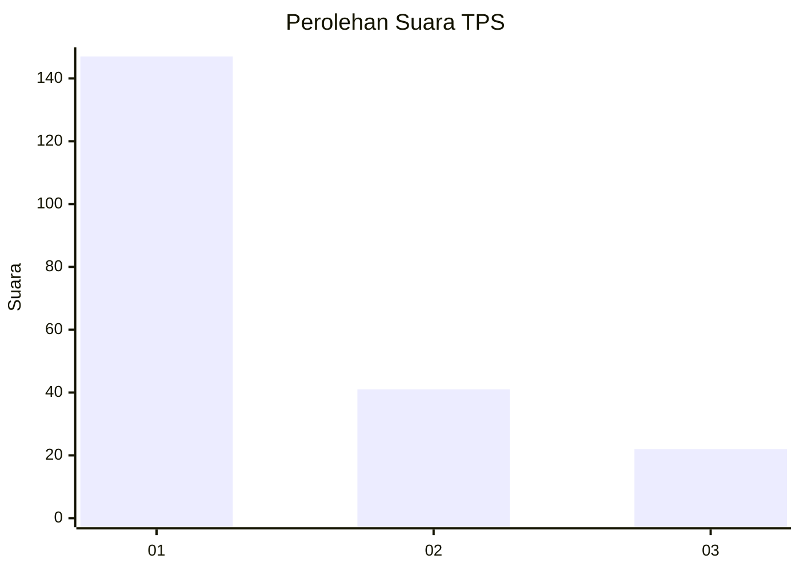
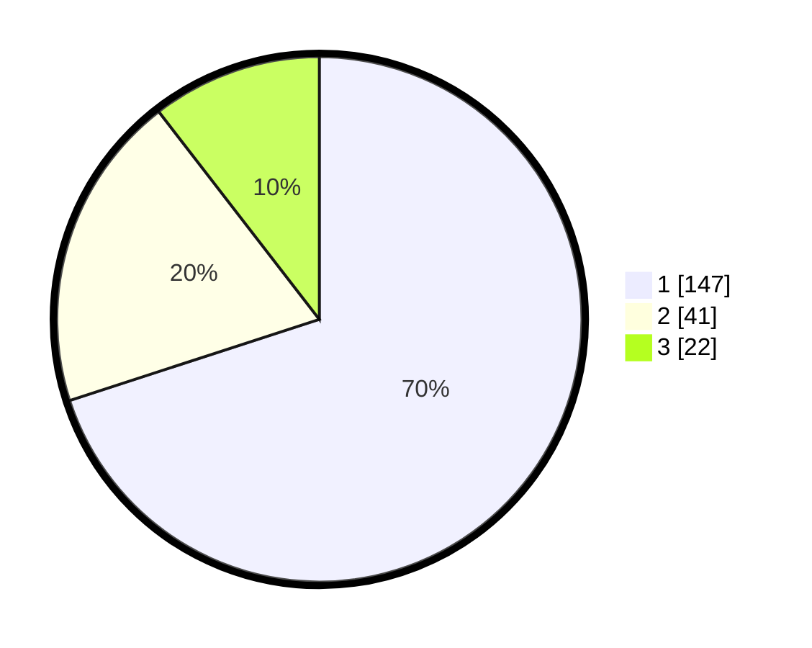

# Hasil

## Grafik

## Tabel

| No. | Nama Paslon    | Suara | Suara (raw) | Persentase |
|:--- |:-------------- | -----:| -----------:| ----------:|
| 1   | ANIES MUHAIMIN | 147   | [147][p-1]  | 70,00      |
| 2   | PRABOWO GIBRAN | 41    | [41][p-2]   | 19,52      |
| 3   | GANJAR MAHFUD  | 22    | [22][p-3]   | 10,48      |

[p-1]: https://github.com/gigit-pemilu/pemilu-2024/blob/main/pilpres/hitung-suara/sub/32-jawa-barat/sub/06-tasikmalaya/sub/05-cikatomas/sub/2004-cogreg/sub/015-tps/sub/paslon-1.txt
[p-2]: https://github.com/gigit-pemilu/pemilu-2024/blob/main/pilpres/hitung-suara/sub/32-jawa-barat/sub/06-tasikmalaya/sub/05-cikatomas/sub/2004-cogreg/sub/015-tps/sub/paslon-2.txt
[p-3]: https://github.com/gigit-pemilu/pemilu-2024/blob/main/pilpres/hitung-suara/sub/32-jawa-barat/sub/06-tasikmalaya/sub/05-cikatomas/sub/2004-cogreg/sub/015-tps/sub/paslon-3.txt

## Foto C Plano

https://sirekap-obj-formc.kpu.go.id/43ca/pemilu/ppwp/32/06/05/20/04/3206052004015-20240219-204136--bad73c5a-3f2b-41ca-9483-c79c2564bceb.jpg

https://sirekap-obj-formc.kpu.go.id/43ca/pemilu/ppwp/32/06/05/20/04/3206052004015-20240219-204305--81aac2be-f6c5-42d1-b346-cdf3c6ed856f.jpg

https://sirekap-obj-formc.kpu.go.id/43ca/pemilu/ppwp/32/06/05/20/04/3206052004015-20240219-204616--b4d85bd1-ae35-40ca-975a-78f948072bd4.jpg

## Metadata

| Key        | Value               |
| ---------- | ------------------- |
| Time Stamp | 2024-02-19 21:00:00 |

## DATA PEMILIH TETAP

Jumlah pemilih dalam DPT: **283**.
 * L: **849**.
 * P: **838**.

## DATA PENGGUNA HAK PILIH

Jumlah pengguna hak pilih dalam DPT: **240**.
 * L: **888**.
 * P: **823**.

Jumlah pengguna hak pilih dalam DPTb: **888**.
 * L: **88**.
 * P: **88**.

Jumlah pengguna hak pilih dalam DPK: **3**.
 * L: **888**.
 * P: **88**.

Jumlah pengguna hak pilih: **247**.
 * L: **387**.
 * P: **438**.

## JUMLAH SUARA SAH DAN TIDAK SAH

JUMLAH SELURUH SUARA SAH: **246**.

JUMLAH SUARA TIDAK SAH: **88**.

JUMLAH SELURUH SUARA SAH DAN SUARA TIDAK SAH: **247**.

