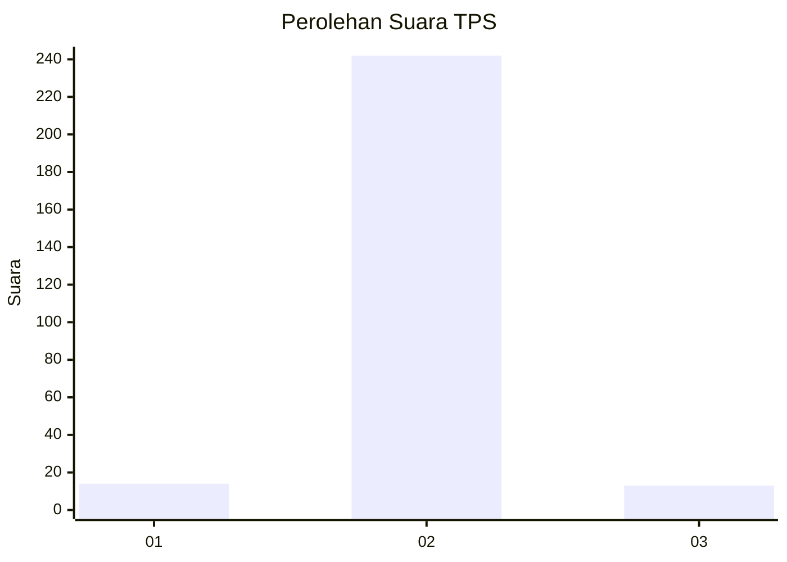
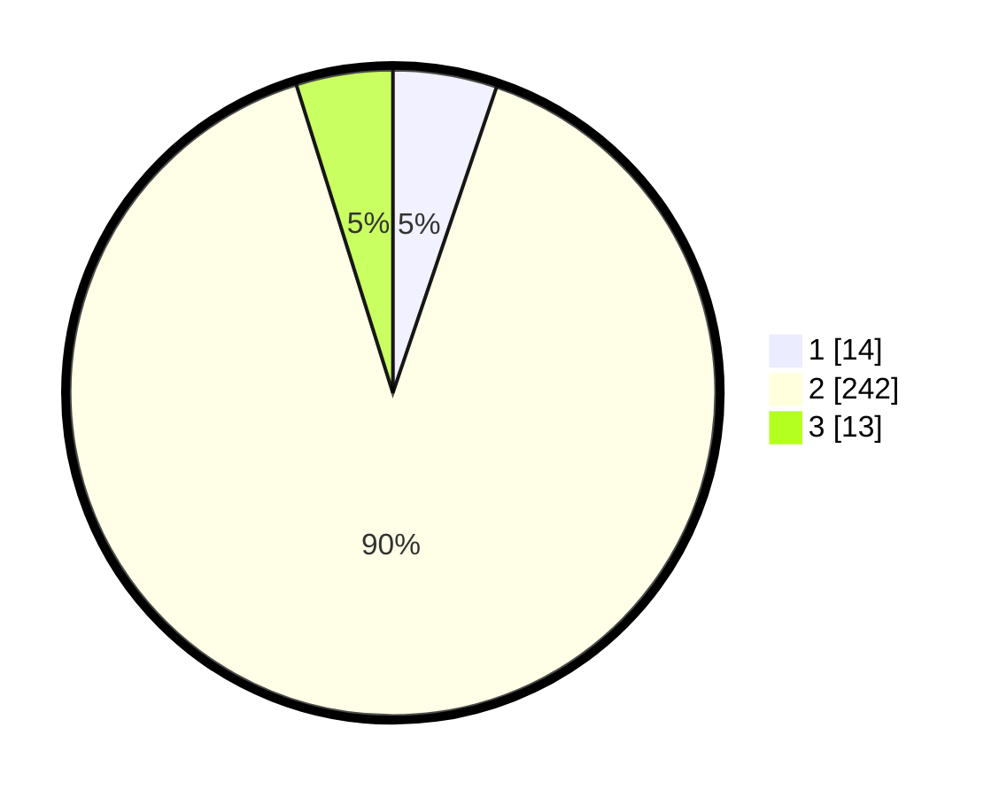

# Hasil

## Grafik

## Tabel

| No. | Nama Paslon    | Suara | Suara (raw) | Persentase |
|:--- |:-------------- | -----:| -----------:| ----------:|
| 1   | ANIES MUHAIMIN | 14    | [14][p-1]   | 5,20       |
| 2   | PRABOWO GIBRAN | 242   | [242][p-2]  | 89,96      |
| 3   | GANJAR MAHFUD  | 13    | [13][p-3]   | 4,83       |

[p-1]: https://github.com/gigit-pemilu/pemilu-2024/blob/main/pilpres/hitung-suara/sub/32-jawa-barat/sub/06-tasikmalaya/sub/06-cibalong/sub/2002-setiawaras/sub/016-tps/sub/paslon-1.txt
[p-2]: https://github.com/gigit-pemilu/pemilu-2024/blob/main/pilpres/hitung-suara/sub/32-jawa-barat/sub/06-tasikmalaya/sub/06-cibalong/sub/2002-setiawaras/sub/016-tps/sub/paslon-2.txt
[p-3]: https://github.com/gigit-pemilu/pemilu-2024/blob/main/pilpres/hitung-suara/sub/32-jawa-barat/sub/06-tasikmalaya/sub/06-cibalong/sub/2002-setiawaras/sub/016-tps/sub/paslon-3.txt

## Foto C Plano

https://sirekap-obj-formc.kpu.go.id/2e32/pemilu/ppwp/32/06/06/20/02/3206062002016-20240218-194756--49609bd9-3946-4467-9d09-dfb62954a409.jpg

https://sirekap-obj-formc.kpu.go.id/2e32/pemilu/ppwp/32/06/06/20/02/3206062002016-20240218-194847--52b3742a-679d-49ea-ae14-006e3e3412aa.jpg

https://sirekap-obj-formc.kpu.go.id/2e32/pemilu/ppwp/32/06/06/20/02/3206062002016-20240214-190944--5e148878-2c67-463c-8078-592d9f19b047.jpg

## Metadata

| Key        | Value               |
| ---------- | ------------------- |
| Time Stamp | 2024-02-19 06:16:00 |

