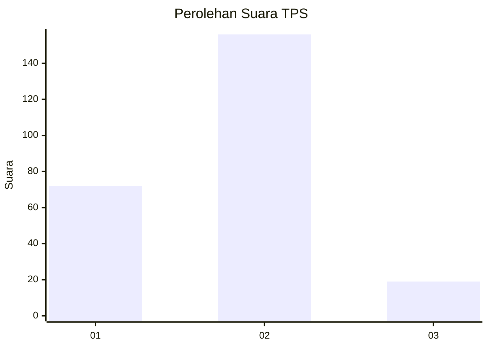
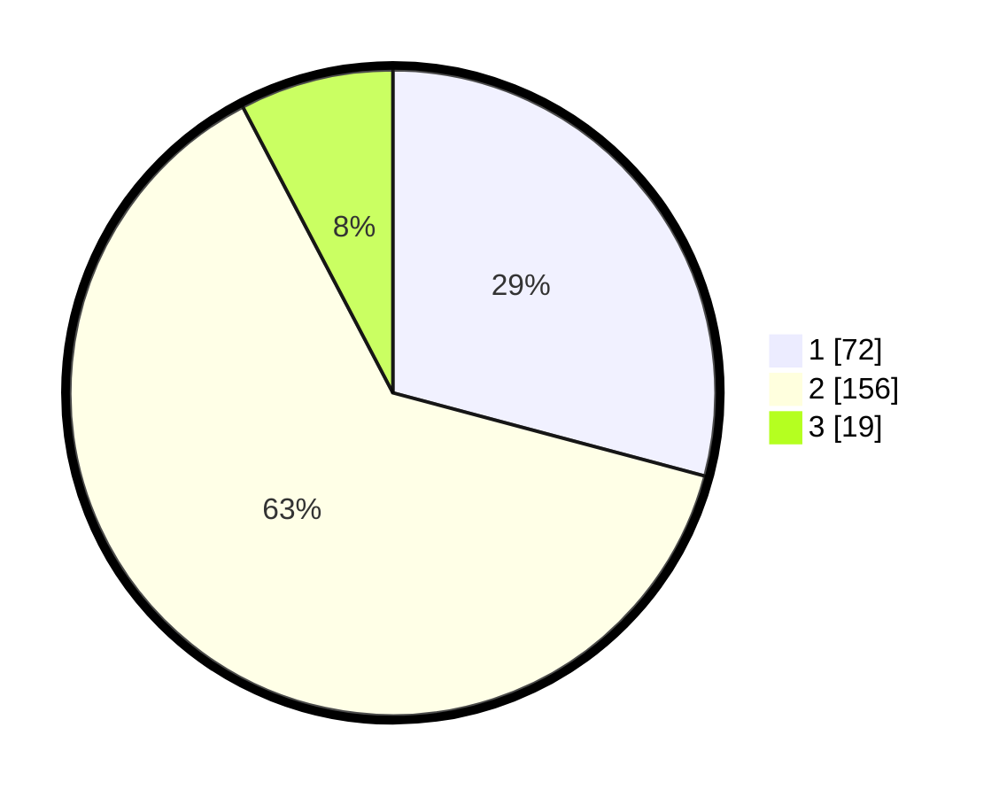

# Hasil

## Grafik

## Tabel

| No. | Nama Paslon    | Suara | Suara (raw) | Persentase |
|:--- |:-------------- | -----:| -----------:| ----------:|
| 1   | ANIES MUHAIMIN | 72    | [72][p-1]   | 29,15      |
| 2   | PRABOWO GIBRAN | 156   | [156][p-2]  | 63,16      |
| 3   | GANJAR MAHFUD  | 19    | [19][p-3]   | 7,69       |

[p-1]: https://github.com/gigit-pemilu/pemilu-2024-32-jawa-barat/blob/main/pilpres/hitung-suara/sub/32-jawa-barat/sub/06-tasikmalaya/sub/07-parungponteng/sub/2001-parungponteng/sub/001-tps/sub/paslon-1.txt
[p-2]: https://github.com/gigit-pemilu/pemilu-2024-32-jawa-barat/blob/main/pilpres/hitung-suara/sub/32-jawa-barat/sub/06-tasikmalaya/sub/07-parungponteng/sub/2001-parungponteng/sub/001-tps/sub/paslon-2.txt
[p-3]: https://github.com/gigit-pemilu/pemilu-2024-32-jawa-barat/blob/main/pilpres/hitung-suara/sub/32-jawa-barat/sub/06-tasikmalaya/sub/07-parungponteng/sub/2001-parungponteng/sub/001-tps/sub/paslon-3.txt

## Foto C Plano

https://sirekap-obj-formc.kpu.go.id/cc4a/pemilu/ppwp/32/06/07/20/01/3206072001001-20240215-074859--f4a5cd1d-b8d2-4a19-b444-de75b9b0af08.jpg

https://sirekap-obj-formc.kpu.go.id/cc4a/pemilu/ppwp/32/06/07/20/01/3206072001001-20240215-075011--75476ed4-044f-4c50-8a3a-2f05a53e7ad1.jpg

https://sirekap-obj-formc.kpu.go.id/cc4a/pemilu/ppwp/32/06/07/20/01/3206072001001-20240215-075124--5fe7081d-7fc2-4597-9c71-f2c732e3e317.jpg

## Metadata

| Key        | Value               |
| ---------- | ------------------- |
| Time Stamp | 2024-02-16 05:00:26 |

