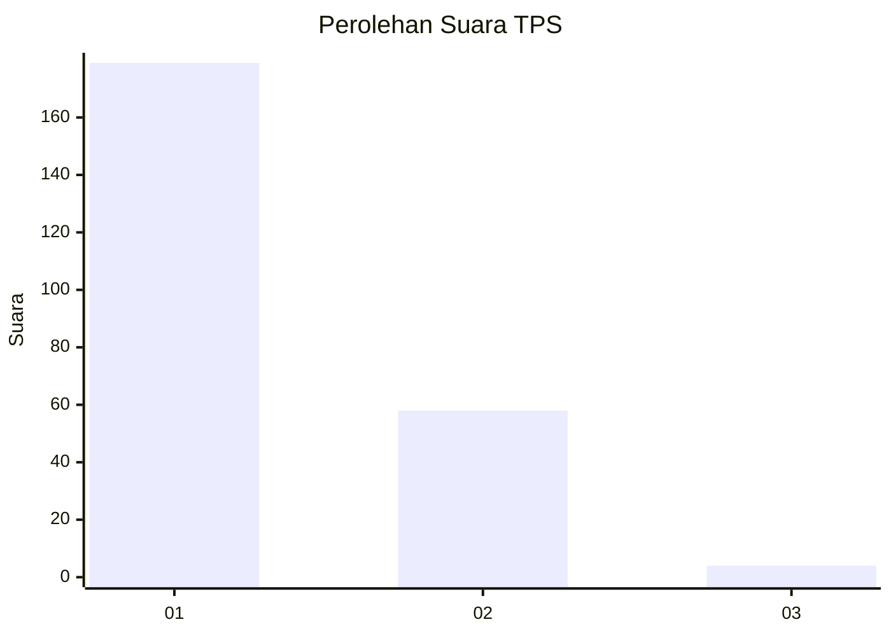
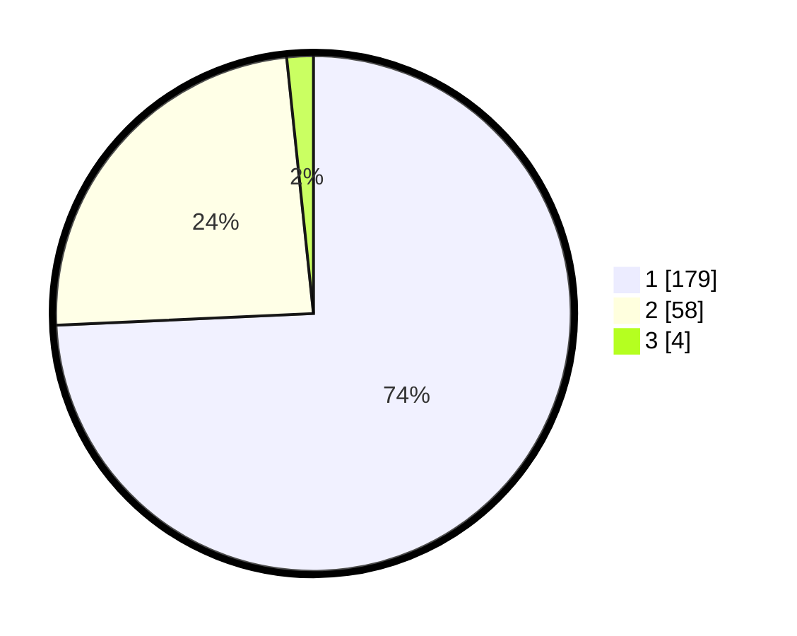

# Hasil

## Grafik

## Tabel

| No. | Nama Paslon    | Suara | Suara (raw) | Persentase |
|:--- |:-------------- | -----:| -----------:| ----------:|
| 1   | ANIES MUHAIMIN | 179   | [179][p-1]  | 74,27      |
| 2   | PRABOWO GIBRAN | 58    | [58][p-2]   | 24,07      |
| 3   | GANJAR MAHFUD  | 4     | [4][p-3]    | 1,66       |

[p-1]: https://github.com/gigit-pemilu/pemilu-2024/blob/main/pilpres/hitung-suara/sub/32-jawa-barat/sub/06-tasikmalaya/sub/08-bantarkalong/sub/2004-sukamaju/sub/011-tps/sub/paslon-1.txt
[p-2]: https://github.com/gigit-pemilu/pemilu-2024/blob/main/pilpres/hitung-suara/sub/32-jawa-barat/sub/06-tasikmalaya/sub/08-bantarkalong/sub/2004-sukamaju/sub/011-tps/sub/paslon-2.txt
[p-3]: https://github.com/gigit-pemilu/pemilu-2024/blob/main/pilpres/hitung-suara/sub/32-jawa-barat/sub/06-tasikmalaya/sub/08-bantarkalong/sub/2004-sukamaju/sub/011-tps/sub/paslon-3.txt

## Foto C Plano

https://sirekap-obj-formc.kpu.go.id/a5a1/pemilu/ppwp/32/06/08/20/04/3206082004011-20240219-221125--5e7eacdd-2560-4444-bc47-20b79a58887c.jpg

https://sirekap-obj-formc.kpu.go.id/a5a1/pemilu/ppwp/32/06/08/20/04/3206082004011-20240219-192738--64295e7d-e210-4a98-b936-9b4c305c97dd.jpg

https://sirekap-obj-formc.kpu.go.id/a5a1/pemilu/ppwp/32/06/08/20/04/3206082004011-20240219-192843--3baa5d6e-0a08-478b-9c68-8d7dbab17e2a.jpg

## Metadata

| Key        | Value               |
| ---------- | ------------------- |
| Time Stamp | 2024-02-19 23:00:00 |

