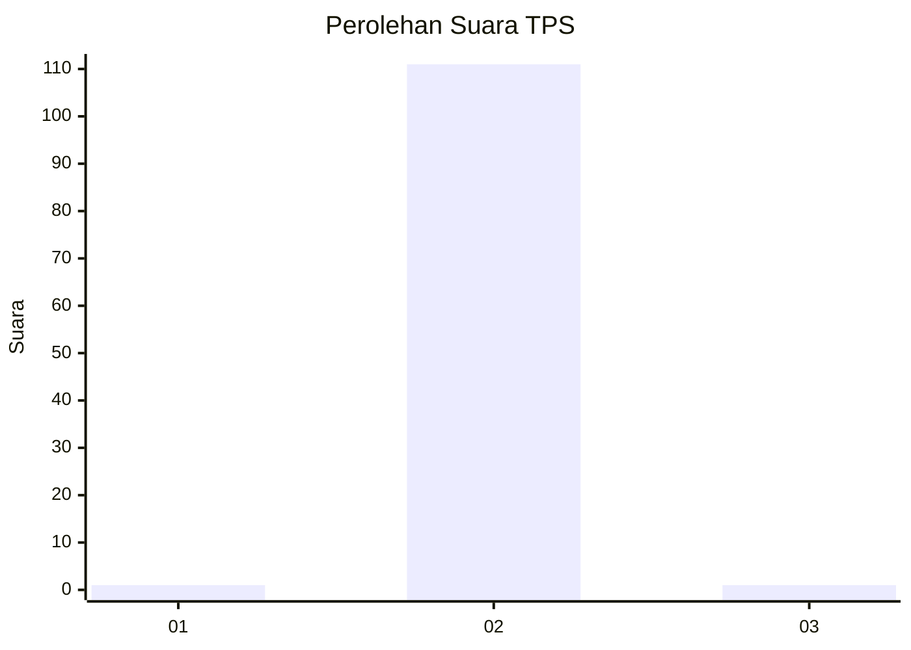
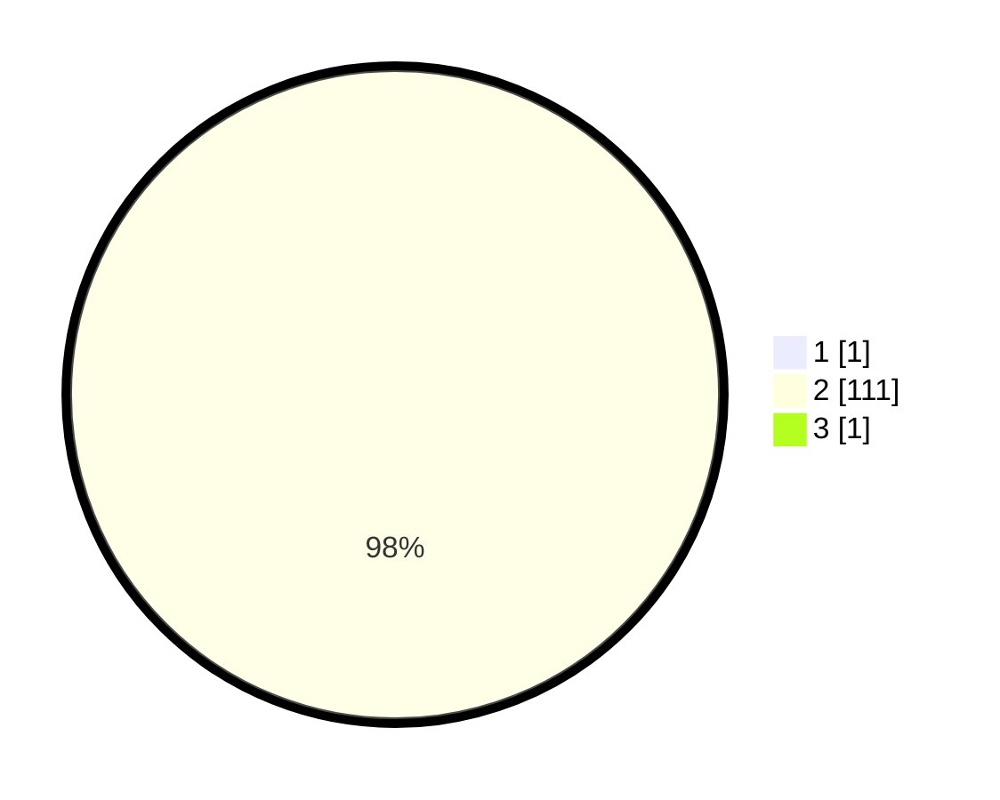

# Hasil

## Grafik

## Tabel

| No. | Nama Paslon    | Suara | Suara (raw) | Persentase |
|:--- |:-------------- | -----:| -----------:| ----------:|
| 1   | ANIES MUHAIMIN | 1     | [1][p-1]    | 0,88       |
| 2   | PRABOWO GIBRAN | 111   | [111][p-2]  | 98,23      |
| 3   | GANJAR MAHFUD  | 1     | [1][p-3]    | 0,88       |

[p-1]: https://github.com/gigit-pemilu/pemilu-2024/blob/main/pilpres/hitung-suara/sub/32-jawa-barat/sub/06-tasikmalaya/sub/08-bantarkalong/sub/2008-sirnagalih/sub/009-tps/sub/paslon-1.txt
[p-2]: https://github.com/gigit-pemilu/pemilu-2024/blob/main/pilpres/hitung-suara/sub/32-jawa-barat/sub/06-tasikmalaya/sub/08-bantarkalong/sub/2008-sirnagalih/sub/009-tps/sub/paslon-2.txt
[p-3]: https://github.com/gigit-pemilu/pemilu-2024/blob/main/pilpres/hitung-suara/sub/32-jawa-barat/sub/06-tasikmalaya/sub/08-bantarkalong/sub/2008-sirnagalih/sub/009-tps/sub/paslon-3.txt

## Foto C Plano

https://sirekap-obj-formc.kpu.go.id/b4ee/pemilu/ppwp/32/06/08/20/08/3206082008009-20240219-193618--c3457118-3a38-45ea-804f-6834855aabcb.jpg

https://sirekap-obj-formc.kpu.go.id/b4ee/pemilu/ppwp/32/06/08/20/08/3206082008009-20240220-075431--36af1ba2-5ec7-4606-a514-d4f270166c9a.jpg

https://sirekap-obj-formc.kpu.go.id/b4ee/pemilu/ppwp/32/06/08/20/08/3206082008009-20240220-075530--c23cd665-3546-4ac8-a989-506215b9541b.jpg

## Metadata

| Key        | Value               |
| ---------- | ------------------- |
| Time Stamp | 2024-02-20 08:00:00 |

## DATA PEMILIH TETAP

Jumlah pemilih dalam DPT: **252**.
 * L: **129**.
 * P: **123**.

## DATA PENGGUNA HAK PILIH

Jumlah pengguna hak pilih dalam DPT: **183**.
 * L: **287**.
 * P: **296**.

Jumlah pengguna hak pilih dalam DPTb: **0**.
 * L: **480**.
 * P: **8**.

Jumlah pengguna hak pilih dalam DPK: **408**.
 * L: **80**.
 * P: **802**.

Jumlah pengguna hak pilih: **183**.
 * L: **4**.
 * P: **800**.

## JUMLAH SUARA SAH DAN TIDAK SAH

JUMLAH SELURUH SUARA SAH: **0**.

JUMLAH SUARA TIDAK SAH: **222**.

JUMLAH SELURUH SUARA SAH DAN SUARA TIDAK SAH: **522**.

