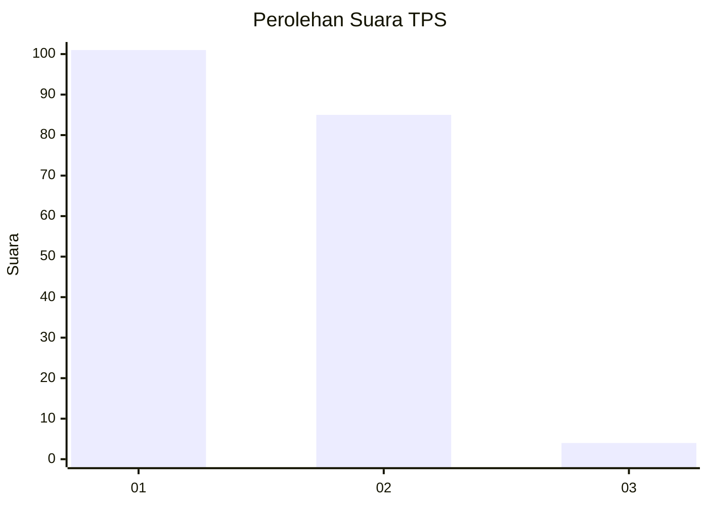
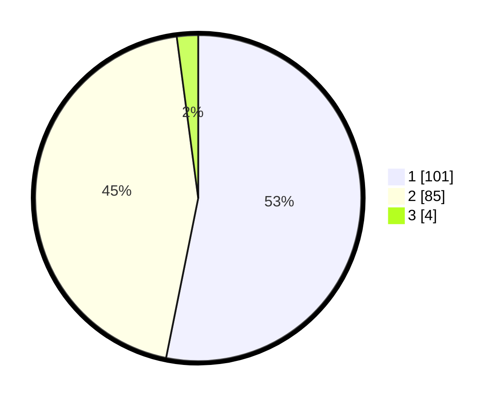

# Hasil

## Grafik

## Tabel

| No. | Nama Paslon    | Suara | Suara (raw) | Persentase |
|:--- |:-------------- | -----:| -----------:| ----------:|
| 1   | ANIES MUHAIMIN | 101   | [101][p-1]  | 53,16      |
| 2   | PRABOWO GIBRAN | 85    | [85][p-2]   | 44,74      |
| 3   | GANJAR MAHFUD  | 4     | [4][p-3]    | 2,11       |

[p-1]: https://github.com/gigit-pemilu/pemilu-2024/blob/main/pilpres/hitung-suara/sub/32-jawa-barat/sub/06-tasikmalaya/sub/09-bojongasih/sub/2001-mertajaya/sub/004-tps/sub/paslon-1.txt
[p-2]: https://github.com/gigit-pemilu/pemilu-2024/blob/main/pilpres/hitung-suara/sub/32-jawa-barat/sub/06-tasikmalaya/sub/09-bojongasih/sub/2001-mertajaya/sub/004-tps/sub/paslon-2.txt
[p-3]: https://github.com/gigit-pemilu/pemilu-2024/blob/main/pilpres/hitung-suara/sub/32-jawa-barat/sub/06-tasikmalaya/sub/09-bojongasih/sub/2001-mertajaya/sub/004-tps/sub/paslon-3.txt

## Foto C Plano

https://sirekap-obj-formc.kpu.go.id/1372/pemilu/ppwp/32/06/09/20/01/3206092001004-20240214-230539--81075f11-a7a9-4947-9bb2-4e15fdeb3ee3.jpg

https://sirekap-obj-formc.kpu.go.id/1372/pemilu/ppwp/32/06/09/20/01/3206092001004-20240214-231533--f053710c-2b11-4afc-8ff7-08b39a839e2c.jpg

https://sirekap-obj-formc.kpu.go.id/1372/pemilu/ppwp/32/06/09/20/01/3206092001004-20240214-231630--46da2dd9-767e-43f7-925b-6ca746792e6e.jpg

## Metadata

| Key        | Value               |
| ---------- | ------------------- |
| Time Stamp | 2024-02-16 14:00:34 |

