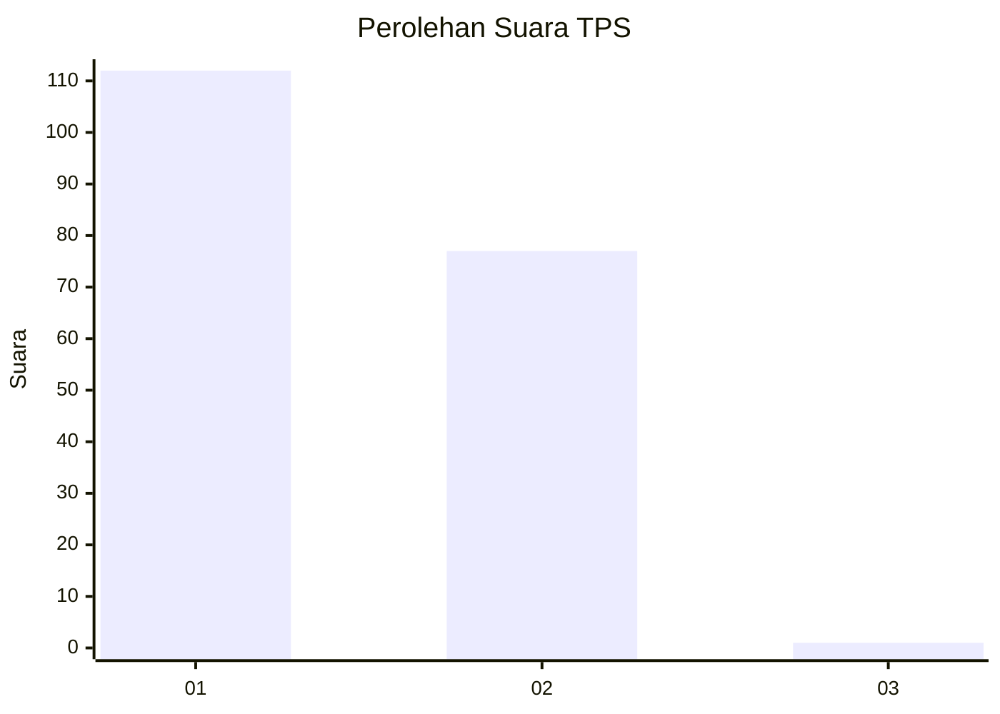
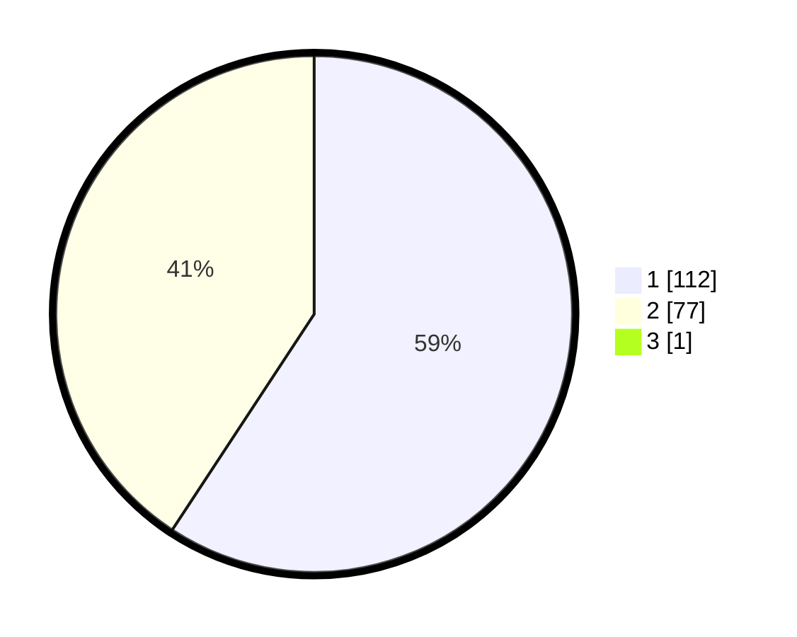

# Hasil

## Grafik

## Tabel

| No. | Nama Paslon    | Suara | Suara (raw) | Persentase |
|:--- |:-------------- | -----:| -----------:| ----------:|
| 1   | ANIES MUHAIMIN | 112   | [112][p-1]  | 58,95      |
| 2   | PRABOWO GIBRAN | 77    | [77][p-2]   | 40,53      |
| 3   | GANJAR MAHFUD  | 1     | [1][p-3]    | 0,53       |

[p-1]: https://github.com/gigit-pemilu/pemilu-2024/blob/main/pilpres/hitung-suara/sub/32-jawa-barat/sub/06-tasikmalaya/sub/09-bojongasih/sub/2001-mertajaya/sub/005-tps/sub/paslon-1.txt
[p-2]: https://github.com/gigit-pemilu/pemilu-2024/blob/main/pilpres/hitung-suara/sub/32-jawa-barat/sub/06-tasikmalaya/sub/09-bojongasih/sub/2001-mertajaya/sub/005-tps/sub/paslon-2.txt
[p-3]: https://github.com/gigit-pemilu/pemilu-2024/blob/main/pilpres/hitung-suara/sub/32-jawa-barat/sub/06-tasikmalaya/sub/09-bojongasih/sub/2001-mertajaya/sub/005-tps/sub/paslon-3.txt

## Foto C Plano

https://sirekap-obj-formc.kpu.go.id/7be5/pemilu/ppwp/32/06/09/20/01/3206092001005-20240215-030017--ea861726-ab27-43bf-a6b4-0ae7d31dbe6c.jpg

https://sirekap-obj-formc.kpu.go.id/7be5/pemilu/ppwp/32/06/09/20/01/3206092001005-20240216-150531--3b7b7fd6-62d0-465e-b9d9-b45e9526cc1d.jpg

https://sirekap-obj-formc.kpu.go.id/7be5/pemilu/ppwp/32/06/09/20/01/3206092001005-20240215-030806--adb23782-dfce-4a91-89e9-a0f6158d81a9.jpg

## Metadata

| Key        | Value               |
| ---------- | ------------------- |
| Time Stamp | 2024-02-17 00:28:35 |

