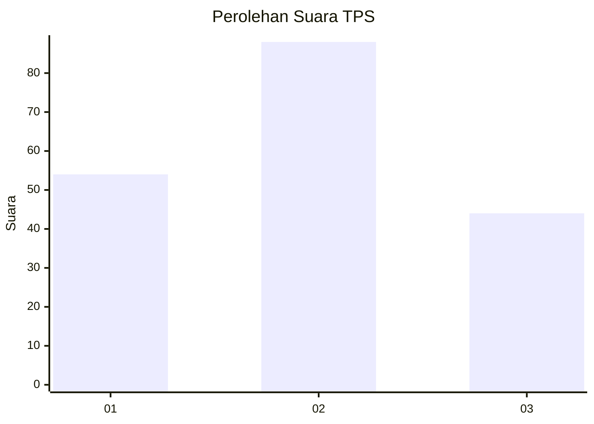
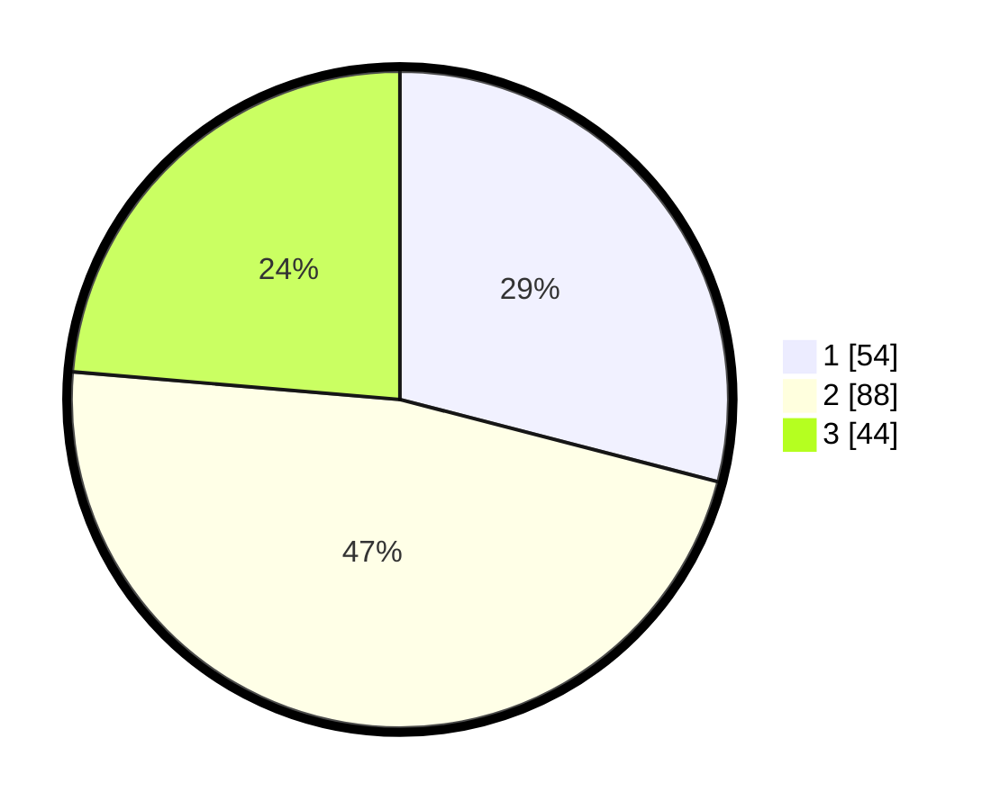

# Hasil

## Grafik

## Tabel

| No. | Nama Paslon    | Suara | Suara (raw) | Persentase |
|:--- |:-------------- | -----:| -----------:| ----------:|
| 1   | ANIES MUHAIMIN | 54    | [54][p-1]   | 29,03      |
| 2   | PRABOWO GIBRAN | 88    | [88][p-2]   | 47,31      |
| 3   | GANJAR MAHFUD  | 44    | [44][p-3]   | 23,66      |

[p-1]: https://github.com/gigit-pemilu/pemilu-2024-32-jawa-barat/blob/main/pilpres/hitung-suara/sub/32-jawa-barat/sub/06-tasikmalaya/sub/10-culamega/sub/2001-cikuya/sub/001-tps/sub/paslon-1.txt
[p-2]: https://github.com/gigit-pemilu/pemilu-2024-32-jawa-barat/blob/main/pilpres/hitung-suara/sub/32-jawa-barat/sub/06-tasikmalaya/sub/10-culamega/sub/2001-cikuya/sub/001-tps/sub/paslon-2.txt
[p-3]: https://github.com/gigit-pemilu/pemilu-2024-32-jawa-barat/blob/main/pilpres/hitung-suara/sub/32-jawa-barat/sub/06-tasikmalaya/sub/10-culamega/sub/2001-cikuya/sub/001-tps/sub/paslon-3.txt

## Foto C Plano

https://sirekap-obj-formc.kpu.go.id/8605/pemilu/ppwp/32/06/10/20/01/3206102001001-20240215-104308--378a397f-1e0c-483e-ae05-889d1705fdad.jpg

https://sirekap-obj-formc.kpu.go.id/8605/pemilu/ppwp/32/06/10/20/01/3206102001001-20240215-104335--03fc0bf5-1d98-4c70-a8ab-094d4920c782.jpg

https://sirekap-obj-formc.kpu.go.id/8605/pemilu/ppwp/32/06/10/20/01/3206102001001-20240215-104352--bf28bde6-c439-41cd-8fe2-7338ab897424.jpg

## Metadata

| Key        | Value               |
| ---------- | ------------------- |
| Time Stamp | 2024-02-15 15:00:29 |

