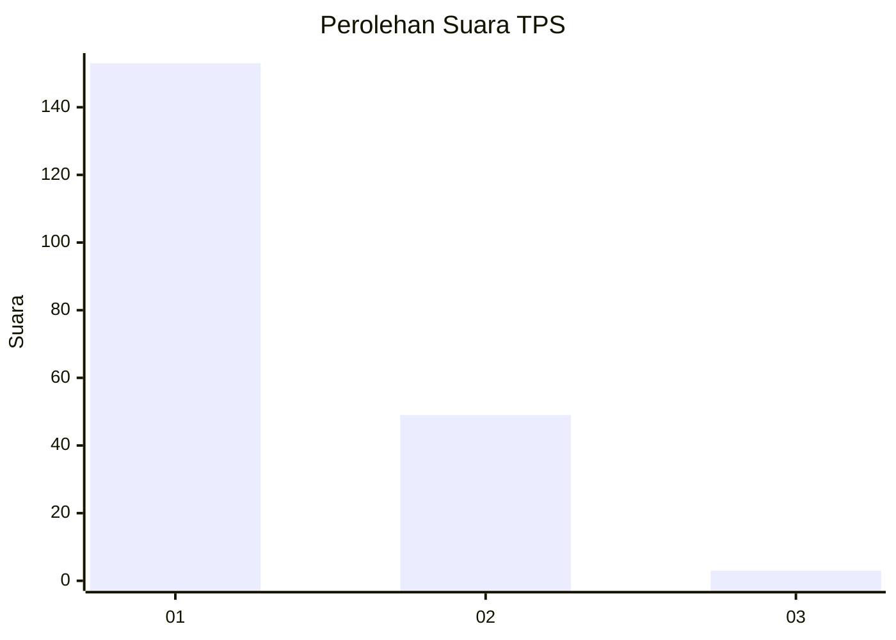
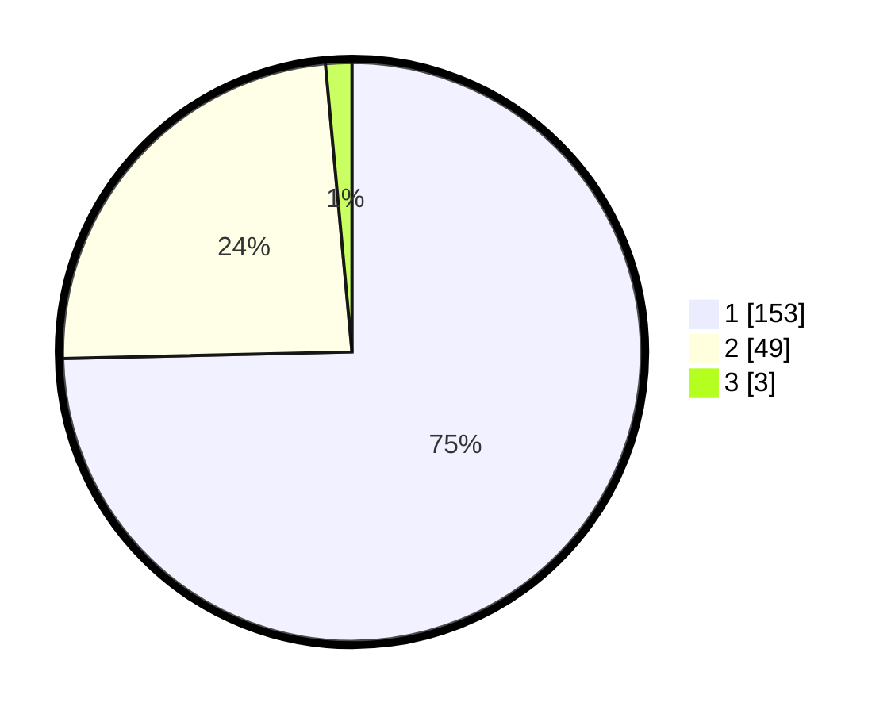

# Hasil

## Grafik

## Tabel

| No. | Nama Paslon    | Suara | Suara (raw) | Persentase |
|:--- |:-------------- | -----:| -----------:| ----------:|
| 1   | ANIES MUHAIMIN | 153   | [153][p-1]  | 74,63      |
| 2   | PRABOWO GIBRAN | 49    | [49][p-2]   | 23,90      |
| 3   | GANJAR MAHFUD  | 3     | [3][p-3]    | 1,46       |

[p-1]: https://github.com/gigit-pemilu/pemilu-2024/blob/main/pilpres/hitung-suara/sub/32-jawa-barat/sub/06-tasikmalaya/sub/12-sodonghilir/sub/2001-parumasan/sub/002-tps/sub/paslon-1.txt
[p-2]: https://github.com/gigit-pemilu/pemilu-2024/blob/main/pilpres/hitung-suara/sub/32-jawa-barat/sub/06-tasikmalaya/sub/12-sodonghilir/sub/2001-parumasan/sub/002-tps/sub/paslon-2.txt
[p-3]: https://github.com/gigit-pemilu/pemilu-2024/blob/main/pilpres/hitung-suara/sub/32-jawa-barat/sub/06-tasikmalaya/sub/12-sodonghilir/sub/2001-parumasan/sub/002-tps/sub/paslon-3.txt

## Foto C Plano

https://sirekap-obj-formc.kpu.go.id/46ed/pemilu/ppwp/32/06/12/20/01/3206122001002-20240215-054905--d612ad41-9bd7-41ab-bffd-666874b24a9f.jpg

https://sirekap-obj-formc.kpu.go.id/46ed/pemilu/ppwp/32/06/12/20/01/3206122001002-20240215-041824--5835967a-0236-4fe9-8fbf-467fc65a69f9.jpg

https://sirekap-obj-formc.kpu.go.id/46ed/pemilu/ppwp/32/06/12/20/01/3206122001002-20240215-041625--0854d29f-2286-46b9-9bac-c26181f6a4dd.jpg

## Metadata

| Key        | Value               |
| ---------- | ------------------- |
| Time Stamp | 2024-02-15 23:29:50 |

