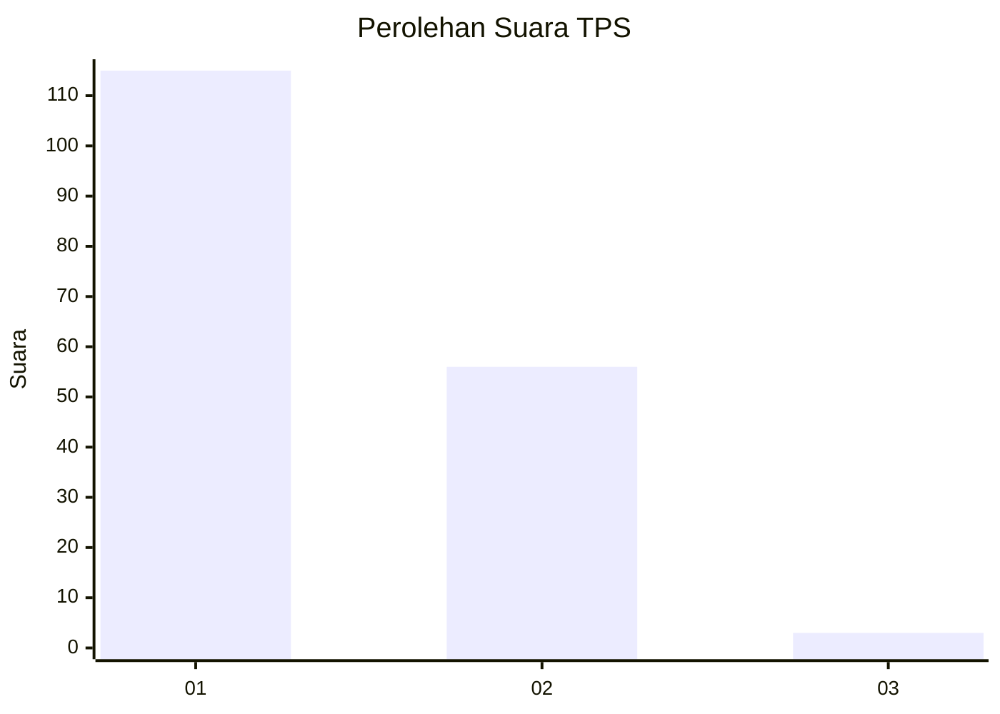
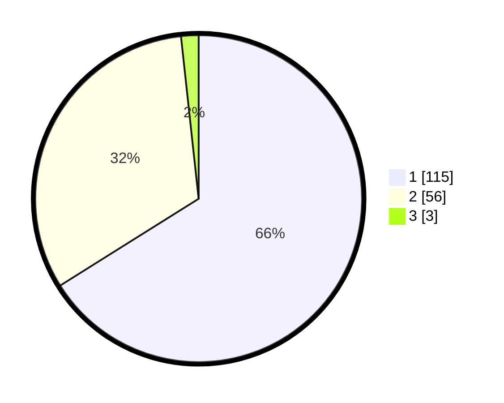

# Hasil

## Grafik

## Tabel

| No. | Nama Paslon    | Suara | Suara (raw) | Persentase |
|:--- |:-------------- | -----:| -----------:| ----------:|
| 1   | ANIES MUHAIMIN | 115   | [115][p-1]  | 66,09      |
| 2   | PRABOWO GIBRAN | 56    | [56][p-2]   | 32,18      |
| 3   | GANJAR MAHFUD  | 3     | [3][p-3]    | 1,72       |

[p-1]: https://github.com/gigit-pemilu/pemilu-2024-32-jawa-barat/blob/main/pilpres/hitung-suara/sub/32-jawa-barat/sub/06-tasikmalaya/sub/12-sodonghilir/sub/2008-sepatnunggal/sub/001-tps/sub/paslon-1.txt
[p-2]: https://github.com/gigit-pemilu/pemilu-2024-32-jawa-barat/blob/main/pilpres/hitung-suara/sub/32-jawa-barat/sub/06-tasikmalaya/sub/12-sodonghilir/sub/2008-sepatnunggal/sub/001-tps/sub/paslon-2.txt
[p-3]: https://github.com/gigit-pemilu/pemilu-2024-32-jawa-barat/blob/main/pilpres/hitung-suara/sub/32-jawa-barat/sub/06-tasikmalaya/sub/12-sodonghilir/sub/2008-sepatnunggal/sub/001-tps/sub/paslon-3.txt

## Foto C Plano

https://sirekap-obj-formc.kpu.go.id/4f92/pemilu/ppwp/32/06/12/20/08/3206122008001-20240215-090412--0bb42d97-8052-4679-aaa8-7b715644d483.jpg

https://sirekap-obj-formc.kpu.go.id/4f92/pemilu/ppwp/32/06/12/20/08/3206122008001-20240214-191530--2cdb1933-a744-469a-9661-b6d25370ee68.jpg

https://sirekap-obj-formc.kpu.go.id/4f92/pemilu/ppwp/32/06/12/20/08/3206122008001-20240215-082339--acc02432-0538-46f7-b81c-a6b48275b203.jpg

## Metadata

| Key        | Value               |
| ---------- | ------------------- |
| Time Stamp | 2024-02-15 15:30:25 |

