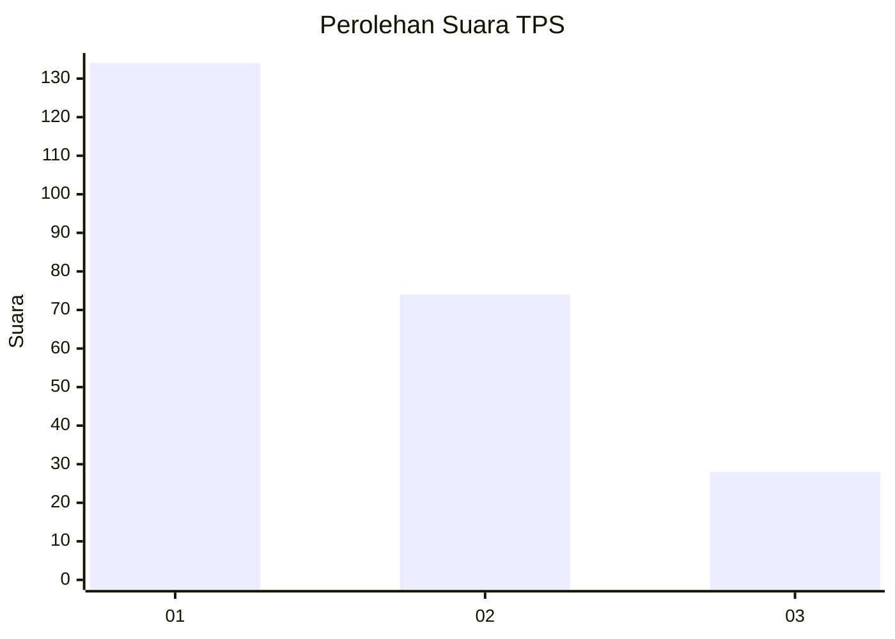
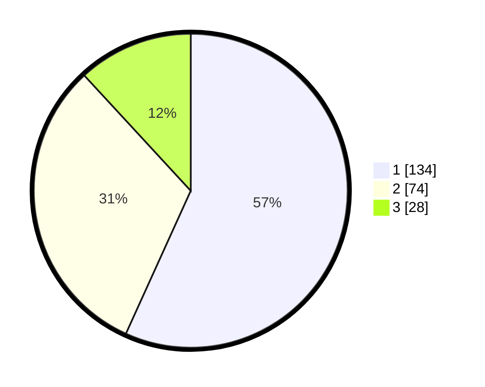

# Hasil

## Grafik

## Tabel

| No. | Nama Paslon    | Suara | Suara (raw) | Persentase |
|:--- |:-------------- | -----:| -----------:| ----------:|
| 1   | ANIES MUHAIMIN | 134   | [134][p-1]  | 56,78      |
| 2   | PRABOWO GIBRAN | 74    | [74][p-2]   | 31,36      |
| 3   | GANJAR MAHFUD  | 28    | [28][p-3]   | 11,86      |

[p-1]: https://github.com/gigit-pemilu/pemilu-2024-32-jawa-barat/blob/main/pilpres/hitung-suara/sub/32-jawa-barat/sub/06-tasikmalaya/sub/12-sodonghilir/sub/2009-cukangjayaguna/sub/006-tps/sub/paslon-1.txt
[p-2]: https://github.com/gigit-pemilu/pemilu-2024-32-jawa-barat/blob/main/pilpres/hitung-suara/sub/32-jawa-barat/sub/06-tasikmalaya/sub/12-sodonghilir/sub/2009-cukangjayaguna/sub/006-tps/sub/paslon-2.txt
[p-3]: https://github.com/gigit-pemilu/pemilu-2024-32-jawa-barat/blob/main/pilpres/hitung-suara/sub/32-jawa-barat/sub/06-tasikmalaya/sub/12-sodonghilir/sub/2009-cukangjayaguna/sub/006-tps/sub/paslon-3.txt

## Foto C Plano

https://sirekap-obj-formc.kpu.go.id/60e4/pemilu/ppwp/32/06/12/20/09/3206122009006-20240219-122153--932297b7-29b9-4edc-94cb-39d65a89f4ce.jpg

https://sirekap-obj-formc.kpu.go.id/60e4/pemilu/ppwp/32/06/12/20/09/3206122009006-20240219-123616--5cb41dae-fb0c-49ef-9eda-6d3dac60cd90.jpg

https://sirekap-obj-formc.kpu.go.id/60e4/pemilu/ppwp/32/06/12/20/09/3206122009006-20240219-123831--2801f408-04c1-4040-ba17-3d62650a3bb3.jpg

## Metadata

| Key        | Value               |
| ---------- | ------------------- |
| Time Stamp | 2024-02-19 13:00:00 |

