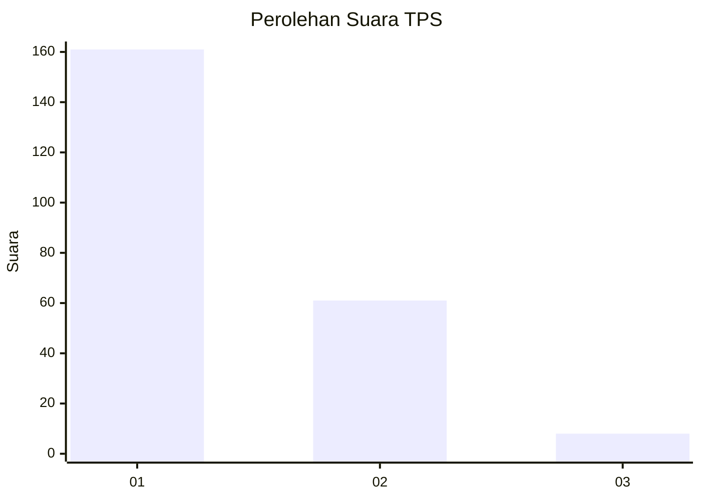
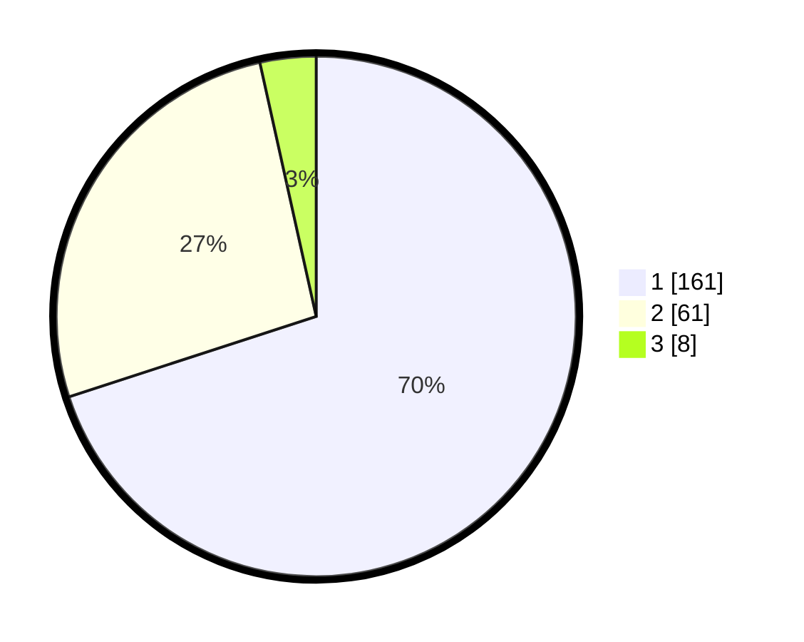

# Hasil

## Grafik

## Tabel

| No. | Nama Paslon    | Suara | Suara (raw) | Persentase |
|:--- |:-------------- | -----:| -----------:| ----------:|
| 1   | ANIES MUHAIMIN | 161   | [161][p-1]  | 70,00      |
| 2   | PRABOWO GIBRAN | 61    | [61][p-2]   | 26,52      |
| 3   | GANJAR MAHFUD  | 8     | [8][p-3]    | 3,48       |

[p-1]: https://github.com/gigit-pemilu/pemilu-2024/blob/main/pilpres/hitung-suara/sub/32-jawa-barat/sub/06-tasikmalaya/sub/12-sodonghilir/sub/2009-cukangjayaguna/sub/010-tps/sub/paslon-1.txt
[p-2]: https://github.com/gigit-pemilu/pemilu-2024/blob/main/pilpres/hitung-suara/sub/32-jawa-barat/sub/06-tasikmalaya/sub/12-sodonghilir/sub/2009-cukangjayaguna/sub/010-tps/sub/paslon-2.txt
[p-3]: https://github.com/gigit-pemilu/pemilu-2024/blob/main/pilpres/hitung-suara/sub/32-jawa-barat/sub/06-tasikmalaya/sub/12-sodonghilir/sub/2009-cukangjayaguna/sub/010-tps/sub/paslon-3.txt

## Foto C Plano

https://sirekap-obj-formc.kpu.go.id/379a/pemilu/ppwp/32/06/12/20/09/3206122009010-20240217-091906--e06a8cc4-b405-4301-ac5e-0f1c889a9d4d.jpg

https://sirekap-obj-formc.kpu.go.id/379a/pemilu/ppwp/32/06/12/20/09/3206122009010-20240217-092355--74fe7410-3ea2-4b0e-9758-bdb2446644ad.jpg

https://sirekap-obj-formc.kpu.go.id/379a/pemilu/ppwp/32/06/12/20/09/3206122009010-20240217-093113--96200070-e95b-446e-b792-3bef1e31e457.jpg

## Metadata

| Key        | Value               |
| ---------- | ------------------- |
| Time Stamp | 2024-02-17 10:00:02 |

