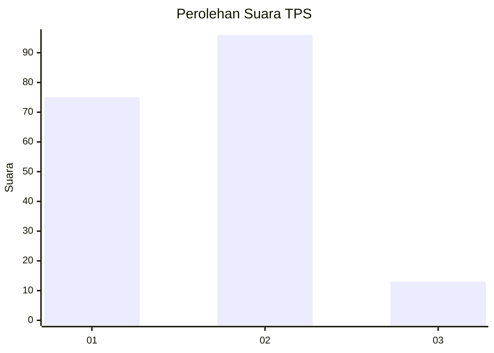

# Hasil

## Grafik

## Tabel

| No. | Nama Paslon    | Suara | Suara (raw) | Persentase |
|:--- |:-------------- | -----:| -----------:| ----------:|
| 1   | ANIES MUHAIMIN | 75    | [75][p-1]   | 40,76      |
| 2   | PRABOWO GIBRAN | 96    | [96][p-2]   | 52,17      |
| 3   | GANJAR MAHFUD  | 13    | [13][p-3]   | 7,07       |

[p-1]: https://github.com/gigit-pemilu/pemilu-2024-32-jawa-barat/blob/main/pilpres/hitung-suara/sub/32-jawa-barat/sub/06-tasikmalaya/sub/18-salopa/sub/2001-mandalahayu/sub/002-tps/sub/paslon-1.txt
[p-2]: https://github.com/gigit-pemilu/pemilu-2024-32-jawa-barat/blob/main/pilpres/hitung-suara/sub/32-jawa-barat/sub/06-tasikmalaya/sub/18-salopa/sub/2001-mandalahayu/sub/002-tps/sub/paslon-2.txt
[p-3]: https://github.com/gigit-pemilu/pemilu-2024-32-jawa-barat/blob/main/pilpres/hitung-suara/sub/32-jawa-barat/sub/06-tasikmalaya/sub/18-salopa/sub/2001-mandalahayu/sub/002-tps/sub/paslon-3.txt

## Foto C Plano

https://sirekap-obj-formc.kpu.go.id/720e/pemilu/ppwp/32/06/18/20/01/3206182001002-20240214-155835--aa75ab9e-4574-4847-a9e5-31188c12032c.jpg

https://sirekap-obj-formc.kpu.go.id/720e/pemilu/ppwp/32/06/18/20/01/3206182001002-20240214-141715--6b0a6595-f20c-4867-a18b-5e6722e88c4b.jpg

https://sirekap-obj-formc.kpu.go.id/720e/pemilu/ppwp/32/06/18/20/01/3206182001002-20240214-141804--976d73f6-be88-4931-b8cc-06657eb9ea81.jpg

## Metadata

| Key        | Value               |
| ---------- | ------------------- |
| Time Stamp | 2024-02-14 21:46:01 |

