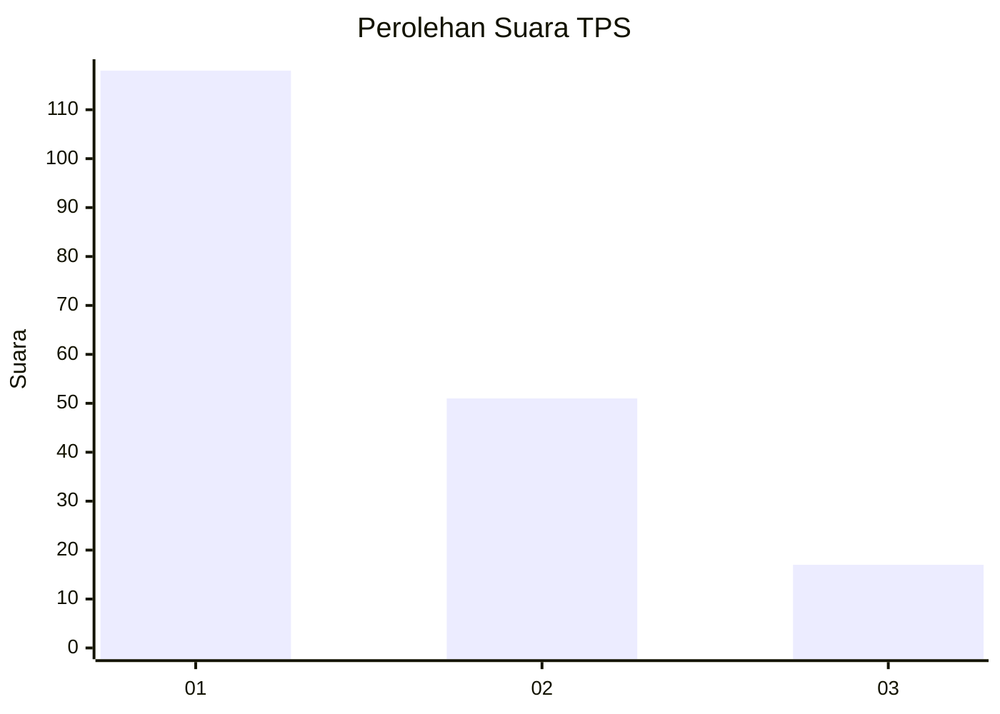
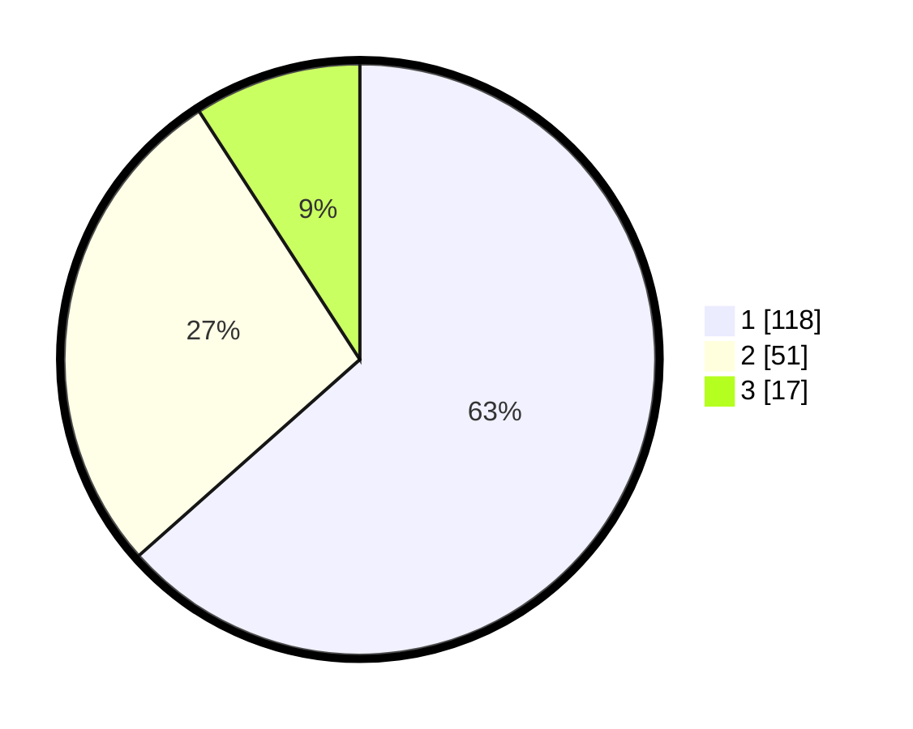

# Hasil

## Grafik

## Tabel

| No. | Nama Paslon    | Suara | Suara (raw) | Persentase |
|:--- |:-------------- | -----:| -----------:| ----------:|
| 1   | ANIES MUHAIMIN | 118   | [118][p-1]  | 63,44      |
| 2   | PRABOWO GIBRAN | 51    | [51][p-2]   | 27,42      |
| 3   | GANJAR MAHFUD  | 17    | [17][p-3]   | 9,14       |

[p-1]: https://github.com/gigit-pemilu/pemilu-2024-32-jawa-barat/blob/main/pilpres/hitung-suara/sub/32-jawa-barat/sub/06-tasikmalaya/sub/19-jatiwaras/sub/2001-kaputihan/sub/001-tps/sub/paslon-1.txt
[p-2]: https://github.com/gigit-pemilu/pemilu-2024-32-jawa-barat/blob/main/pilpres/hitung-suara/sub/32-jawa-barat/sub/06-tasikmalaya/sub/19-jatiwaras/sub/2001-kaputihan/sub/001-tps/sub/paslon-2.txt
[p-3]: https://github.com/gigit-pemilu/pemilu-2024-32-jawa-barat/blob/main/pilpres/hitung-suara/sub/32-jawa-barat/sub/06-tasikmalaya/sub/19-jatiwaras/sub/2001-kaputihan/sub/001-tps/sub/paslon-3.txt

## Foto C Plano

https://sirekap-obj-formc.kpu.go.id/9bbd/pemilu/ppwp/32/06/19/20/01/3206192001001-20240215-071413--547490ec-1d43-41ee-bb43-4f1368dd98c1.jpg

https://sirekap-obj-formc.kpu.go.id/9bbd/pemilu/ppwp/32/06/19/20/01/3206192001001-20240215-071612--28461b5b-cecb-41f1-9b25-7cd032cac78d.jpg

https://sirekap-obj-formc.kpu.go.id/9bbd/pemilu/ppwp/32/06/19/20/01/3206192001001-20240215-072024--51c238a8-0d4f-42a9-9f9d-9516ec041992.jpg

## Metadata

| Key        | Value               |
| ---------- | ------------------- |
| Time Stamp | 2024-02-15 22:30:27 |

