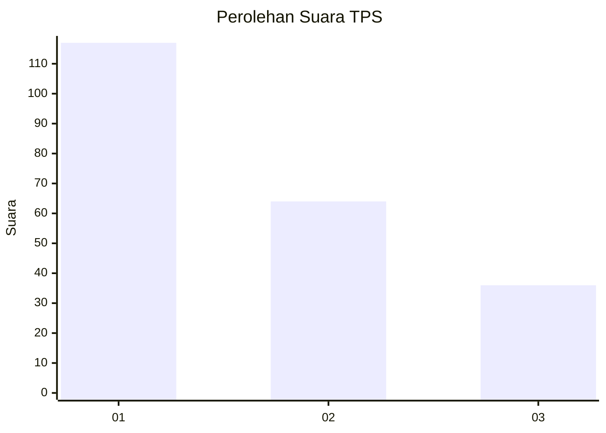
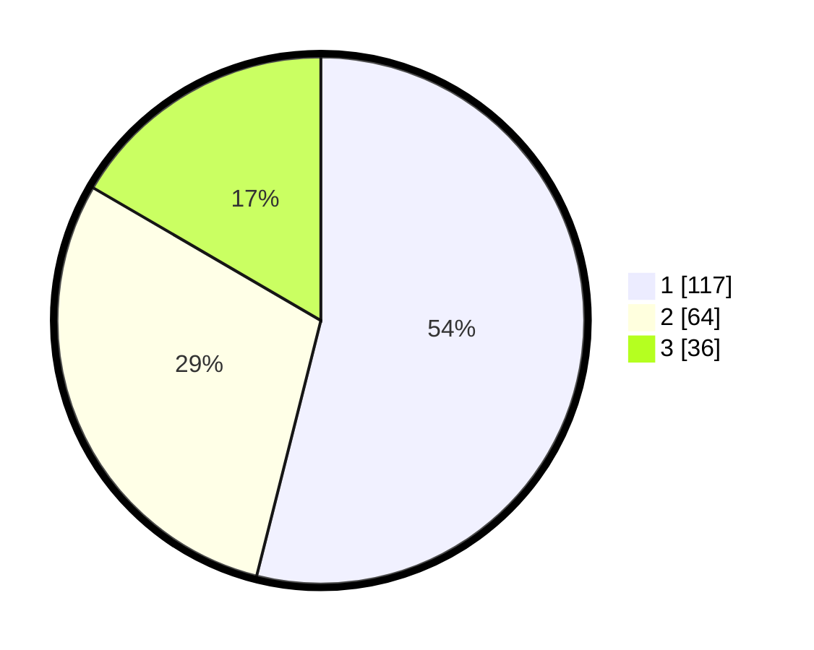

# Hasil

## Grafik

## Tabel

| No. | Nama Paslon    | Suara | Suara (raw) | Persentase |
|:--- |:-------------- | -----:| -----------:| ----------:|
| 1   | ANIES MUHAIMIN | 117   | [117][p-1]  | 53,92      |
| 2   | PRABOWO GIBRAN | 64    | [64][p-2]   | 29,49      |
| 3   | GANJAR MAHFUD  | 36    | [36][p-3]   | 16,59      |

[p-1]: https://github.com/gigit-pemilu/pemilu-2024/blob/main/pilpres/hitung-suara/sub/32-jawa-barat/sub/06-tasikmalaya/sub/19-jatiwaras/sub/2001-kaputihan/sub/003-tps/sub/paslon-1.txt
[p-2]: https://github.com/gigit-pemilu/pemilu-2024/blob/main/pilpres/hitung-suara/sub/32-jawa-barat/sub/06-tasikmalaya/sub/19-jatiwaras/sub/2001-kaputihan/sub/003-tps/sub/paslon-2.txt
[p-3]: https://github.com/gigit-pemilu/pemilu-2024/blob/main/pilpres/hitung-suara/sub/32-jawa-barat/sub/06-tasikmalaya/sub/19-jatiwaras/sub/2001-kaputihan/sub/003-tps/sub/paslon-3.txt

## Foto C Plano

https://sirekap-obj-formc.kpu.go.id/62aa/pemilu/ppwp/32/06/19/20/01/3206192001003-20240215-183820--89fd04cd-8d36-4c6e-a2dd-1992fa43bf04.jpg

https://sirekap-obj-formc.kpu.go.id/62aa/pemilu/ppwp/32/06/19/20/01/3206192001003-20240215-183022--fb72342f-6121-455a-b677-0e16ac972e81.jpg

https://sirekap-obj-formc.kpu.go.id/62aa/pemilu/ppwp/32/06/19/20/01/3206192001003-20240215-183401--a25930bb-45bf-4c7f-8cdc-24fc49e2a80a.jpg

## Metadata

| Key        | Value               |
| ---------- | ------------------- |
| Time Stamp | 2024-02-17 04:00:03 |

