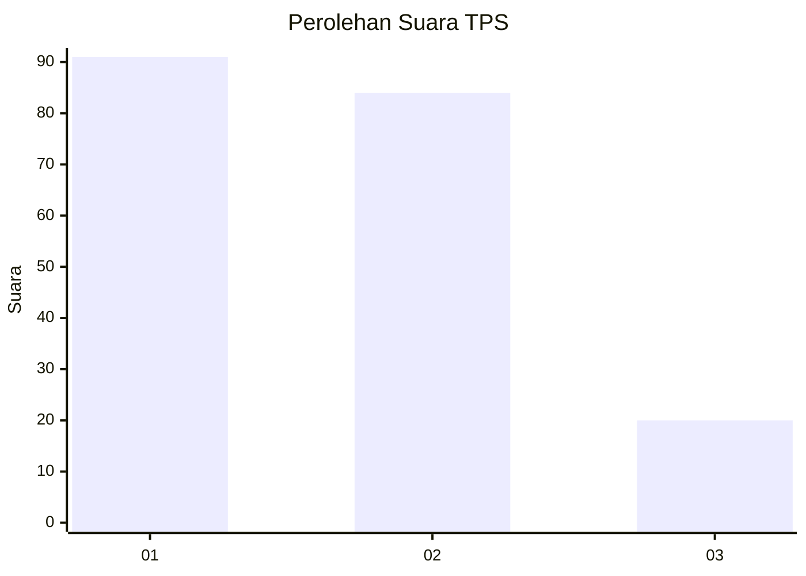
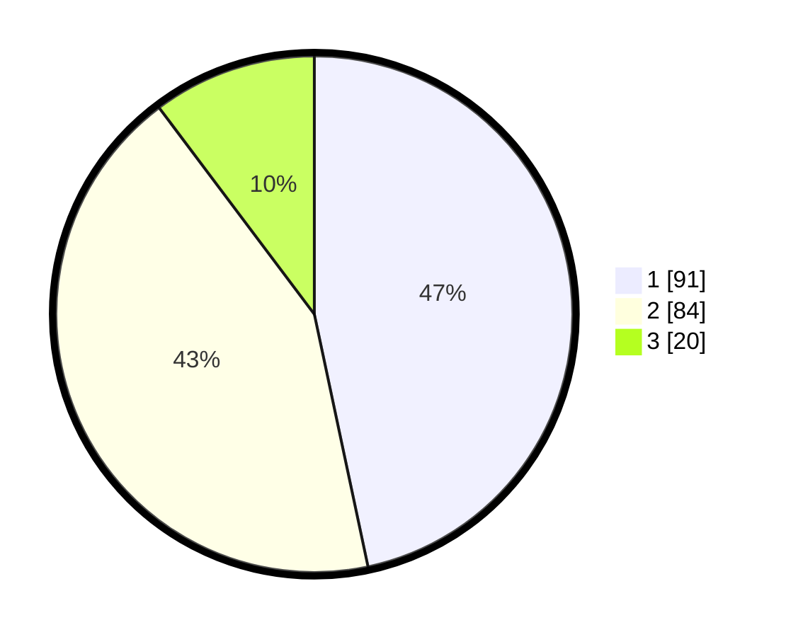

# Hasil

## Grafik

## Tabel

| No. | Nama Paslon    | Suara | Suara (raw) | Persentase |
|:--- |:-------------- | -----:| -----------:| ----------:|
| 1   | ANIES MUHAIMIN | 91    | [91][p-1]   | 46,67      |
| 2   | PRABOWO GIBRAN | 84    | [84][p-2]   | 43,08      |
| 3   | GANJAR MAHFUD  | 20    | [20][p-3]   | 10,26      |

[p-1]: https://github.com/gigit-pemilu/pemilu-2024/blob/main/pilpres/hitung-suara/sub/32-jawa-barat/sub/06-tasikmalaya/sub/19-jatiwaras/sub/2001-kaputihan/sub/006-tps/sub/paslon-1.txt
[p-2]: https://github.com/gigit-pemilu/pemilu-2024/blob/main/pilpres/hitung-suara/sub/32-jawa-barat/sub/06-tasikmalaya/sub/19-jatiwaras/sub/2001-kaputihan/sub/006-tps/sub/paslon-2.txt
[p-3]: https://github.com/gigit-pemilu/pemilu-2024/blob/main/pilpres/hitung-suara/sub/32-jawa-barat/sub/06-tasikmalaya/sub/19-jatiwaras/sub/2001-kaputihan/sub/006-tps/sub/paslon-3.txt

## Foto C Plano

https://sirekap-obj-formc.kpu.go.id/582d/pemilu/ppwp/32/06/19/20/01/3206192001006-20240215-125028--02acd2bf-fba6-429d-b89f-6d9f3d25c6c7.jpg

https://sirekap-obj-formc.kpu.go.id/582d/pemilu/ppwp/32/06/19/20/01/3206192001006-20240215-124620--17bdef35-027e-46fa-929f-ba42fbae48d8.jpg

https://sirekap-obj-formc.kpu.go.id/582d/pemilu/ppwp/32/06/19/20/01/3206192001006-20240215-140925--cf173510-d5ad-46b5-970e-e56796d86008.jpg

## Metadata

| Key        | Value               |
| ---------- | ------------------- |
| Time Stamp | 2024-02-17 04:00:03 |

