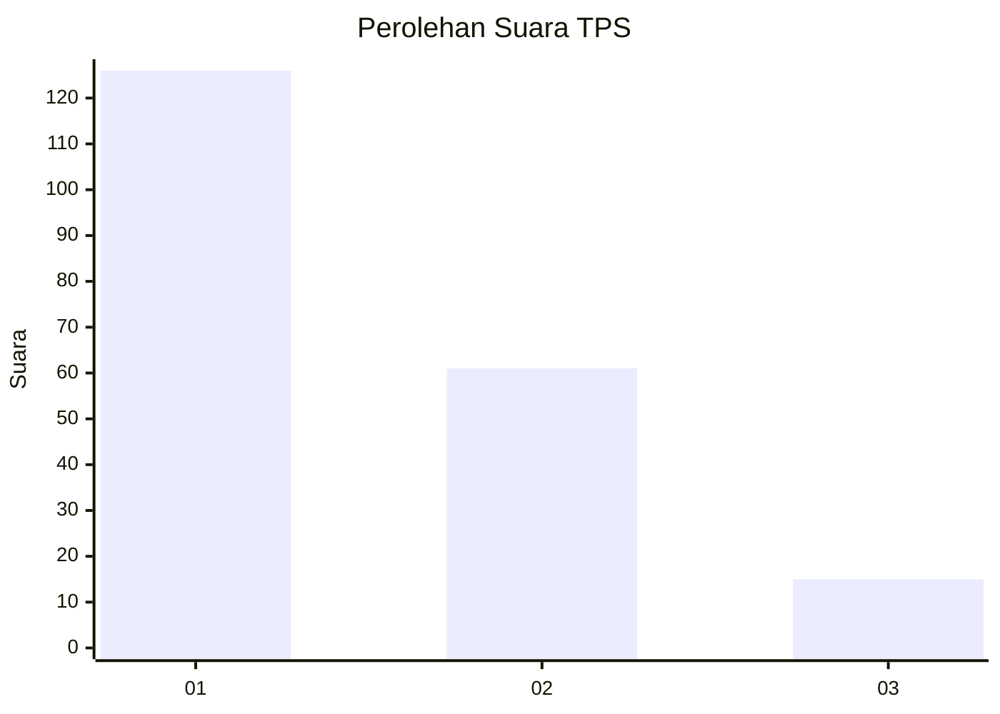
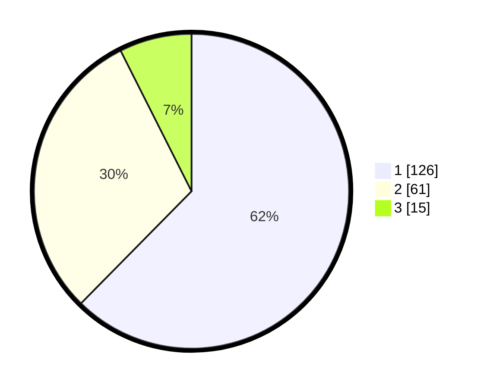

# Hasil

## Grafik

## Tabel

| No. | Nama Paslon    | Suara | Suara (raw) | Persentase |
|:--- |:-------------- | -----:| -----------:| ----------:|
| 1   | ANIES MUHAIMIN | 126   | [126][p-1]  | 62,38      |
| 2   | PRABOWO GIBRAN | 61    | [61][p-2]   | 30,20      |
| 3   | GANJAR MAHFUD  | 15    | [15][p-3]   | 7,43       |

[p-1]: https://github.com/gigit-pemilu/pemilu-2024-32-jawa-barat/blob/main/pilpres/hitung-suara/sub/32-jawa-barat/sub/06-tasikmalaya/sub/19-jatiwaras/sub/2001-kaputihan/sub/013-tps/sub/paslon-1.txt
[p-2]: https://github.com/gigit-pemilu/pemilu-2024-32-jawa-barat/blob/main/pilpres/hitung-suara/sub/32-jawa-barat/sub/06-tasikmalaya/sub/19-jatiwaras/sub/2001-kaputihan/sub/013-tps/sub/paslon-2.txt
[p-3]: https://github.com/gigit-pemilu/pemilu-2024-32-jawa-barat/blob/main/pilpres/hitung-suara/sub/32-jawa-barat/sub/06-tasikmalaya/sub/19-jatiwaras/sub/2001-kaputihan/sub/013-tps/sub/paslon-3.txt

## Foto C Plano

https://sirekap-obj-formc.kpu.go.id/4606/pemilu/ppwp/32/06/19/20/01/3206192001013-20240214-200429--a3e5182d-a786-4dbf-8f9a-69f3464f6c94.jpg

https://sirekap-obj-formc.kpu.go.id/4606/pemilu/ppwp/32/06/19/20/01/3206192001013-20240214-200448--fae65a3b-dcdf-4cce-91a3-4c8aa80ae2c7.jpg

https://sirekap-obj-formc.kpu.go.id/4606/pemilu/ppwp/32/06/19/20/01/3206192001013-20240214-200255--fe2c423b-1c69-4177-8cde-209cba49c6d1.jpg

## Metadata

| Key        | Value               |
| ---------- | ------------------- |
| Time Stamp | 2024-02-17 04:00:03 |

