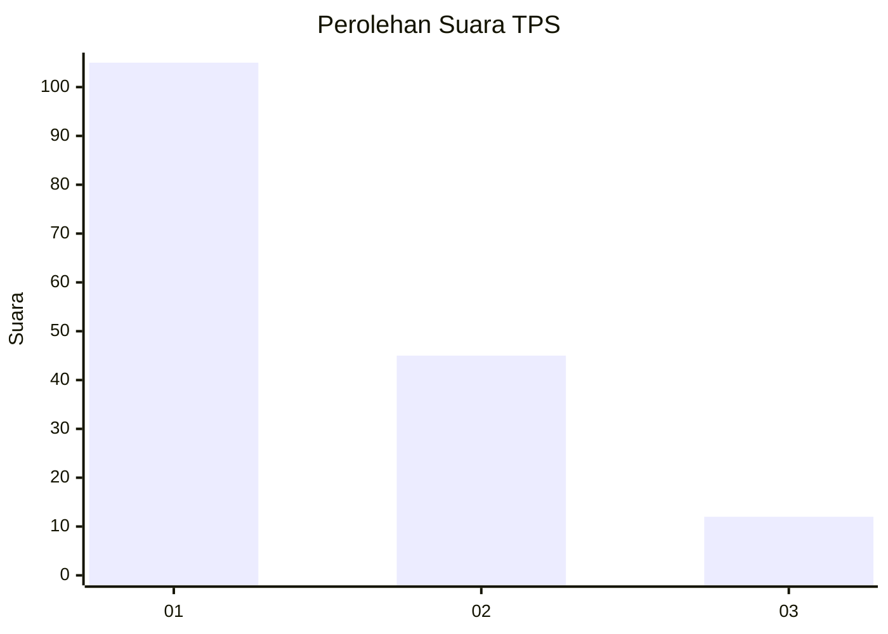
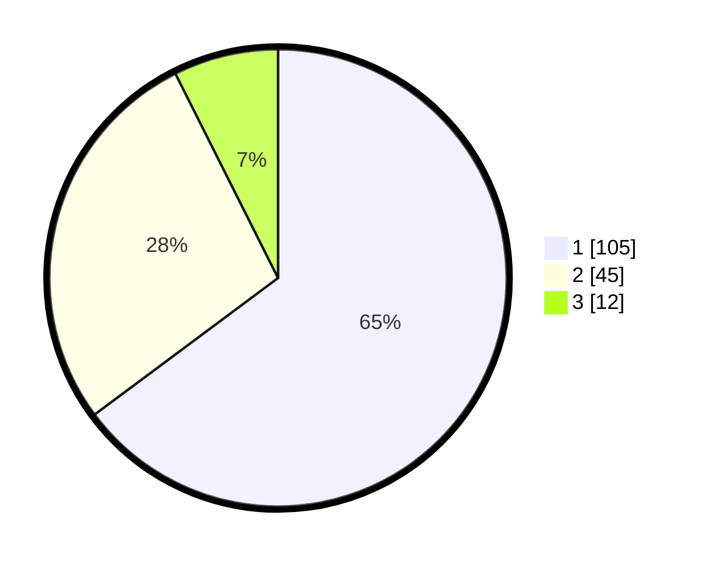

# Hasil

## Grafik

## Tabel

| No. | Nama Paslon    | Suara | Suara (raw) | Persentase |
|:--- |:-------------- | -----:| -----------:| ----------:|
| 1   | ANIES MUHAIMIN | 105   | [105][p-1]  | 64,81      |
| 2   | PRABOWO GIBRAN | 45    | [45][p-2]   | 27,78      |
| 3   | GANJAR MAHFUD  | 12    | [12][p-3]   | 7,41       |

[p-1]: https://github.com/gigit-pemilu/pemilu-2024/blob/main/pilpres/hitung-suara/sub/32-jawa-barat/sub/06-tasikmalaya/sub/19-jatiwaras/sub/2001-kaputihan/sub/016-tps/sub/paslon-1.txt
[p-2]: https://github.com/gigit-pemilu/pemilu-2024/blob/main/pilpres/hitung-suara/sub/32-jawa-barat/sub/06-tasikmalaya/sub/19-jatiwaras/sub/2001-kaputihan/sub/016-tps/sub/paslon-2.txt
[p-3]: https://github.com/gigit-pemilu/pemilu-2024/blob/main/pilpres/hitung-suara/sub/32-jawa-barat/sub/06-tasikmalaya/sub/19-jatiwaras/sub/2001-kaputihan/sub/016-tps/sub/paslon-3.txt

## Foto C Plano

https://sirekap-obj-formc.kpu.go.id/1d26/pemilu/ppwp/32/06/19/20/01/3206192001016-20240219-161039--ae66b392-e36b-4567-9074-6170dfa39a9d.jpg

https://sirekap-obj-formc.kpu.go.id/1d26/pemilu/ppwp/32/06/19/20/01/3206192001016-20240219-161717--f9c09977-dcc1-4e57-9664-d75db3ef7980.jpg

https://sirekap-obj-formc.kpu.go.id/1d26/pemilu/ppwp/32/06/19/20/01/3206192001016-20240219-182523--708bdd10-94ce-4852-ae28-0b74ed06badc.jpg

## Metadata

| Key        | Value               |
| ---------- | ------------------- |
| Time Stamp | 2024-02-20 00:00:00 |

