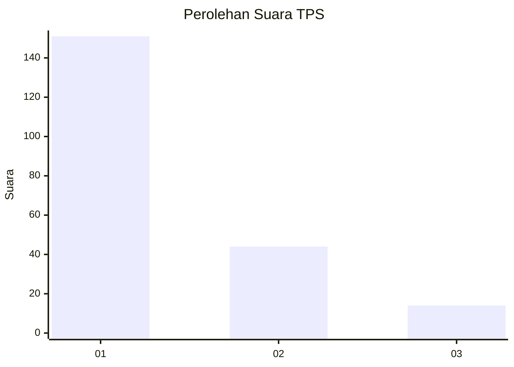
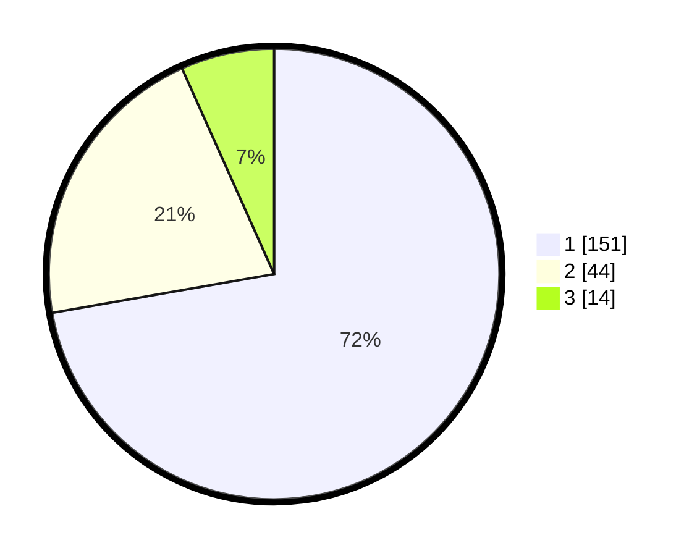

# Hasil

## Grafik

## Tabel

| No. | Nama Paslon    | Suara | Suara (raw) | Persentase |
|:--- |:-------------- | -----:| -----------:| ----------:|
| 1   | ANIES MUHAIMIN | 151   | [151][p-1]  | 72,25      |
| 2   | PRABOWO GIBRAN | 44    | [44][p-2]   | 21,05      |
| 3   | GANJAR MAHFUD  | 14    | [14][p-3]   | 6,70       |

[p-1]: https://github.com/gigit-pemilu/pemilu-2024/blob/main/pilpres/hitung-suara/sub/32-jawa-barat/sub/06-tasikmalaya/sub/19-jatiwaras/sub/2001-kaputihan/sub/017-tps/sub/paslon-1.txt
[p-2]: https://github.com/gigit-pemilu/pemilu-2024/blob/main/pilpres/hitung-suara/sub/32-jawa-barat/sub/06-tasikmalaya/sub/19-jatiwaras/sub/2001-kaputihan/sub/017-tps/sub/paslon-2.txt
[p-3]: https://github.com/gigit-pemilu/pemilu-2024/blob/main/pilpres/hitung-suara/sub/32-jawa-barat/sub/06-tasikmalaya/sub/19-jatiwaras/sub/2001-kaputihan/sub/017-tps/sub/paslon-3.txt

## Foto C Plano

https://sirekap-obj-formc.kpu.go.id/e4ab/pemilu/ppwp/32/06/19/20/01/3206192001017-20240215-105246--d7252be1-02e0-4f92-98ee-4cd63af2f798.jpg

https://sirekap-obj-formc.kpu.go.id/e4ab/pemilu/ppwp/32/06/19/20/01/3206192001017-20240215-105221--c9a986de-6bd7-4016-8881-883f487c10ff.jpg

https://sirekap-obj-formc.kpu.go.id/e4ab/pemilu/ppwp/32/06/19/20/01/3206192001017-20240215-105157--19ed1562-6baf-407c-a35b-4e1d7455243d.jpg

## Metadata

| Key        | Value               |
| ---------- | ------------------- |
| Time Stamp | 2024-02-17 04:00:03 |

