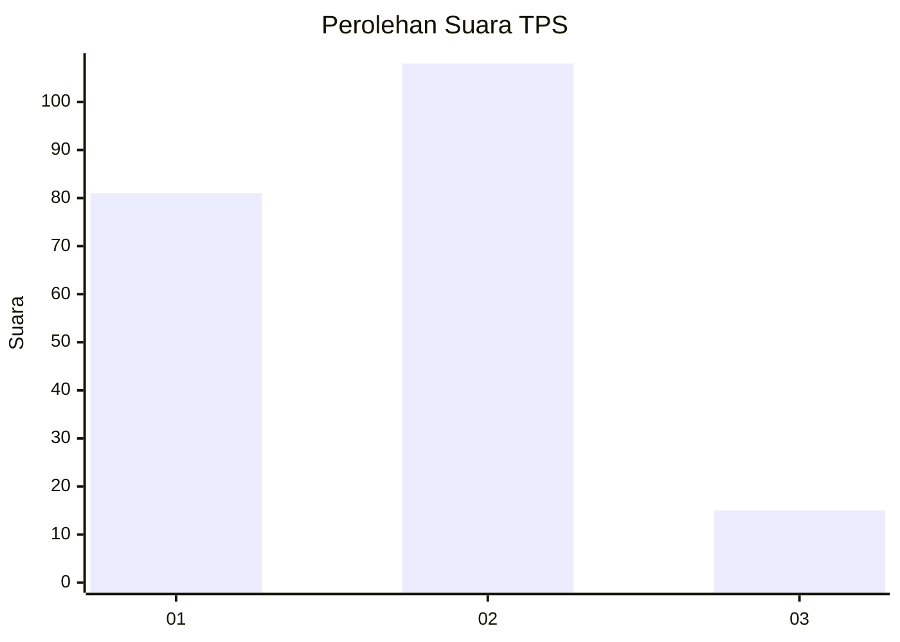

# Hasil

## Grafik

## Tabel

| No. | Nama Paslon    | Suara | Suara (raw) | Persentase |
|:--- |:-------------- | -----:| -----------:| ----------:|
| 1   | ANIES MUHAIMIN | 81    | [81][p-1]   | 39,71      |
| 2   | PRABOWO GIBRAN | 108   | [108][p-2]  | 52,94      |
| 3   | GANJAR MAHFUD  | 15    | [15][p-3]   | 7,35       |

[p-1]: https://github.com/gigit-pemilu/pemilu-2024/blob/main/pilpres/hitung-suara/sub/32-jawa-barat/sub/06-tasikmalaya/sub/21-karangjaya/sub/2001-sirnajaya/sub/002-tps/sub/paslon-1.txt
[p-2]: https://github.com/gigit-pemilu/pemilu-2024/blob/main/pilpres/hitung-suara/sub/32-jawa-barat/sub/06-tasikmalaya/sub/21-karangjaya/sub/2001-sirnajaya/sub/002-tps/sub/paslon-2.txt
[p-3]: https://github.com/gigit-pemilu/pemilu-2024/blob/main/pilpres/hitung-suara/sub/32-jawa-barat/sub/06-tasikmalaya/sub/21-karangjaya/sub/2001-sirnajaya/sub/002-tps/sub/paslon-3.txt

## Foto C Plano

https://sirekap-obj-formc.kpu.go.id/7961/pemilu/ppwp/32/06/21/20/01/3206212001002-20240215-000047--2194b663-b77b-4718-84df-b09fdc432974.jpg

https://sirekap-obj-formc.kpu.go.id/7961/pemilu/ppwp/32/06/21/20/01/3206212001002-20240216-150446--ce231fb5-557e-4b54-8dcf-5b5798dadfbe.jpg

https://sirekap-obj-formc.kpu.go.id/7961/pemilu/ppwp/32/06/21/20/01/3206212001002-20240215-000239--3f7a5caa-1c41-4598-ab27-20fbcb79f666.jpg

## Metadata

| Key        | Value               |
| ---------- | ------------------- |
| Time Stamp | 2024-02-16 23:30:00 |

