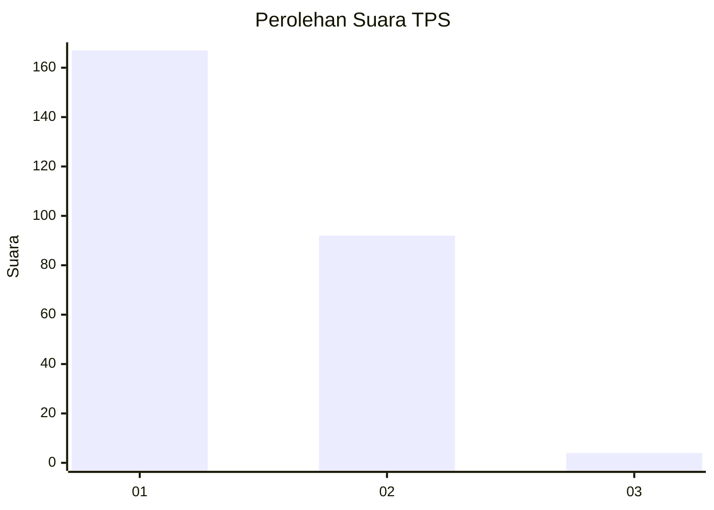
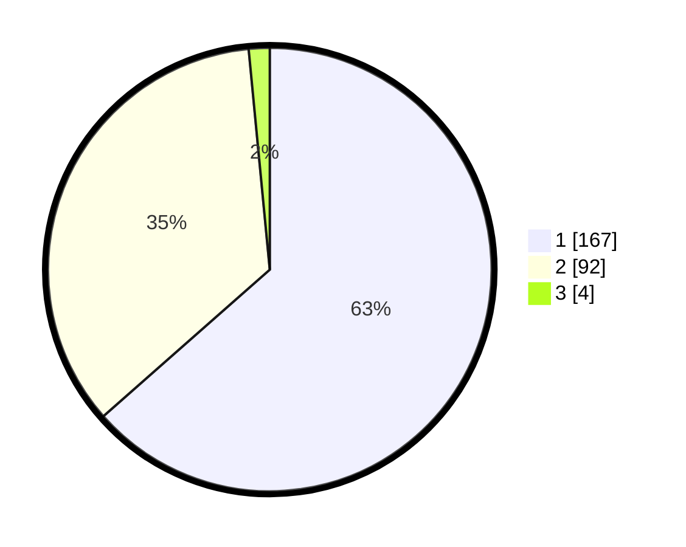

# Hasil

## Grafik

## Tabel

| No. | Nama Paslon    | Suara | Suara (raw) | Persentase |
|:--- |:-------------- | -----:| -----------:| ----------:|
| 1   | ANIES MUHAIMIN | 167   | [167][p-1]  | 63,50      |
| 2   | PRABOWO GIBRAN | 92    | [92][p-2]   | 34,98      |
| 3   | GANJAR MAHFUD  | 4     | [4][p-3]    | 1,52       |

[p-1]: https://github.com/gigit-pemilu/pemilu-2024-32-jawa-barat/blob/main/pilpres/hitung-suara/sub/32-jawa-barat/sub/06-tasikmalaya/sub/24-singaparna/sub/2001-cikunten/sub/006-tps/sub/paslon-1.txt
[p-2]: https://github.com/gigit-pemilu/pemilu-2024-32-jawa-barat/blob/main/pilpres/hitung-suara/sub/32-jawa-barat/sub/06-tasikmalaya/sub/24-singaparna/sub/2001-cikunten/sub/006-tps/sub/paslon-2.txt
[p-3]: https://github.com/gigit-pemilu/pemilu-2024-32-jawa-barat/blob/main/pilpres/hitung-suara/sub/32-jawa-barat/sub/06-tasikmalaya/sub/24-singaparna/sub/2001-cikunten/sub/006-tps/sub/paslon-3.txt

## Foto C Plano

https://sirekap-obj-formc.kpu.go.id/b4f8/pemilu/ppwp/32/06/24/20/01/3206242001006-20240214-192833--fe1c5dbd-71cb-4f90-8a31-6756b8925272.jpg

https://sirekap-obj-formc.kpu.go.id/b4f8/pemilu/ppwp/32/06/24/20/01/3206242001006-20240214-192730--4b22d582-3aa4-46a5-899d-524449662d8a.jpg

https://sirekap-obj-formc.kpu.go.id/b4f8/pemilu/ppwp/32/06/24/20/01/3206242001006-20240214-192637--d01e4ba2-5cab-48fa-a5fd-4144276c63a1.jpg

## Metadata

| Key        | Value               |
| ---------- | ------------------- |
| Time Stamp | 2024-02-17 04:00:03 |

