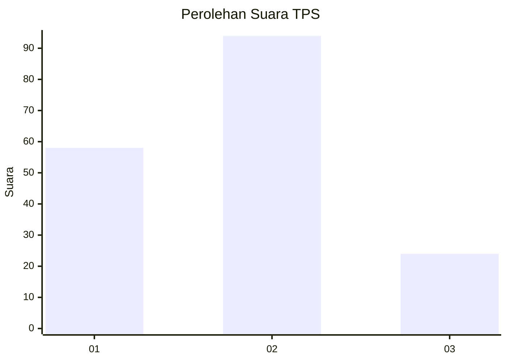
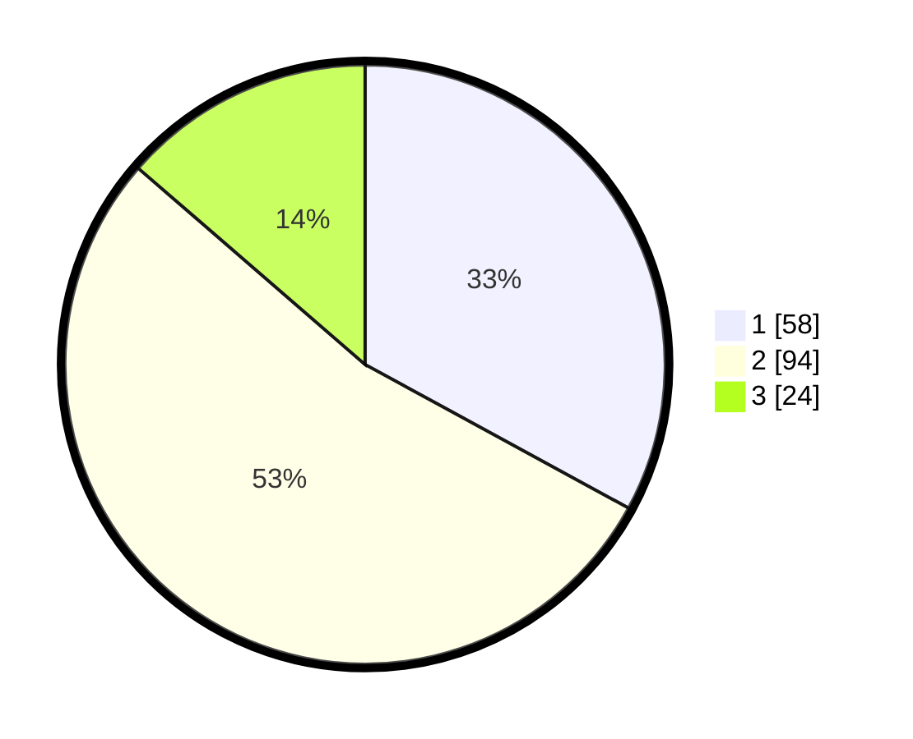

# Hasil

## Grafik

## Tabel

| No. | Nama Paslon    | Suara | Suara (raw) | Persentase |
|:--- |:-------------- | -----:| -----------:| ----------:|
| 1   | ANIES MUHAIMIN | 58    | [58][p-1]   | 32,95      |
| 2   | PRABOWO GIBRAN | 94    | [94][p-2]   | 53,41      |
| 3   | GANJAR MAHFUD  | 24    | [24][p-3]   | 13,64      |

[p-1]: https://github.com/gigit-pemilu/pemilu-2024/blob/main/pilpres/hitung-suara/sub/32-jawa-barat/sub/06-tasikmalaya/sub/24-singaparna/sub/2002-singaparna/sub/005-tps/sub/paslon-1.txt
[p-2]: https://github.com/gigit-pemilu/pemilu-2024/blob/main/pilpres/hitung-suara/sub/32-jawa-barat/sub/06-tasikmalaya/sub/24-singaparna/sub/2002-singaparna/sub/005-tps/sub/paslon-2.txt
[p-3]: https://github.com/gigit-pemilu/pemilu-2024/blob/main/pilpres/hitung-suara/sub/32-jawa-barat/sub/06-tasikmalaya/sub/24-singaparna/sub/2002-singaparna/sub/005-tps/sub/paslon-3.txt

## Foto C Plano

https://sirekap-obj-formc.kpu.go.id/c7fe/pemilu/ppwp/32/06/24/20/02/3206242002005-20240217-174246--1efb1466-e0e9-42a2-bf1a-af83a6545dbc.jpg

https://sirekap-obj-formc.kpu.go.id/c7fe/pemilu/ppwp/32/06/24/20/02/3206242002005-20240217-161829--6b9b3dc9-3ac1-4c91-b589-9d5ac32b2f0f.jpg

https://sirekap-obj-formc.kpu.go.id/c7fe/pemilu/ppwp/32/06/24/20/02/3206242002005-20240217-162001--9b0ce897-99bc-491c-bab2-ff8edc631f99.jpg

## Metadata

| Key        | Value               |
| ---------- | ------------------- |
| Time Stamp | 2024-02-19 11:00:00 |

## DATA PEMILIH TETAP

Jumlah pemilih dalam DPT: **437**.
 * L: **385**.
 * P: **612**.

## DATA PENGGUNA HAK PILIH

Jumlah pengguna hak pilih dalam DPT: **875**.
 * L: **837**.
 * P: **808**.

Jumlah pengguna hak pilih dalam DPTb: **285**.
 * L: **888**.
 * P: **884**.

Jumlah pengguna hak pilih dalam DPK: **888**.
 * L: **888**.
 * P: **888**.

Jumlah pengguna hak pilih: **353**.
 * L: **838**.
 * P: **835**.

## JUMLAH SUARA SAH DAN TIDAK SAH

JUMLAH SELURUH SUARA SAH: **176**.

JUMLAH SUARA TIDAK SAH: **7**.

JUMLAH SELURUH SUARA SAH DAN SUARA TIDAK SAH: **183**.

