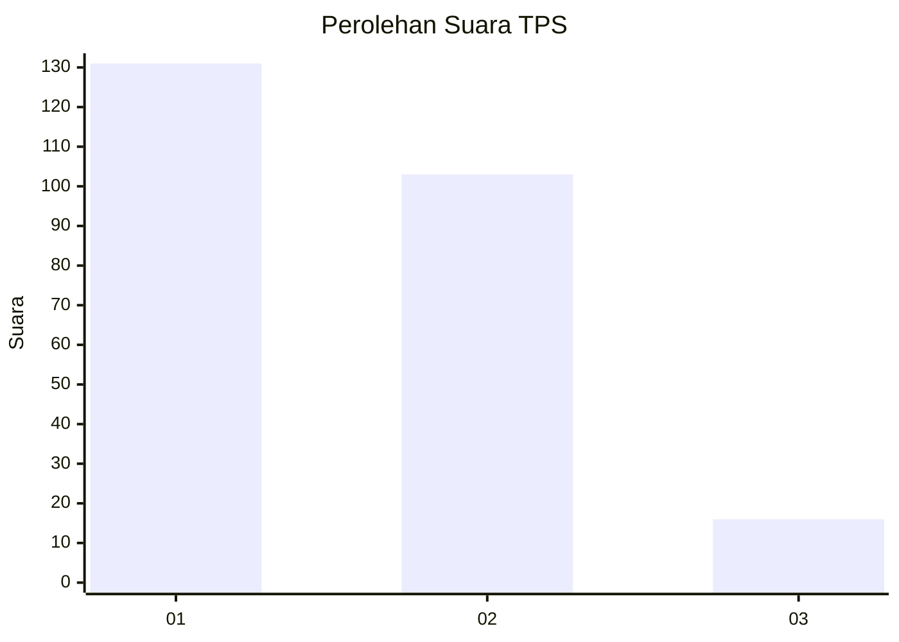
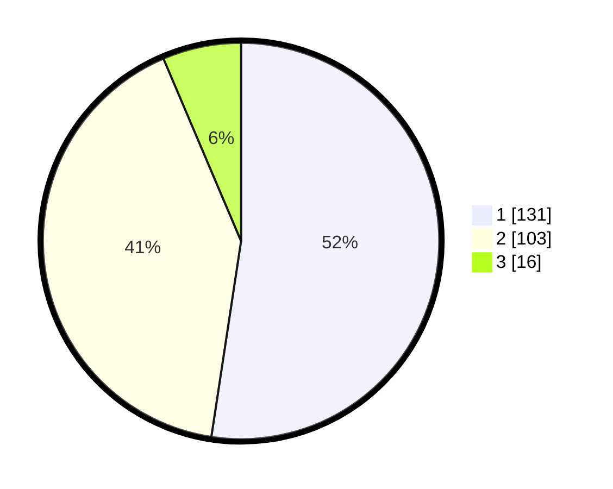

# Hasil

## Grafik

## Tabel

| No. | Nama Paslon    | Suara | Suara (raw) | Persentase |
|:--- |:-------------- | -----:| -----------:| ----------:|
| 1   | ANIES MUHAIMIN | 131   | [131][p-1]  | 52,40      |
| 2   | PRABOWO GIBRAN | 103   | [103][p-2]  | 41,20      |
| 3   | GANJAR MAHFUD  | 16    | [16][p-3]   | 6,40       |

[p-1]: https://github.com/gigit-pemilu/pemilu-2024-32-jawa-barat/blob/main/pilpres/hitung-suara/sub/32-jawa-barat/sub/06-tasikmalaya/sub/26-sukarame/sub/2005-sukarapih/sub/012-tps/sub/paslon-1.txt
[p-2]: https://github.com/gigit-pemilu/pemilu-2024-32-jawa-barat/blob/main/pilpres/hitung-suara/sub/32-jawa-barat/sub/06-tasikmalaya/sub/26-sukarame/sub/2005-sukarapih/sub/012-tps/sub/paslon-2.txt
[p-3]: https://github.com/gigit-pemilu/pemilu-2024-32-jawa-barat/blob/main/pilpres/hitung-suara/sub/32-jawa-barat/sub/06-tasikmalaya/sub/26-sukarame/sub/2005-sukarapih/sub/012-tps/sub/paslon-3.txt

## Foto C Plano

https://sirekap-obj-formc.kpu.go.id/1ae2/pemilu/ppwp/32/06/26/20/05/3206262005012-20240214-194614--7ad910b2-518b-4140-84fc-acff29b2e9ff.jpg

https://sirekap-obj-formc.kpu.go.id/1ae2/pemilu/ppwp/32/06/26/20/05/3206262005012-20240216-045248--f796cb09-9c7c-4288-8113-7e27571e0ff6.jpg

https://sirekap-obj-formc.kpu.go.id/1ae2/pemilu/ppwp/32/06/26/20/05/3206262005012-20240214-195713--83747d3e-c9f4-47bc-9fee-ecf4b9300efe.jpg

## Metadata

| Key        | Value               |
| ---------- | ------------------- |
| Time Stamp | 2024-02-16 06:00:27 |

