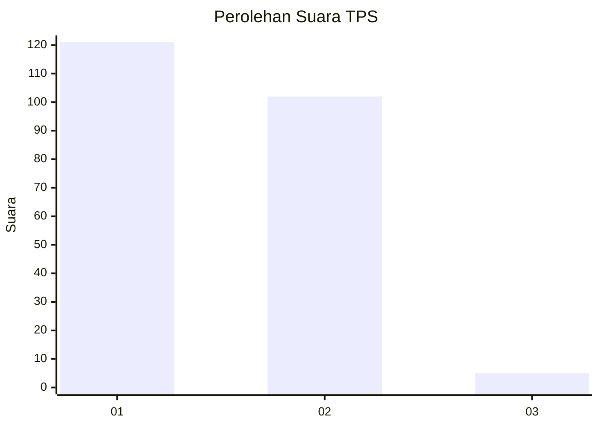
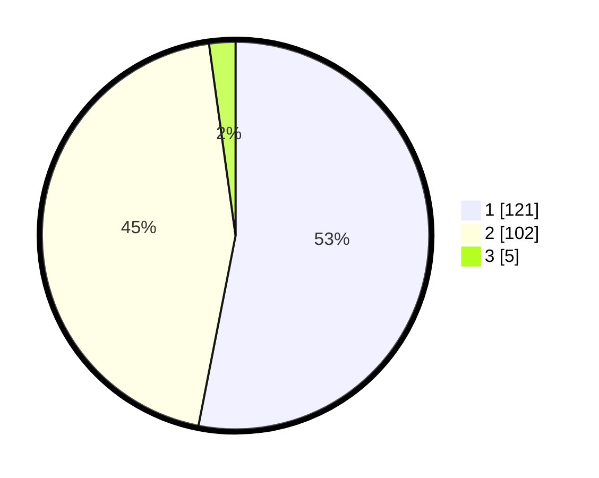

# Hasil

## Grafik

## Tabel

| No. | Nama Paslon    | Suara | Suara (raw) | Persentase |
|:--- |:-------------- | -----:| -----------:| ----------:|
| 1   | ANIES MUHAIMIN | 121   | [121][p-1]  | 53,07      |
| 2   | PRABOWO GIBRAN | 102   | [102][p-2]  | 44,74      |
| 3   | GANJAR MAHFUD  | 5     | [5][p-3]    | 2,19       |

[p-1]: https://github.com/gigit-pemilu/pemilu-2024-32-jawa-barat/blob/main/pilpres/hitung-suara/sub/32-jawa-barat/sub/06-tasikmalaya/sub/30-sariwangi/sub/2007-selawangi/sub/010-tps/sub/paslon-1.txt
[p-2]: https://github.com/gigit-pemilu/pemilu-2024-32-jawa-barat/blob/main/pilpres/hitung-suara/sub/32-jawa-barat/sub/06-tasikmalaya/sub/30-sariwangi/sub/2007-selawangi/sub/010-tps/sub/paslon-2.txt
[p-3]: https://github.com/gigit-pemilu/pemilu-2024-32-jawa-barat/blob/main/pilpres/hitung-suara/sub/32-jawa-barat/sub/06-tasikmalaya/sub/30-sariwangi/sub/2007-selawangi/sub/010-tps/sub/paslon-3.txt

## Foto C Plano

https://sirekap-obj-formc.kpu.go.id/101c/pemilu/ppwp/32/06/30/20/07/3206302007010-20240217-101516--1ced4b13-0f27-49b9-bc14-37dbe39bd1dd.jpg

https://sirekap-obj-formc.kpu.go.id/101c/pemilu/ppwp/32/06/30/20/07/3206302007010-20240217-112208--8b92ea4f-032f-4ac2-877a-8753da9c7ebc.jpg

https://sirekap-obj-formc.kpu.go.id/101c/pemilu/ppwp/32/06/30/20/07/3206302007010-20240217-101611--9a47d138-ce59-45a7-9efa-9b751a19ab93.jpg

## Metadata

| Key        | Value               |
| ---------- | ------------------- |
| Time Stamp | 2024-02-17 12:00:00 |

## DATA PEMILIH TETAP

Jumlah pemilih dalam DPT: **296**.
 * L: **157**.
 * P: **139**.

## DATA PENGGUNA HAK PILIH

Jumlah pengguna hak pilih dalam DPT: **211**.
 * L: **722**.
 * P: **911**.

Jumlah pengguna hak pilih dalam DPTb: **10**.
 * L: **10**.
 * P: **29**.

Jumlah pengguna hak pilih dalam DPK: **109**.
 * L: **109**.
 * P: **200**.

Jumlah pengguna hak pilih: **411**.
 * L: **923**.
 * P: **311**.

## JUMLAH SUARA SAH DAN TIDAK SAH

JUMLAH SELURUH SUARA SAH: **223**.

JUMLAH SUARA TIDAK SAH: **5**.

JUMLAH SELURUH SUARA SAH DAN SUARA TIDAK SAH: **233**.

