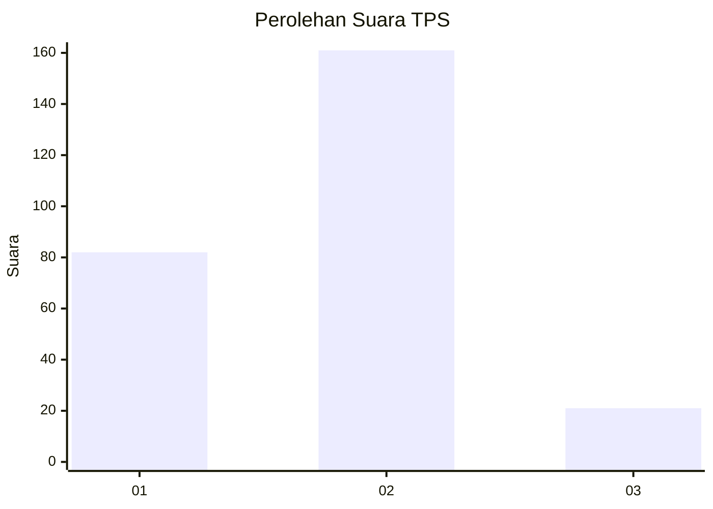
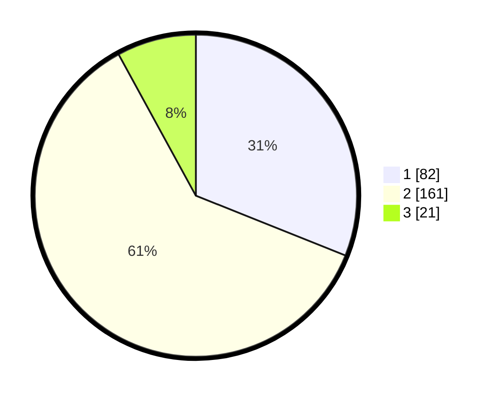

# Hasil

## Grafik

## Tabel

| No. | Nama Paslon    | Suara | Suara (raw) | Persentase |
|:--- |:-------------- | -----:| -----------:| ----------:|
| 1   | ANIES MUHAIMIN | 82    | [82][p-1]   | 31,06      |
| 2   | PRABOWO GIBRAN | 161   | [161][p-2]  | 60,98      |
| 3   | GANJAR MAHFUD  | 21    | [21][p-3]   | 7,95       |

[p-1]: https://github.com/gigit-pemilu/pemilu-2024/blob/main/pilpres/hitung-suara/sub/32-jawa-barat/sub/06-tasikmalaya/sub/31-sukaratu/sub/2004-gunungsari/sub/001-tps/sub/paslon-1.txt
[p-2]: https://github.com/gigit-pemilu/pemilu-2024/blob/main/pilpres/hitung-suara/sub/32-jawa-barat/sub/06-tasikmalaya/sub/31-sukaratu/sub/2004-gunungsari/sub/001-tps/sub/paslon-2.txt
[p-3]: https://github.com/gigit-pemilu/pemilu-2024/blob/main/pilpres/hitung-suara/sub/32-jawa-barat/sub/06-tasikmalaya/sub/31-sukaratu/sub/2004-gunungsari/sub/001-tps/sub/paslon-3.txt

## Foto C Plano

https://sirekap-obj-formc.kpu.go.id/5921/pemilu/ppwp/32/06/31/20/04/3206312004001-20240215-190747--d4bc6118-6673-44c7-8efa-e940a4ffbcf5.jpg

https://sirekap-obj-formc.kpu.go.id/5921/pemilu/ppwp/32/06/31/20/04/3206312004001-20240215-190842--49afffcd-b899-4aba-b0ef-89c176e149b6.jpg

https://sirekap-obj-formc.kpu.go.id/5921/pemilu/ppwp/32/06/31/20/04/3206312004001-20240215-190935--07f8147f-569c-4dbf-a79f-e7ea5c85462a.jpg

## Metadata

| Key        | Value               |
| ---------- | ------------------- |
| Time Stamp | 2024-02-15 20:00:44 |

