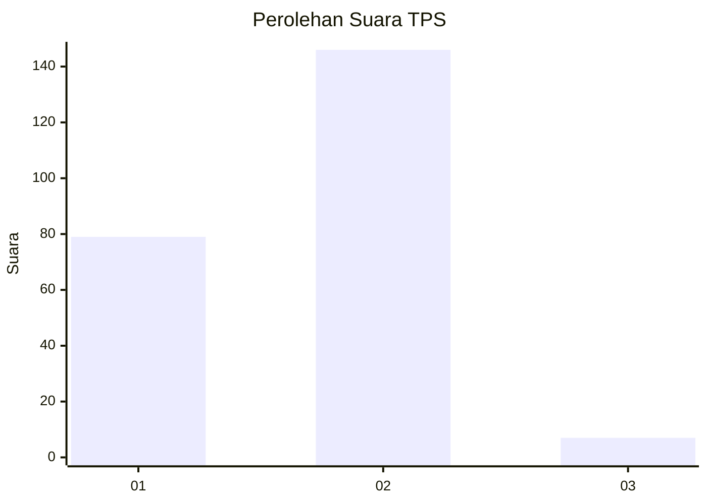
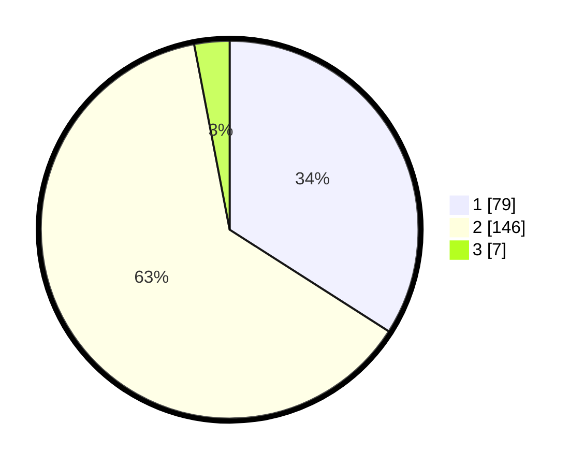

# Hasil

## Grafik

## Tabel

| No. | Nama Paslon    | Suara | Suara (raw) | Persentase |
|:--- |:-------------- | -----:| -----------:| ----------:|
| 1   | ANIES MUHAIMIN | 79    | [79][p-1]   | 34,05      |
| 2   | PRABOWO GIBRAN | 146   | [146][p-2]  | 62,93      |
| 3   | GANJAR MAHFUD  | 7     | [7][p-3]    | 3,02       |

[p-1]: https://github.com/gigit-pemilu/pemilu-2024-32-jawa-barat/blob/main/pilpres/hitung-suara/sub/32-jawa-barat/sub/06-tasikmalaya/sub/32-cisayong/sub/2001-cisayong/sub/002-tps/sub/paslon-1.txt
[p-2]: https://github.com/gigit-pemilu/pemilu-2024-32-jawa-barat/blob/main/pilpres/hitung-suara/sub/32-jawa-barat/sub/06-tasikmalaya/sub/32-cisayong/sub/2001-cisayong/sub/002-tps/sub/paslon-2.txt
[p-3]: https://github.com/gigit-pemilu/pemilu-2024-32-jawa-barat/blob/main/pilpres/hitung-suara/sub/32-jawa-barat/sub/06-tasikmalaya/sub/32-cisayong/sub/2001-cisayong/sub/002-tps/sub/paslon-3.txt

## Foto C Plano

https://sirekap-obj-formc.kpu.go.id/1338/pemilu/ppwp/32/06/32/20/01/3206322001002-20240214-155857--3324117d-8241-433e-940b-a744169f1cb4.jpg

https://sirekap-obj-formc.kpu.go.id/1338/pemilu/ppwp/32/06/32/20/01/3206322001002-20240224-220108--0ceb3e93-79b3-43d5-bd7b-713038403f63.jpg

https://sirekap-obj-formc.kpu.go.id/1338/pemilu/ppwp/32/06/32/20/01/3206322001002-20240224-220148--80f9c074-7675-4aed-b061-9e16398d8569.jpg

## Metadata

| Key        | Value               |
| ---------- | ------------------- |
| Time Stamp | 2024-02-24 22:31:28 |

