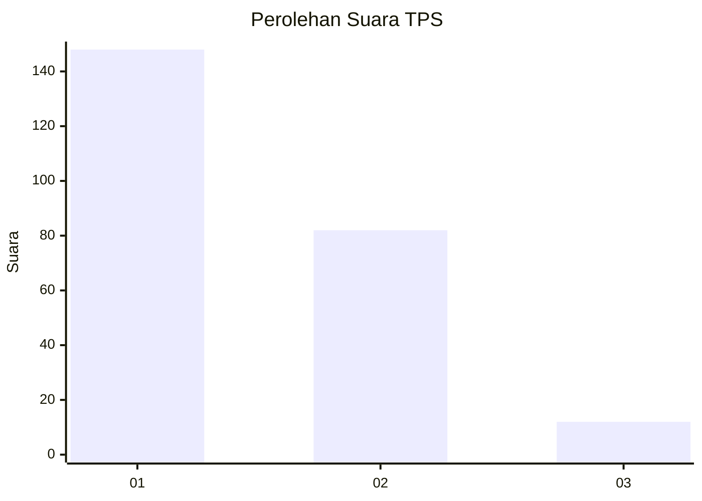
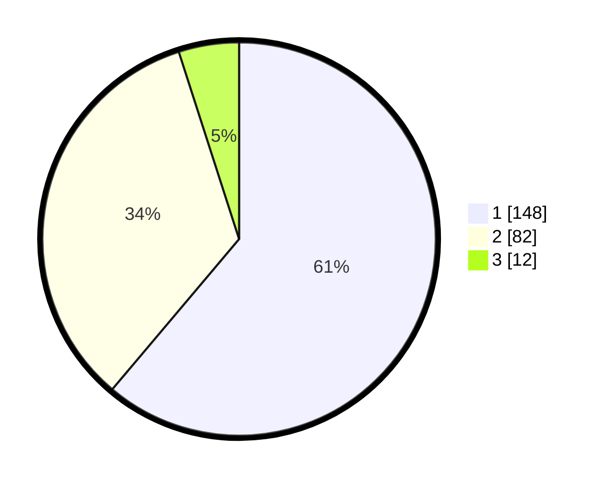

# Hasil

## Grafik

## Tabel

| No. | Nama Paslon    | Suara | Suara (raw) | Persentase |
|:--- |:-------------- | -----:| -----------:| ----------:|
| 1   | ANIES MUHAIMIN | 148   | [148][p-1]  | 61,16      |
| 2   | PRABOWO GIBRAN | 82    | [82][p-2]   | 33,88      |
| 3   | GANJAR MAHFUD  | 12    | [12][p-3]   | 4,96       |

[p-1]: https://github.com/gigit-pemilu/pemilu-2024/blob/main/pilpres/hitung-suara/sub/32-jawa-barat/sub/06-tasikmalaya/sub/32-cisayong/sub/2012-mekarwangi/sub/010-tps/sub/paslon-1.txt
[p-2]: https://github.com/gigit-pemilu/pemilu-2024/blob/main/pilpres/hitung-suara/sub/32-jawa-barat/sub/06-tasikmalaya/sub/32-cisayong/sub/2012-mekarwangi/sub/010-tps/sub/paslon-2.txt
[p-3]: https://github.com/gigit-pemilu/pemilu-2024/blob/main/pilpres/hitung-suara/sub/32-jawa-barat/sub/06-tasikmalaya/sub/32-cisayong/sub/2012-mekarwangi/sub/010-tps/sub/paslon-3.txt

## Foto C Plano

https://sirekap-obj-formc.kpu.go.id/5c46/pemilu/ppwp/32/06/32/20/12/3206322012010-20240215-020958--79011e0b-5720-4924-804f-64a3524eedd0.jpg

https://sirekap-obj-formc.kpu.go.id/5c46/pemilu/ppwp/32/06/32/20/12/3206322012010-20240215-021113--4eafe052-b0b4-4fde-a7dc-08825bbc6cd8.jpg

https://sirekap-obj-formc.kpu.go.id/5c46/pemilu/ppwp/32/06/32/20/12/3206322012010-20240215-021210--cacd03ce-cfbd-4bf9-920c-3cf7d80b2a78.jpg

## Metadata

| Key        | Value               |
| ---------- | ------------------- |
| Time Stamp | 2024-02-15 18:30:25 |

