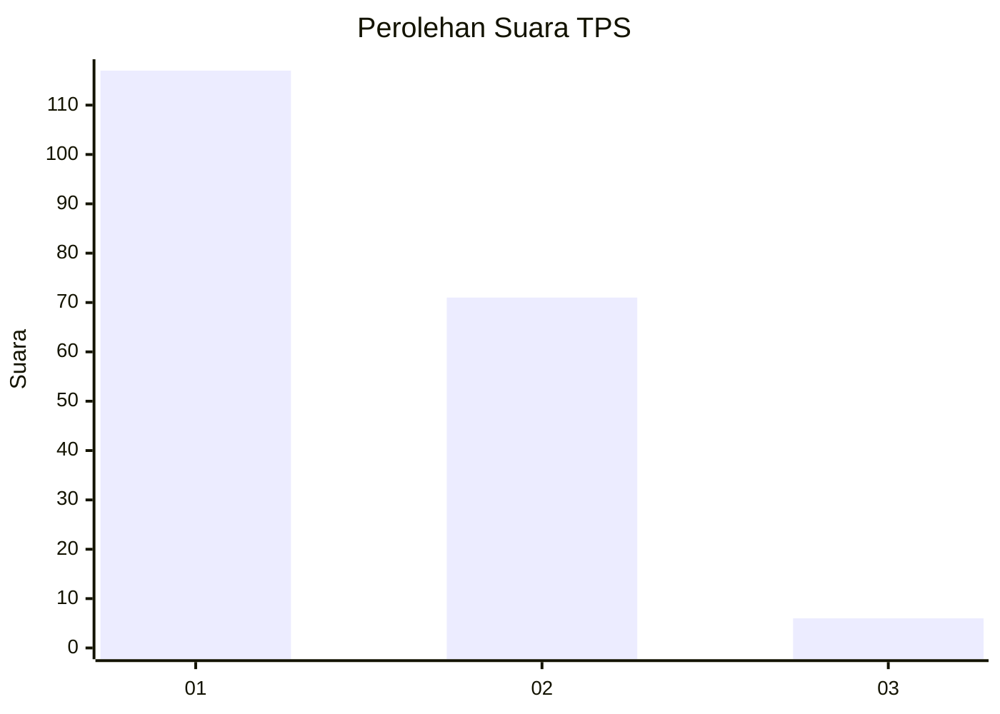
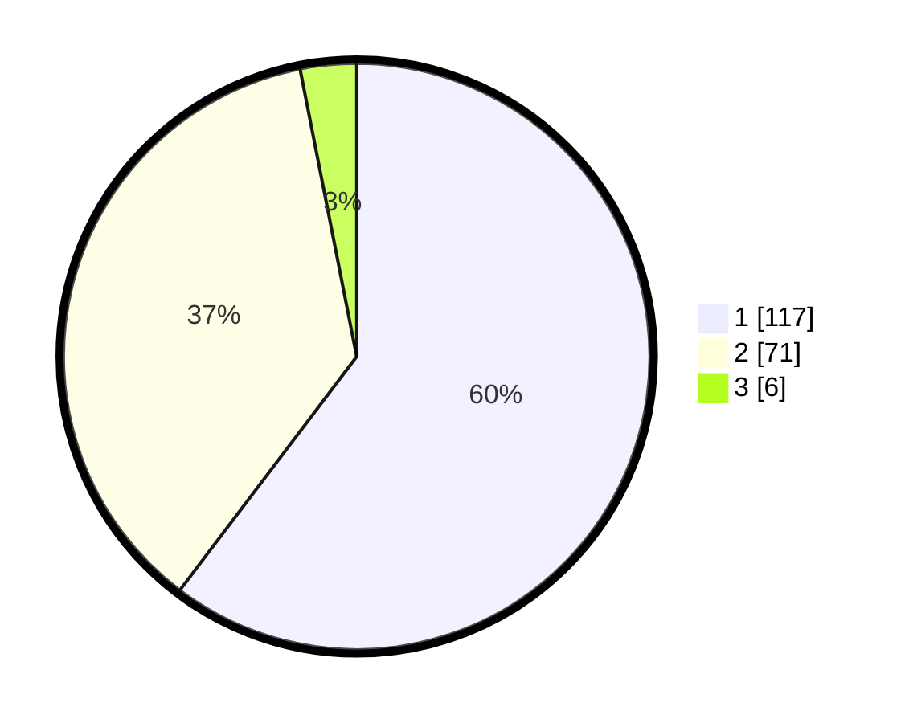

# Hasil

## Grafik

## Tabel

| No. | Nama Paslon    | Suara | Suara (raw) | Persentase |
|:--- |:-------------- | -----:| -----------:| ----------:|
| 1   | ANIES MUHAIMIN | 117   | [117][p-1]  | 60,31      |
| 2   | PRABOWO GIBRAN | 71    | [71][p-2]   | 36,60      |
| 3   | GANJAR MAHFUD  | 6     | [6][p-3]    | 3,09       |

[p-1]: https://github.com/gigit-pemilu/pemilu-2024-32-jawa-barat/blob/main/pilpres/hitung-suara/sub/32-jawa-barat/sub/06-tasikmalaya/sub/33-sukahening/sub/2001-banyurasa/sub/004-tps/sub/paslon-1.txt
[p-2]: https://github.com/gigit-pemilu/pemilu-2024-32-jawa-barat/blob/main/pilpres/hitung-suara/sub/32-jawa-barat/sub/06-tasikmalaya/sub/33-sukahening/sub/2001-banyurasa/sub/004-tps/sub/paslon-2.txt
[p-3]: https://github.com/gigit-pemilu/pemilu-2024-32-jawa-barat/blob/main/pilpres/hitung-suara/sub/32-jawa-barat/sub/06-tasikmalaya/sub/33-sukahening/sub/2001-banyurasa/sub/004-tps/sub/paslon-3.txt

## Foto C Plano

https://sirekap-obj-formc.kpu.go.id/0081/pemilu/ppwp/32/06/33/20/01/3206332001004-20240214-141304--b5e29919-ea57-4fb3-a11e-76218fb50097.jpg

https://sirekap-obj-formc.kpu.go.id/0081/pemilu/ppwp/32/06/33/20/01/3206332001004-20240214-141742--70cc9b02-1806-405f-88c0-a31ab9646c7a.jpg

https://sirekap-obj-formc.kpu.go.id/0081/pemilu/ppwp/32/06/33/20/01/3206332001004-20240214-141902--93058015-bcdd-4d3d-9c5d-6af2af6a2628.jpg

## Metadata

| Key        | Value               |
| ---------- | ------------------- |
| Time Stamp | 2024-02-14 21:46:01 |

