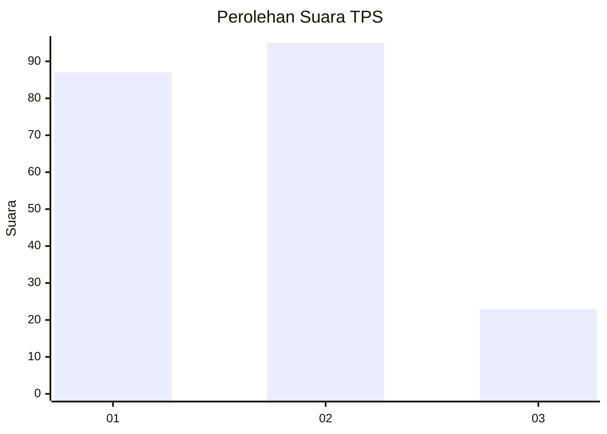
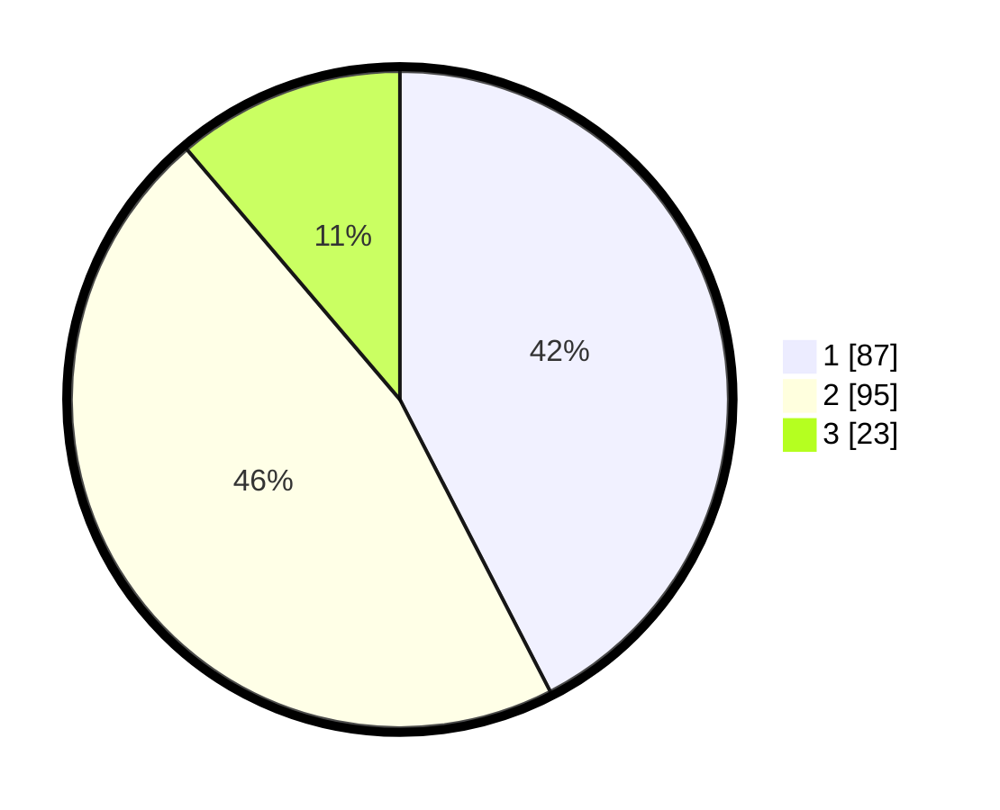

# Hasil

## Grafik

## Tabel

| No. | Nama Paslon    | Suara | Suara (raw) | Persentase |
|:--- |:-------------- | -----:| -----------:| ----------:|
| 1   | ANIES MUHAIMIN | 87    | [87][p-1]   | 42,44      |
| 2   | PRABOWO GIBRAN | 95    | [95][p-2]   | 46,34      |
| 3   | GANJAR MAHFUD  | 23    | [23][p-3]   | 11,22      |

[p-1]: https://github.com/gigit-pemilu/pemilu-2024-32-jawa-barat/blob/main/pilpres/hitung-suara/sub/32-jawa-barat/sub/07-ciamis/sub/01-ciamis/sub/1001-ciamis/sub/002-tps/sub/paslon-1.txt
[p-2]: https://github.com/gigit-pemilu/pemilu-2024-32-jawa-barat/blob/main/pilpres/hitung-suara/sub/32-jawa-barat/sub/07-ciamis/sub/01-ciamis/sub/1001-ciamis/sub/002-tps/sub/paslon-2.txt
[p-3]: https://github.com/gigit-pemilu/pemilu-2024-32-jawa-barat/blob/main/pilpres/hitung-suara/sub/32-jawa-barat/sub/07-ciamis/sub/01-ciamis/sub/1001-ciamis/sub/002-tps/sub/paslon-3.txt

## Foto C Plano

https://sirekap-obj-formc.kpu.go.id/c4cb/pemilu/ppwp/32/07/01/10/01/3207011001002-20240214-205740--ad6b2327-764f-4a3b-b3ee-aa07bd3c94a3.jpg

https://sirekap-obj-formc.kpu.go.id/c4cb/pemilu/ppwp/32/07/01/10/01/3207011001002-20240214-205803--70fa5022-0c0b-408c-b415-3a4daabe4451.jpg

https://sirekap-obj-formc.kpu.go.id/c4cb/pemilu/ppwp/32/07/01/10/01/3207011001002-20240214-205828--7d154884-fa9e-4eb0-89f4-fa825368ccd0.jpg

## Metadata

| Key        | Value               |
| ---------- | ------------------- |
| Time Stamp | 2024-02-15 15:00:29 |

