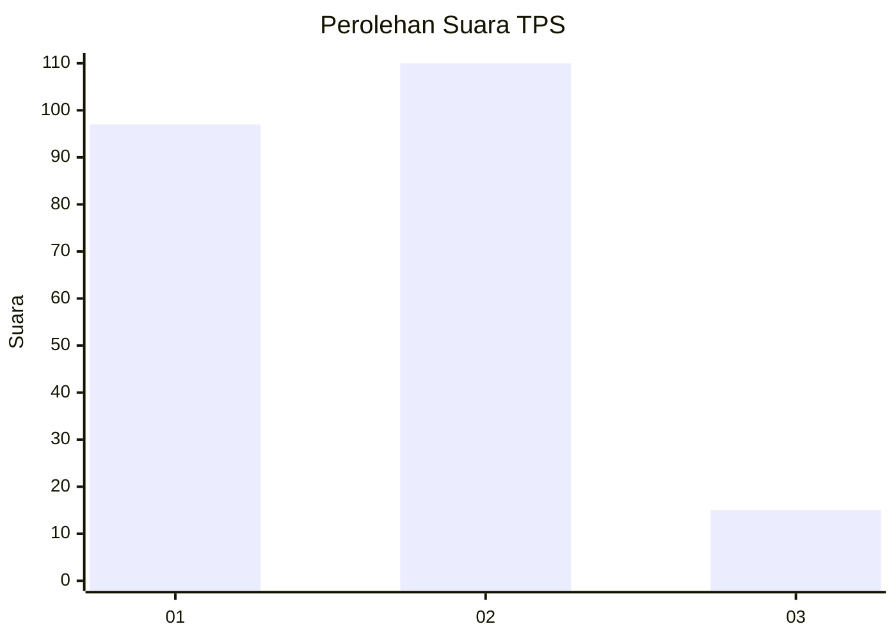
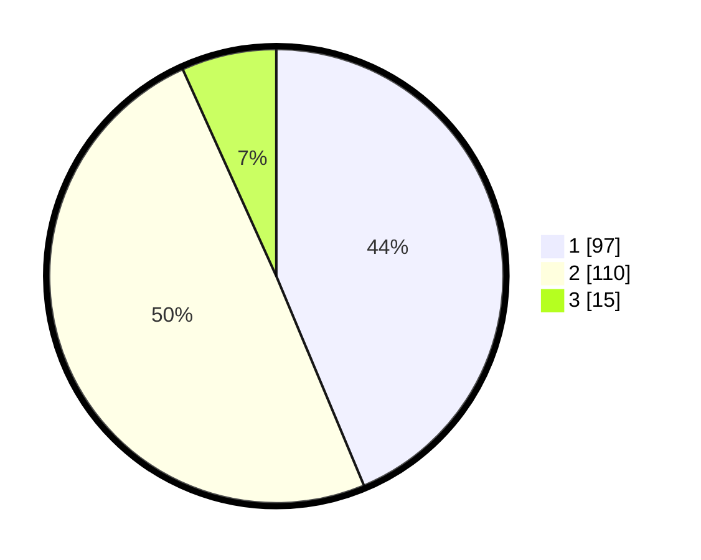

# Hasil

## Grafik

## Tabel

| No. | Nama Paslon    | Suara | Suara (raw) | Persentase |
|:--- |:-------------- | -----:| -----------:| ----------:|
| 1   | ANIES MUHAIMIN | 97    | [97][p-1]   | 43,69      |
| 2   | PRABOWO GIBRAN | 110   | [110][p-2]  | 49,55      |
| 3   | GANJAR MAHFUD  | 15    | [15][p-3]   | 6,76       |

[p-1]: https://github.com/gigit-pemilu/pemilu-2024/blob/main/pilpres/hitung-suara/sub/32-jawa-barat/sub/07-ciamis/sub/01-ciamis/sub/1001-ciamis/sub/005-tps/sub/paslon-1.txt
[p-2]: https://github.com/gigit-pemilu/pemilu-2024/blob/main/pilpres/hitung-suara/sub/32-jawa-barat/sub/07-ciamis/sub/01-ciamis/sub/1001-ciamis/sub/005-tps/sub/paslon-2.txt
[p-3]: https://github.com/gigit-pemilu/pemilu-2024/blob/main/pilpres/hitung-suara/sub/32-jawa-barat/sub/07-ciamis/sub/01-ciamis/sub/1001-ciamis/sub/005-tps/sub/paslon-3.txt

## Foto C Plano

https://sirekap-obj-formc.kpu.go.id/b6a7/pemilu/ppwp/32/07/01/10/01/3207011001005-20240214-225307--4ba5088a-a6b5-44cb-a9f9-1923fa0f8188.jpg

https://sirekap-obj-formc.kpu.go.id/b6a7/pemilu/ppwp/32/07/01/10/01/3207011001005-20240214-225618--ee76ec86-2201-4da6-8e01-a14abb0b209d.jpg

https://sirekap-obj-formc.kpu.go.id/b6a7/pemilu/ppwp/32/07/01/10/01/3207011001005-20240215-041725--323a44df-79ea-40ec-aa23-950aebb5a659.jpg

## Metadata

| Key        | Value               |
| ---------- | ------------------- |
| Time Stamp | 2024-02-15 15:00:29 |

