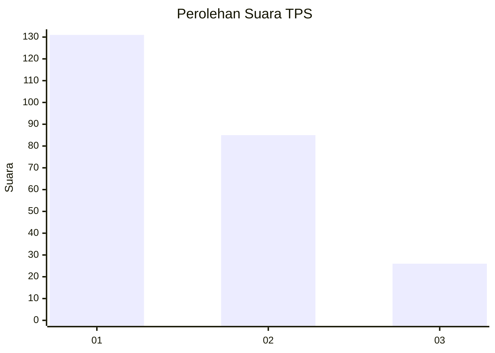
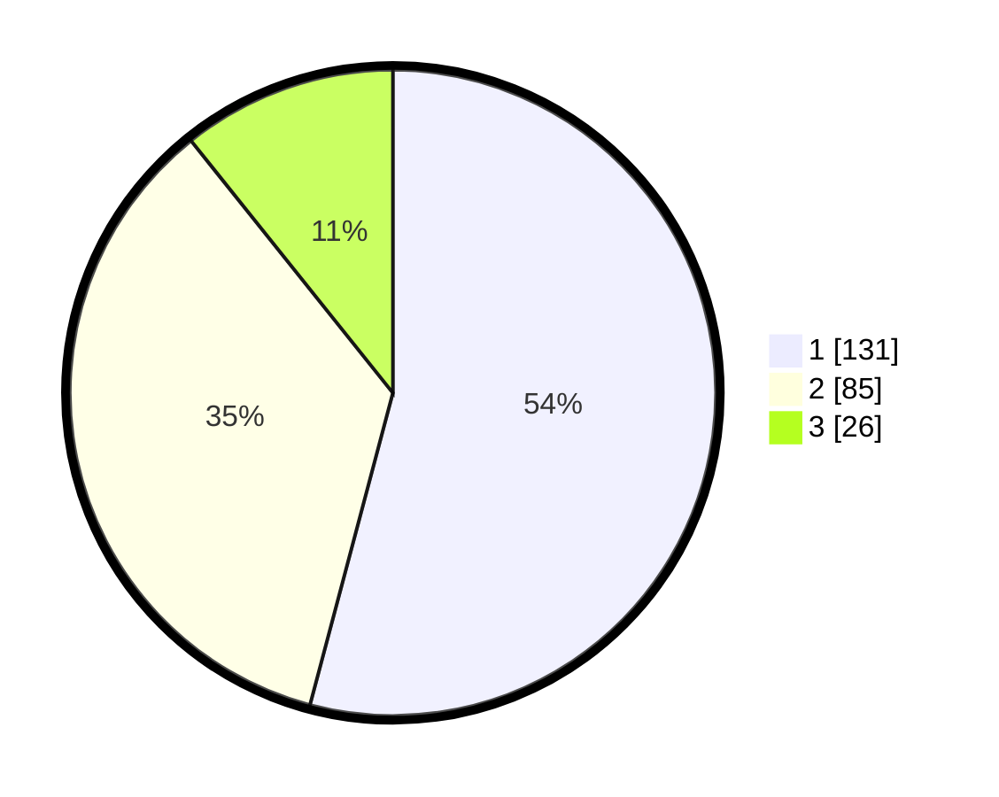

# Hasil

## Grafik

## Tabel

| No. | Nama Paslon    | Suara | Suara (raw) | Persentase |
|:--- |:-------------- | -----:| -----------:| ----------:|
| 1   | ANIES MUHAIMIN | 131   | [131][p-1]  | 54,13      |
| 2   | PRABOWO GIBRAN | 85    | [85][p-2]   | 35,12      |
| 3   | GANJAR MAHFUD  | 26    | [26][p-3]   | 10,74      |

[p-1]: https://github.com/gigit-pemilu/pemilu-2024/blob/main/pilpres/hitung-suara/sub/32-jawa-barat/sub/07-ciamis/sub/01-ciamis/sub/1003-maleber/sub/006-tps/sub/paslon-1.txt
[p-2]: https://github.com/gigit-pemilu/pemilu-2024/blob/main/pilpres/hitung-suara/sub/32-jawa-barat/sub/07-ciamis/sub/01-ciamis/sub/1003-maleber/sub/006-tps/sub/paslon-2.txt
[p-3]: https://github.com/gigit-pemilu/pemilu-2024/blob/main/pilpres/hitung-suara/sub/32-jawa-barat/sub/07-ciamis/sub/01-ciamis/sub/1003-maleber/sub/006-tps/sub/paslon-3.txt

## Foto C Plano

https://sirekap-obj-formc.kpu.go.id/1e44/pemilu/ppwp/32/07/01/10/03/3207011003006-20240215-235253--33a715ad-9f88-48eb-ad08-8e750c8f5df6.jpg

https://sirekap-obj-formc.kpu.go.id/1e44/pemilu/ppwp/32/07/01/10/03/3207011003006-20240215-235257--f521d4b4-c0f3-496c-bc34-b548f496383c.jpg

https://sirekap-obj-formc.kpu.go.id/1e44/pemilu/ppwp/32/07/01/10/03/3207011003006-20240215-235301--4f1a2a69-0cae-4bc1-86bb-3460eb8f49f9.jpg

## Metadata

| Key        | Value               |
| ---------- | ------------------- |
| Time Stamp | 2024-02-17 16:36:25 |

